    

# RAID  
## Content  
1. [Giới thiệu chung](#1)
2. [Phân loại RAID](#2)  
&emsp;2.1 [Software RAID](#2.1)  
&emsp;2.2 [Hardware RAID](#2.2)
3. [Các cấp độ RAID](/3)  
&emsp;3.1 [RAID 0](#3.1)  
&emsp;3.2 [RAID 1](#3.2)  
&emsp;3.3 [RAID 10](#3.3)  
&emsp;3.4 [RAID 2](#3.4)  
&emsp;3.5 [RAID 3](#3.5)    
&emsp;3.6 [RAID 4](#3.6)  
&emsp;3.7 [RAID 5](#3.7)  
&emsp;3.8 [RAID 6](#3.8)   
&emsp;[Một số loại RAID khác](#3.9)   

---  

  

## 1. Giới thiệu chung  
- `RAID` là viết tắt của **R**edundant **A**rrays of **I**ndependent **D**isks(ngày trước là Redundant Arrays of Inexpensive Disks). Ban đầu `RAID` được sử dụng như một giải pháp phòng hộ vì nó cho phép ghi dữ liệu lên nhiều đĩa cứng cùng lúc. Về sau, RAID đã có nhiều biến thể cho phép không chỉ đảm bảo an toàn dữ liệu mà còn giúp gia tăng đáng kể tốc độ truy xuất dữ liệu từ đĩa cứng. 

  

## 2. Phân loại RAID  
- RAID có thể được thực hiện bằng cách sử dụng bộ điều khiển đặc biệt (RAID phần cứng) hoặc bằng trình điều khiển hệ điều hành (RAID phần mềm).
  
  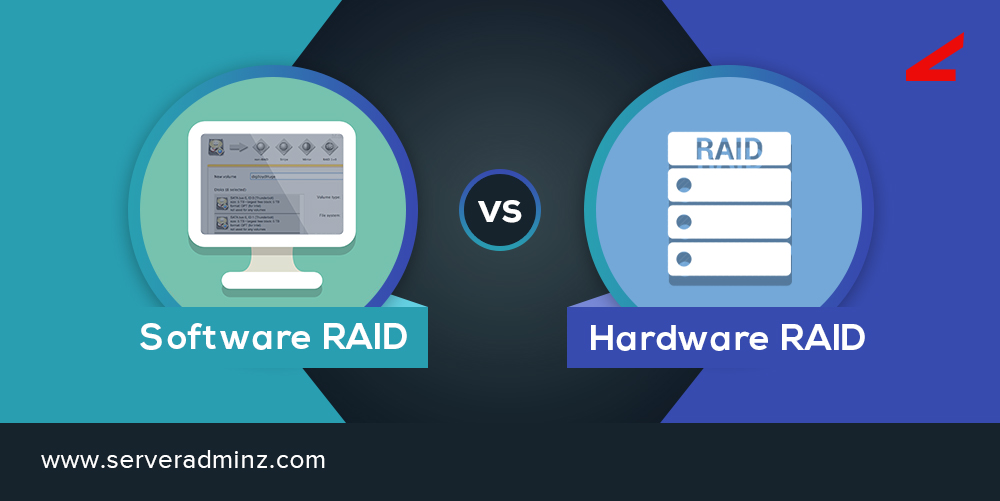  

### &ensp;2.1. RAID Hardware  
- `Raid Hardware` có bộ xử lý và bộ nhớ riêng để xử lý RAID. Trong cách triển khai này, hệ thống RAID là một hệ thống máy tính con độc lập chỉ dành cho ứng dụng RAID, giúp giảm tải khỏi hệ thống host. 
- `Raid Hardware` có thể được triển khai theo 2 cách: 
  - Sử dụng một card điều khiển RAID rời.
  - Sử dụng phần cứng tích hợp dựa trên công nghệ ROC.
### &emsp;2.1.1. Card điều khiển RAID rời  
- Đây là card mở rộng thường tích hợp một bộ xử lý RAID (bộ xử lý Vào/Ra) và có giao tiếp riêng với ổ đĩa (bộ điều khiển Vào/Ra). Nó thường được cắm vào khe `PCI-X` hoặc `PCIe` trên bo mạch chủ hệ thống máy tính. Những card plug-in này thường có giá đắt nhất, nhưng cũng là giải pháp RAID linh hoạt nhất và hiệu năng tốt nhất. Ở đây, chức năng RAID hoàn toàn độc lập với host (hệ thống máy tính). Đặc tính của card rời này cho phép sử dụng bộ xử lý Vào/Ra hiệu năng cao nhất và bộ nhớ nhanh nhất. Card RAID giúp giảm tải hoàn toàn tác vụ tạo ra một tiểu hệ thống lưu trữ dự phòng từ hệ thống máy tính và không ảnh hưởng đến hiệu năng của toàn hệ thống, ngay cả trong trường hợp hỏng ổ đĩa. Những cấp độ RAID phức tạp và hiệu quả dung lượng hơn (như RAID 5 hoặc RAID 6) có thể được dùng mà không ảnh hưởng gì đến hệ thống.

- Giao tiếp Vào/Ra bổ sung trên card thường cho phép mở rộng hệ thống lớn hơn (thêm nhiều ổ cứng hơn và nhiều dung lượng hơn). Thậm chí nhiều mảng RAID không hề ảnh hưởng đến hiệu năng của hệ thống host. Chúng có thể được di chuyển dễ dàng sang HĐH khác, hoặc hệ thống host hay nền tảng khác.

- Những lợi ích và hạn chế của card điều khiển RAID rời:
  - Lợi ích:  

    - Được bảo vệ khi boot: Dữ liệu không bị ảnh hưởng gì khi ổ đĩa boot bị lỗi hoặc hỏng hoàn toàn.

    - Hiệu năng tải làm việc độc lập trên máy chủ: Bộ nhớ nhanh, bộ xử lý nhanh và không ảnh hưởng đến hiệu năng của các ứng dụng đang chạy trên hệ thống host.

    - Ứng dụng RAID độc lập với host: Không gặp vấn đề về tính toàn vẹn dữ liệu khi hư hỏng hệ thống.

    - Nâng cao khả năng bảo vệ trong trường hợp mất nguồn: Các giải pháp RAID cứng thường thực thi tiến trình ghi trên phần cứng bất biến. Các giải pháp RAID mềm thiếu đi sự bảo vệ này, khiến nó khó phục hồi khi bị mất nguồn trong quá trình ghi.

    - Không dễ bị nhiễm vi rút: Mảng RAID hoàn toàn độc lập với hệ thống host và HĐH. Không xảy ra vấn đề về tính toàn vẹn dữ liệu khi sự cố hệ thống.

    - Giảm tải tác vụ RAID khỏi host: Phù hợp nhất với loại RAID 5 hoặc RAID 6, thường cho tỷ lệ chi phí / hiệu năng tốt nhất.

    - Có GUI và phần mềm riêng: Dễ dàng thiết lập và bảo dưỡng mảng RAID.

    - Dễ di chuyển và thay thế: Card có thể được cắm vào bất kỳ hệ thống nào và dễ thay thế hoặc nâng cấp bằng biến thể mới nhất, tốt nhất. Cũng dễ dàng hơn trong việc di chuyển từ một HĐH này sang HĐH khác.

    - Hỗ trợ các tính năng RAID nâng cao: Điển hình như cắm nóng ổ đĩa (hot plug), di chuyển toàn mảng và mở rộng dung lượng trực tuyến.

    - Bộ nhớ cache trên bộ điều khiển: Tăng tốc độ truy cập bằng cách sử dụng bộ nhớ cache, bao gồm khả năng sử dụng cache write-back nếu bộ nhớ được bảo vệ bằng pin.
  - Hạn chế:  
    - Chi phí cao nhất: Bộ xử lý Vào/Ra và bộ nhớ bổ sung trên card plug-in làm tăng thêm chi phí.

### &emsp;2.1.2. Giải pháp tích hợp RAID cứng dựa trên công nghệ RAID-on-Chip (ROC)   
- Đối với giải pháp ROC: bộ xử lý RAID, bộ điều khiển bộ nhớ, giao tiếp host, giao tiếp Vào/Ra để kết nối ổ cứng và đôi khi là bộ nhớ, tất cả đều nằm bên trong một con chip duy nhất. Con chip này được tích hợp vào bo mạch chủ và cung cấp chức năng RAID cứng với chi phí giảm đáng kể (chỉ cần một con chip ASIC chuyên dụng). 

- ROC thay thế chip giao tiếp Vào/Ra mà bạn tìm thấy trên nhiều bo mạch chủ của máy chủ (chẳng hạn như chip điều khiển SCSI). Điều này có nghĩa là giải pháp ROC tích hợp nhiều thứ hơn chứ không chỉ là kết nối dành cho các ổ cứng.
- Những lợi ích và hạn chế của RAID cứng dựa trên công nghệ ROC:  
  - Ngoài những lợi ích giống với card raid dời ở trê, ROC còn có thêm 1 số lợi ích:  
    - Chi phí trung bình: Số lượng chip ít hơn giúp giảm chi phí và tăng độ tin cậy so với giải pháp RAID cứng rời.  
  - Hạn chế: 
    - Do tích hợp bộ xử lý và các giao tiếp Vào/Ra ở mật độ cao trong một con chip duy nhất, tần số xung clock của những con chip phức tạp này hiện tại có thể bị giới hạn. 

    - Tính linh hoạt & di chuyển bị hạn chế: Việc di chuyển RAID sang các hệ thống khác chỉ có thể thực hiện khi chúng được trang bị giải pháp ROC tương tự (tương thích).

### &ensp;2.2. RAID Software    
- `Raid Software` là tác vụ RAID chạy trên CPU trong hệ thống máy tính.   

- Ưu điểm:  
  - Chi phí thấp  
  - Cho phép người dùng cấu hình lại các mảng mà không bị hạn chế bởi bộ điều khiển RAID phần cứng.  
- Nhược điểm:  
  - RAID phần mềm thường dành riêng cho HĐH đang được sử dụng do đó nó không thể được sử dụng cho các mảng ổ đĩa được chia sẻ giữa các hệ điều hành.  
  - Bị giới hạn cấp độ RAID mà HĐH hiện tại của bạn có thể hỗ trợ.  
  - Dễ bị nhiễm vi rút: Do RAID chạy như một ứng dụng trên hệ thống máy tính, vi rút và những phần mềm nguy hại khác có thể tác động đến chức năng RAID. 
  - Không có `cache write-back`: RAID mềm chỉ chạy ở chế độ `write-through`, trong khi RAID cứng có thể chạy ở chế độ `write-back` nếu có pin dự phòng - góp phần bảo vệ dữ liệu trong trường hợp hệ thống mất nguồn đột ngột. Chế độ `write-back` cũng giúp nâng cao hiệu năng ghi của mảng RAID. Với RAID mềm, không có cách nào để bổ sung thêm pin dự phòng.
  - Không được bảo vệ khi boot (không thể quản lý và bảo vệ dữ liệu khi boot): Hỏng ổ đĩa hoặc lỗi dữ liệu trong quá trình boot và trước khi RAID mềm được kích hoạt, dẫn đến hệ thống không thể hoạt động.
  - Thêm tải hiệu năng trên máy chủ: Hiệu năng hệ thống bị ảnh hưởng bởi ứng dụng RAID. Số lượng ổ đĩa càng nhiều và hệ thống RAID càng phức tạp (như RAID 5), hiệu năng tổng thể chịu ảnh hưởng càng nhiều. Giải pháp này phù hợp nhất cho các loại RAID 0, 1, 10.

## 3. Các cấp độ RAID
 
### &ensp;3.1. RAID 0

  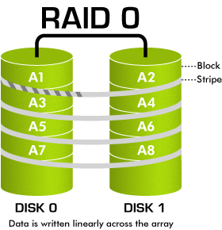  

- Đây là loại Raid khá phổ biến và được nhiều người sử dụng hiện nay do có khả năng nâng cao hiệu suất tốc độc đọc ghi trao đổi dữ liệu của ổ cứng.  
- Khi sử dụng Raid 0, dữ liệu sẽ được phân chia đều vào các ổ đĩa. Giả sử bạn có 100MB dữ liệu và 2 ổ cứng sử dụng raid 0. Khi đó thay vì dồn 100MB vào một đĩa cứng duy nhất, RAID 0 sẽ giúp dồn 50MB vào mỗi đĩa cứng riêng giúp giảm một nửa thời gian làm việc theo lý thuyết. Có càng nhiều đĩa cứng thì tốc độc đọc ghi sẽ càng cao.  
- Có thể sử dụng 1 ổ cứng với RAID 0.
- Ưu điểm: tốc độ đọc ghi nhanh  
- Nhược điểm: Tiềm ẩn nhiều nguy cơ về việc mất dữ liệu do dữ liệu được chia đều về các ổ cứng. Nếu 1 ổ cứng bị hỏng thì dữ liệu không thể sử dụng nữa.  
- Đối tượng sử dụng: thích hợp cho những người dùng cần truy cập nhanh khối lượng dữ liệu lớn, ví dụ các game thủ hoặc những người chuyên làm đồ hoạ, video số.

### &ensp;3.2. RAID 1  

  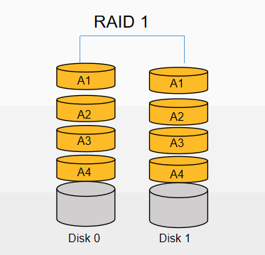  

- Dữ liệu sẽ được ghi trên 2 ổ cứng giống hệt nhau(Mirroing). Khi 1 trong các ổ sử dụng raid 1 bị hỏng thì dữ liệu không bị mất. 
- Số ổ cứng tối thiểu: 2 ổ có cùng dung lượng, nếu 2 ổ khác dung lượng thì lấy ổ thấp nhất. 
- Ưu điểm: An toàn về dữ liệu, trường hợp 1 trong 2 ổ đĩa bị hỏng thì dữ liệu vẫn có khả năng đáp ứng dịch vụ.
- Nhược điểm: Hiệu suất không cao. Nâng cao chi phí (giả sử bạn có 2 ổ cứng 500GB. Khi sử dụng Raid 1 thì dung lượng lưu trữ có thể sử dụng chỉ được 500GB).

- Đối tượng sử dụng: Các dịch vụ lưu trữ, các website vừa và nhỏ không yêu cầu quá cao về tốc độ đọc ghi (in/out) của ổ cứng. Các đối tượng yêu cầu sự an toàn về dữ liệu như các dịch vụ kế toán,lưu trữ thông tin khách hàng, bất động sản v.v…

### &ensp;3.3. RAID 10

  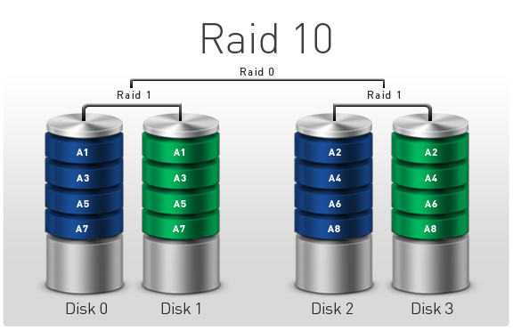 

- Raid 10 là sự kết hợp giữa Raid 1 và Raid 0. 
- Số ổ cứng tối thiểu dùng để setup: 4 ổ cùng dung lượng, nếu 4 ổ khác dung lượng thì lấy ổ thấp nhất.
- Sử dụng Raid 10 dữ liệu sẽ được lưu đồng thời vào 4 ổ cứng. 2 ổ dạng Striping (Raid 0) và 2 ổ (Mirroring) Raid 1.

- Ưu điểm: Đây là 1 hình thức lưu trữ nhanh nhẹn và an toàn, vừa nâng cao hiệu suất mà lại đảm bảo dữ liệu không bị thất thoát khi 1 trong số 4 ổ cứng bị hỏng.
- Nhược điểm: Chi phí cao. Đối với Raid 10 dung lượng sẵn sàng sử dụng chỉ bằng ½ dung lượng của 4 ổ. (giống như raid 1).
- Đối tượng sử dụng: Raid 10 thích hợp với tất cả các đối tượng sử dụng (từ những yêu cầu về hiệu suất đến việc đảm bảo an toàn dữ liệu).

### &ensp;3.4. RAID 2  

  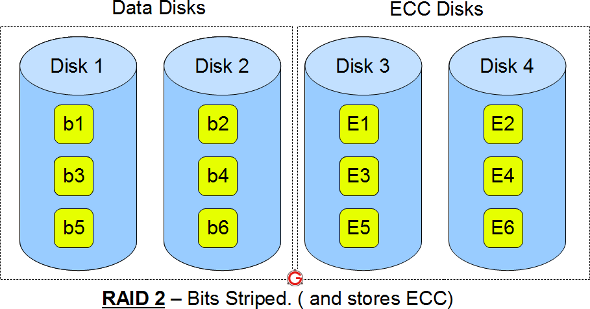  

- RAID 2 gồm hai cụm ổ đĩa, cụm thứ nhất chứa các dữ liệu được phân tách giống như là RAID 0, cụm thứ hai chứa các mã ECC dành cho sửa chữa lỗi ở cụm thứ nhất. Sự hoạt động của các ổ đĩa ở RAID 2 là đồng thời để đảm bảo rằng các dữ liệu được đọc đúng.  
- Việc sử dụng RAID 2 cần rất nhiều ổ cứng do đó chi phí cao và hiệu quả bằng một số loại RAID khác nên không còn được sử dụng.  
- Phân chia dữ liệu ở mức `bit`
  

### &ensp;3.5. RAID 3  

  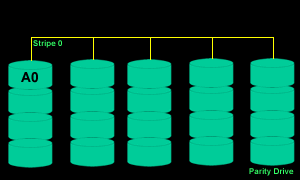  
  
- RAID 3 là sự cải tiến của RAID 0 nhưng có thêm (ít nhất) một ổ cứng chứa thông tin có thể khôi phục lại dữ liệu đã hư hỏng của các ổ cứng RAID 0. 
- Trong ví dụ trên các dữ liệu A,B,C,D được chia đều về các ổ cứng. Ngoài ra có thêm 1 ổ chứa thông tin để khôi phục dữ liệu(Parity Drive). Khi dữ liệu của 1 ổ trong 4 ổ Stripe bị hỏng thì hệ thống vẫn có thể hoạt động bình thường nhờ có dữ liệu được lưu trên ổ Parity.
- Số lượng ổ cứng tối thiểu để thực hiện RAID 3 là 3 ổ cứng.  
- Dữ liệu được phân chia ở mức `byte` 

   

### &ensp;3.6. RAID 4
- RAID 4 tương tự như RAID 3 nhưng ở một mức độ các khối dữ liệu lớn hơn(block). Chúng cũng yêu cầu tối thiểu 3 đĩa cứng (ít nhất hai đĩa dành cho chứa dữ liệu và ít nhất 1 đĩa dùng cho lưu trữ dữ liệu tổng thể)  

### &ensp;3.7. RAID 5  

  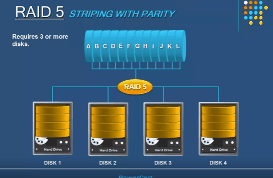  

- RAID 5 thực hiện chia đều dữ liệu trên các ổ đĩa giống như RAID 0 nhưng với một cơ chế phức tạp hơn. Dữ liệu và bản sao lưu được chia lên tất cả các ổ cứng.  
- Giả sử có 8 đoạn dữ liệu và 3 ổ đĩa:  Đoạn dữ liệu số 1 và số 2 sẽ được ghi vào ổ đĩa 1 và 2 riêng rẽ, đoạn sao lưu của chúng được ghi vào ổ cứng 3. Đoạn số 3 và 4 được ghi vào ổ 1 và 3 với đoạn sao lưu tương ứng ghi vào ổ đĩa 2. Đoạn số 5, 6 ghi vào ổ đĩa 2 và 3, còn đoạn sao lưu được ghi vào ổ đĩa 1 và sau đó trình tự này lặp lại, đoạn số 7,8 được ghi vào ổ 1, 2 và đoạn sao lưu ghi vào ổ 3 như ban đầu.  
- Số lượng ổ cứng tối thiểu: 3
- Ưu điểm: Nâng cao hiệu suất, an toàn dữ liệu, tiết kiệm chi phí hơn so với hình thức lưu trữ Raid 10.
- Nhược điểm: Chi phí phát sinh thêm 1 ổ so với hình thức lưu trữ thông thường. (tổng dung lượng ổ cứng sau cùng sẽ bằng tổng dung lượng đĩa sử dụng trừ đi 1 ổ. Giả sử bạn có 4 ổ 500GB thì dung lượng sử dụng sau cùng khi triển khai Raid 5 bạn chỉ còn 1500GB).
- Đối tượng sử dụng: Tất cả những website, dịch vụ, ứng dụng có số lượng truy cập và yêu cầu tài nguyên từ nhỏ đến vừa và lớn.

### &ensp;3.8. RAID 6
  
  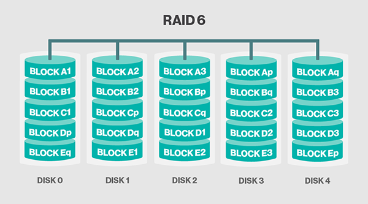  

- RAID 6 phần nào giống như RAID 5 nhưng sử dụng nhiều ổ parity hơn để lưu dữ liệu. 
- RAID 6 yêu cầu tối thiểu 4 ổ cứng.
- Trong RAID 6, khả năng chịu đựng rủi ro hư hỏng ổ cứng được tăng lên rất nhiều. Nếu với 4 ổ cứng thì chúng cho phép hư hỏng đồng thời đến 2 ổ cứng mà hệ thống vẫn làm việc bình thường, điều này tạo ra một xác xuất an toàn rất lớn. Chính do đó mà RAID 6 thường chỉ được sử dụng trong các máy chủ chứa dữ liệu cực kỳ quan trọng.  

### Một số loại RAID khác
- RAID50(Raid5 + Raid0)  

  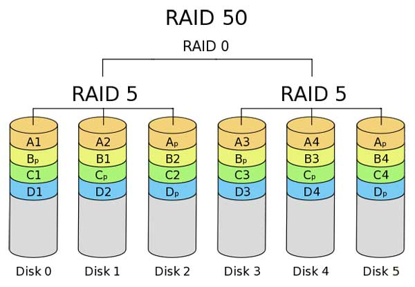

- RAID05(Raid0 + Raid5)  

  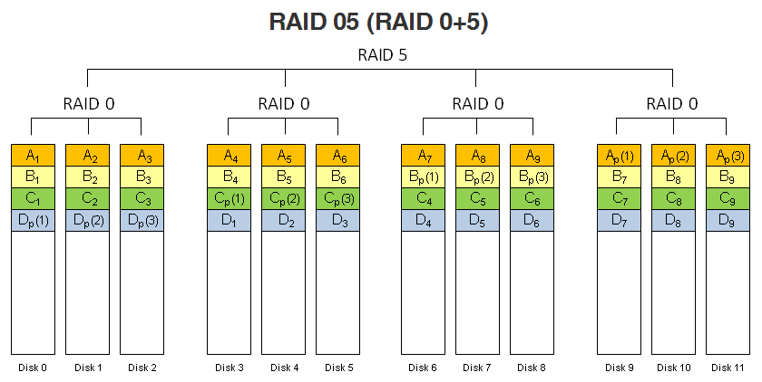

- RAID 5EE

  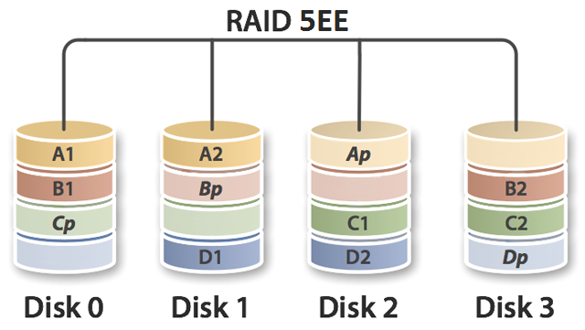

- RAID5 + Hot spare  

  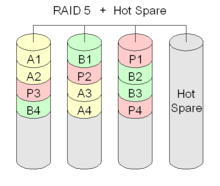

  - `Hot spare` được xem như một ổ cứng dự phòng sử dụng trong các hệ thống tự động. Khi hệ thống sử dụng RAID5 có 1 ổ cứng bị lỗi thì nó sẽ tự động chuyển sang sử dụng `Hot spare` để thay thế cho ổ cứng lỗi đó. Cơ chế này thường được dùng trong các hệ thống mà quản trị viên hệ thống không thường xuyên kiểm tra trạng thái các ổ cứng.
  - Quá trình thêm `Hot spare` vào ổ đĩa RAID hiện có có thể mất từ 20 phút tới vài giờ tùy thuộc vào lượng dữ liệu được lưu trong ổ bị mất và trạng thái ổ cứng trong mảng.  

- RAID01(Raid0 + raid1)

  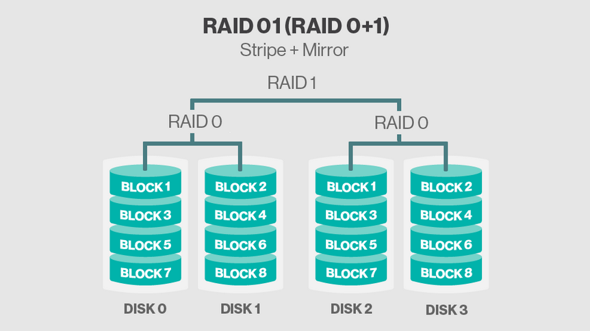

- RAID1E  

  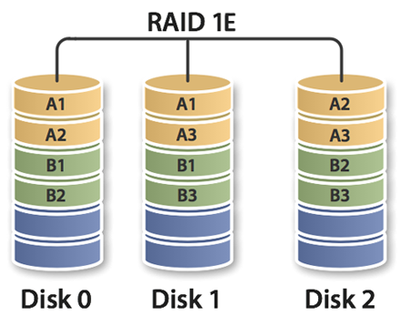  

### Bảng so sánh một vài loại RAID  

  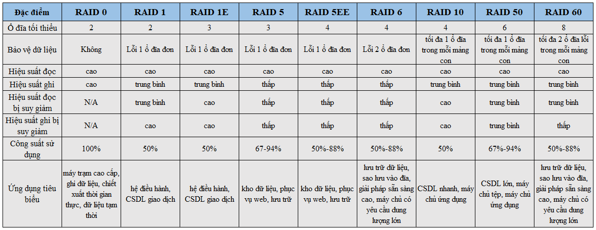

[Tham khảo](../../images/raid/1e8d46_67bffe4892034370b55288f92b26230a_mv2.webp)

## TÀI LIỆU THAM KHẢO  
- [enterprisestorageforum.com](https://www.enterprisestorageforum.com/storage-management/raid-levels.html)
- [searchstorage.techtarget.com](https://searchstorage.techtarget.com/definition/RAID)
- [prepressure.com](https://www.prepressure.com/library/technology/raid)
- [cuudulieutransang.vn](https://www.cuudulieutransang.vn/post/2019/01/21/raid-c%E1%BB%A9ng-vs-raid-m%E1%BB%81m-gi%E1%BA%A3i-ph%C3%A1p-n%C3%A0o-l%C3%A0-t%E1%BB%91t-nh%E1%BA%A5t-cho-%E1%BB%A9ng-d%E1%BB%A5ng-c%E1%BB%A7a-b%E1%BA%A1n)
- [library/technology/raid](https://www.prepressure.com/library/technology/raid)