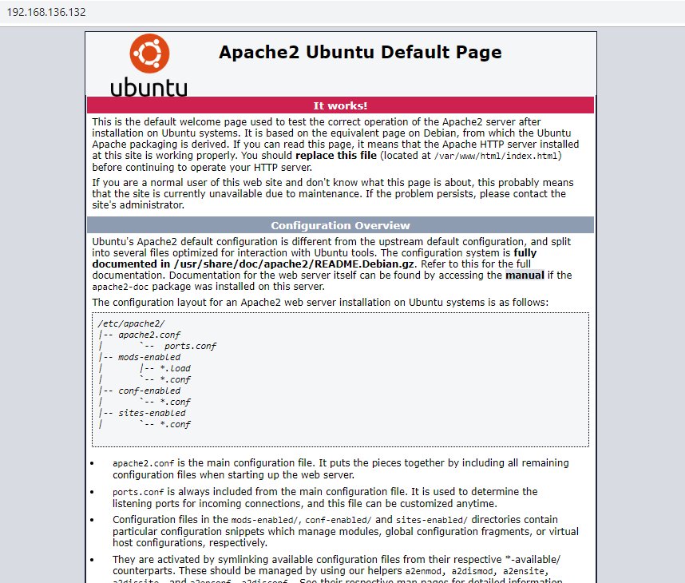
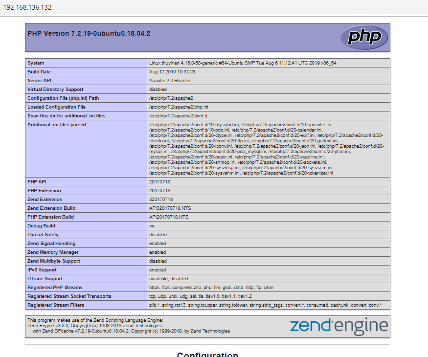

## 1. Điều kiện tiên quyết  

- Bạn có tài khoản root hoặc tài khoản có quyền sudo truy cập được vào Ubuntu Server. SSH tới Ubuntu Server  

  ```sh
    ssh [username]@[IP Server]  
  ```

- Cập nhật kho lưu trữ và các gói phần mềm  

  ```sh
    $ sudo apt update
  ``` 

  ```sh
    $ sudo apt upgrade -y
  ```  

## 2. Install Apache Web Server  

- Sử dụng lệnh dưới để cài đặt Apache Web Server  

  ```sh
    $ sudo apt install apache2 -y
  ```

- Kiểm tra trạng thái dịch vụ  

  ```sh
    $ sudo systemctl status apache2
  ```  

  Nếu mọi cài đặt đều đúng, bạn sẽ nhận được output với trạng thái là  

  ```sh
    active (running)
  ```  
    
    - Nếu ouput không ở trạng thái active, bạn có thể sử dụng câu lệnh duoiws để start apache và cài đặt để apache khởi động cùng OS

      ```sh
        $ sudo systemctl start apache2
      ```

      ```sh
        $ sudo systemctl enable apache2
      ```

- Kiểm tra phiên bản Apache  

  ```sh
    $ apache2 -v
  ```

  OUTPUT  
  
  ```sh
    Server version: Apache/2.4.29 (Ubuntu)
    Server built:   2019-07-16T18:14:45
  ```

- Cấu hình tường lửa cho phép Apache Server hoạt động  

  Theo mặc định, trình duyệt web apache không thể được truy cập từ các hệ thống từ xa nếu bạn đã bật tường lửa UFW trong Ubuntu 18.04 LTS. Bạn phải cho phép các cổng http và https bằng cách thực hiện theo các bước bên dưới.

  - Liệt kê các cấu hình ứng dụng có sẵn trên hệ thống Ubuntu của bạn bằng lệnh  

    ```sh
      $ sudo ufw app list
    ```

    OUTPUT  

    ```sh
    Available applications:
    Apache
    Apache Full
    Apache Secure
    OpenSSH
    ```
  Như bạn có thể thấy, ứng dụng Apache đã cài đặt được cấu hình UFW. Bạn có thể liệt kê ra thông tin về từng hồ sơ và các quy tắc được bao gồm trong đó bằng cách sử dụng câu lệnh **“ufw app info “Profile Name”**
   
  - Để xem thông tin hồ sơ của **"Apache Full"**, sử dụng câu lệnh:  
  
    ```sh
      $ sudo ufw app info "Apache Full"
    ```

    OUTPUT  

    ```sh
    Profile: Apache Full
    Title: Web Server (HTTP,HTTPS)
    Description: Apache v2 is the next generation of the omnipresent Apache web server.
    Ports:
    80,443/tcp
    ```

    Như bạn thấy, hồ sơ Full Apache của Apache đã bao gồm các quy tắc để cho phép lưu lượng truy cập đến các cổng 80 và 443

  - Chạy lệnh sau để cho phép lưu lượng HTTP và HTTPS đến cho cấu hình này:  

    ```sh
      $ sudo ufw allow in "Apache Full"
    ```  

    Nếu bạn không muốn cho phép lưu lượng HTTPS mà chỉ muốn cho phép lưu lượng HTTP, sử dụng câu lệnh  

    ```sh
      $ sudo ufw allow in "Apache"
    ```  

- Test Apache Web Server  

Dùng trình duyệt của bạn nhập vào thanh tìm kiếm theo 1 trong 2 cách `http://localhost/` or `http://IP-Address/`.

  

## 3. Install MariaDB Server

- Cài đặt MariaDB Server

  ```sh
    $ sudo apt install mariadb-server
  ```

- Sau khi cài đặt xong MariaDB Server chạy câu lệnh **sudo mysql_secure_installation** để thay đổi password cho root user MariaDB Server  

  ```sh
    $ sudo mysql_secure_installation
  ```  

  Enter current password for root (enter for none): Nhập password trống trong trường hợp cài lần đầu tiên.  

- Để kiểm tra xem MariaDB đã cài đặt thành công chưa, chúng ta thử kết nối vào MariaDB bằng lệnh mysql với tài khoản root.

  ```sh
    $ sudo mysql -u root -p
  ```

  OUTPUT

  ```sh
  Enter password:
  Welcome to the MariaDB monitor.  Commands end with ; or \g.  
  Your MariaDB connection id is 48
  Server version: 10.1.41-MariaDB-0ubuntu0.18.04.1 Ubuntu 18.04

  Copyright (c) 2000, 2018, Oracle, MariaDB Corporation Ab and others.

  Type 'help;' or '\h' for help. Type '\c' to clear the current input statement.
  ```  

## 4. Install PHP  

- Sử dụng câu lệnh sau để cài đặt PHP  

  ```sh
    $ sudo apt-get install php libapache2-mod-php php-mysql -y
  ```

- Để kiểm tra PHP đã được cài đặt thành công chưa chúng ta tạo 1 file index.php ở thư mục DocumentRoot của Apache là /var/www/html có nội dung như sau:

  ```sh
    <?php
  phpinfo();
  ```  

  - Mặc định Apache sẽ tìm file index.html để hiển thị nội dung trang web, vì vậy cần cấu hình để nó tìm file index.php đầu tiên. Chúng ta cần sửa file config `/etc/apache2/mods-enabled/dir.conf` của Apache với nội dung chỉnh sửa như sau:

  ```sh
    <IfModule mod_dir.c>
        DirectoryIndex index.php index.html index.cgi index.pl index.php index.xhtml index.htm
  </IfModule>
  ```

- Thực hiện restart lại Apache để cập nhật lại config  

  ```sh
    $ sudo systemctl restart apache2
  ```

- Test lại bằng cách truy cập theo đường dẫn http://<ten-mien-hoac-dia-chi-ip> . Nếu hiển thì thông tin phpinfo thì chúng ta đã hoàn thành việc cài đặt  

  
