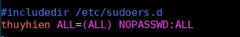

[Cài đặt Ubuntu Server 18.04](../../images/Ubuntu184)

## Su và Sudo trong Linux  

Trong Linux, bạn có thể sử dụng các lệnh su hoặc sudo để tạm thời cấp quyền truy cập root cho người dùng bình thường.Những phương pháp này thực sự khá khác nhau.

- Khi sử dụng lệnh su

  - Để nâng cao đặc quyền, bạn cần nhập mật khẩu gốc.
  - Việc cung cấp mật khẩu gốc cho người dùng bình thường sẽ không bao giờ được thực hiện một khi người dùng nâng lên tài khoản root, người dùng bình thường có thể làm bất cứ điều gì mà người dùng root có thể làm miễn là người dùng muốn, mà không cần hỏi lại mật khẩu
  - Có tính năng đăng nhập hạn chế.  

- Khi sử dụng lệnh sudo

  - Bạn cần nhập mật khẩu người dùng mà không phải mật khẩu gốc.  
  - Những thao tác người dùng thao tác với máy đều sẽ được cấu hình giới hạn.  
  - Chức năng đăng nhập chi tiết có sẵn.

## Các cấu hình quản lý user với sudo  
- Cú pháp cấu hình quyền của người dùng   

  ```sh
  user_list host_list=(effective_user_list) tag_list command_list
  ```

  Trong đó:  
  `user_list` - danh sách tên user hoặc nhóm user muốn cấp quyền  
  `host_list` - danh sách các máy mà khi đăng nhập user có thể thực hiện các quyền được cấp  
  `effective_user_list` - danh sách user/user alias mà user được cấp quyền có thể sử dụng sudo để thao tác như user/user alias đó.  
  `tag_list` - Danh sách các thẻ. Ví dụ như: NOPASSSWD  
  `command_list` - Danh sách các lệnh hoặc bí danh lệnh mà người dùng chạy với sudo 

- Các bước thực hiện:  

  - Backup `/etc/sudoers` file sử dụng lệnh  

    ```sh
      $ sudo cp /etc/sudoers /root/sudoers.bak
    ```  

  - Chỉnh sửa  `/etc/sudoers` file sử dụng lệnh  

    ```sh
      $ sudo vi /etc/sudoers
    ```  

    - Cho phép user bất kỳ thực thi các câu lệnh với sudo mà không cần nhập password, thay `thuyhien` bằng username bạn muốn cấp quyền 

      
    
    - Cho phép user `thuyhien` thực thi các câu lệnh dưới quyền của root user mà không cần nhập password   

      ```sh
      thuyhien ALL=(root) NOPASSWD:ALL
      ```  

    - Cho phép user `thuyhien` được thực thi nhiều lệnh với quyền root  

      ```sh
      thuyhien ALL=(root) /sbin/shutdown, /bin/kill, /etc/init.d/httpd
      ```

    - Cho phép user `thuyhien` được thực hiện bất kỳ lệnh nào trong /usr/bin ở máy linux01  

      ```sh
      thuyhien linux01 = /usr/bin/*
      ```  

    - Cho phép user `thuyhien` được tắt máy mà không cần phải xác nhận bằng mật khẩu  

      ```sh
      thuyhien localhost= NOPASSWD: /sbin/shutdown
      ```

    - Để cấp quyền cho một nhóm, thêm `%` vào trước tên nhóm. Ví dụ: Cấp cho nhóm `thuyhien` được thực thi tất cả các lệnh như user root ngoại trừ reboot máy  

      ```sh
      %hungtn1 All=(root) ALL, !/sbin/reboot
      ```

- Kiểm tra  

  - Chạy /bin/kill để kill một tiến trình bất kỳ đang chạy    

    ```sh
      $ sudo /bin/kill pid-here
    ```

  - Hoặc chạy thử lệnh  

    ```sh
      $ sudo /bin/systemctl restart apache2
    ```

## TÀI LIỆU THAM KHẢO  
- [Chạy tất cả các câu lệnh sudo không cần xác thực lại password](https://www.cyberciti.biz/faq/linux-unix-running-sudo-command-without-a-password/)  
- [https://fossbytes.com/](https://fossbytes.com/sudo-linux-much-more-than-an-elevated-permissions-tool/)
- [https://www.ostechnix.com/](https://www.ostechnix.com/run-particular-commands-without-sudo-password-linux/)