# Cài đặt Wordpress trên Ubuntu 18.04

## Điều kiện
Trên Server có cài sẵn LAMP Stack  

## Các bước thực hiện  

### Bước 1: SSH vào Ubuntu Server 18.04 sử dụng user có quyền sử dụng lệnh sudo  

  ```sh
    ssh thuyhien@192.168.136.132
  ```

### Bước 2: Truy cập vào user root MariaDB tạo CSDL của Wordpress

  - Login vào MariaDB Server  
   
    ```sh
      $ sudo mysql -u root -p
    ```
  
  - Tạo CSDL với tên `demo`  

    ```sh
      > create database wordpress;
    ```
  
  - Tạo user `demo` quản lý CSDL `demo`

    ```sh
      > create user 'wordpress'@'localhost' identified by 'abc@123';
    ```

  - Gán quyền trên CSDL `demo` cho user `demo`

    ```sh
      > grant all on wordpress.* to 'wordpress'@'192.168.136.132' identified by 'abc@123';
    ```

  - Xác nhận lại các thay đổi  

    ```sh
      > flush privileges;
    ```

### Bước 3: Tải và cài đặt Wordpress  

  - Cài đặt gói hỗ trợ `php-dg`

    ```sh
      $ sudo apt install php-gd -y
    ```  

  - Cài đặt wget

    ```sh
      $ sudo apt install wget
    ```  

  - Tiến hành tải xuống WordPress với phiên bản mới nhất

    ```sh
      $ sudo wget http://wordpress.org/latest.tar.gz
    ```  

  - Giải nén file `latest.tar.gz`

    ```sh
      $ sudo tar xvfz latest.tar.gz
    ```

  - Copy các file trong thư mục WordPress tới đường dẫn /var/www/html  

    ```sh
      $ sudo cp -Rvf /home/thuyhien/wordpress/* /var/www/html
    ```
<a name="1.4"></a>

### Bước 4: Cấu hình Wordpress

  - Truy cập vào các file cài đặt của Wordpress

    ```sh
      $ cd /var/www/html
    ```  

  - File cấu hình wordpress là wp-config.php. Tuy nhiên tại đây chỉ có file wp-config-sample.php. Tiến hành sửa lại tên file cấu hình như sau:

    ```sh
      $ sudo mv wp-config-sample.php wp-config.php
    ```  

  - Mở file config với vi để sửa:

    ```sh
    $ sudo vi wp-config.php
    ```  

  Sửa những nội dung được gạch chân theo thông tin bạn đặt ở bước 2  

  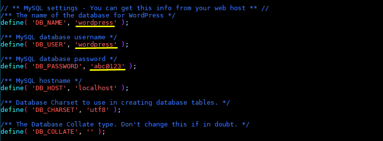
      
  - Lưu file cấu hình và thoát.
  
### Bước 5: Hoàn tất cài đặt giao diện

  - Trên trình duyệt, gõ địa chỉ ip server trên thanh url, trình duyệt sẽ xuất hiện như hình dưới, điền các thông tin vào rồi ấn `Install Wordpress` 

    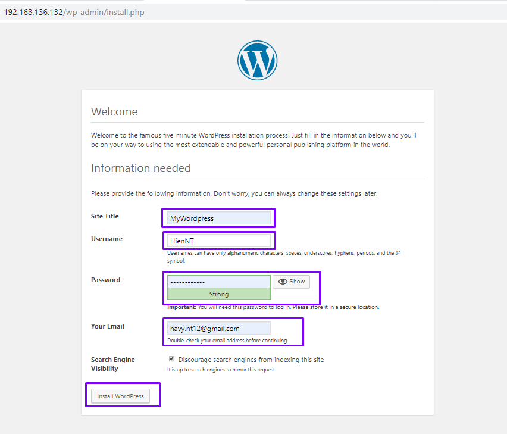  

  - Thiết lập thành công, bạn có thể đăng nhập vào Wordpress  

    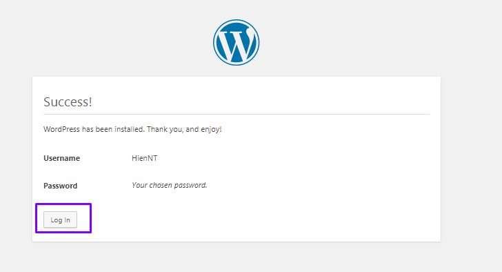  

    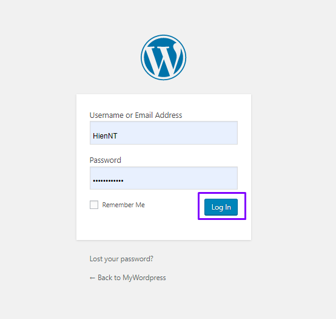 

### Màn hình quản trị sau khi bạn đăng nhập thành công vào Wordpress  

  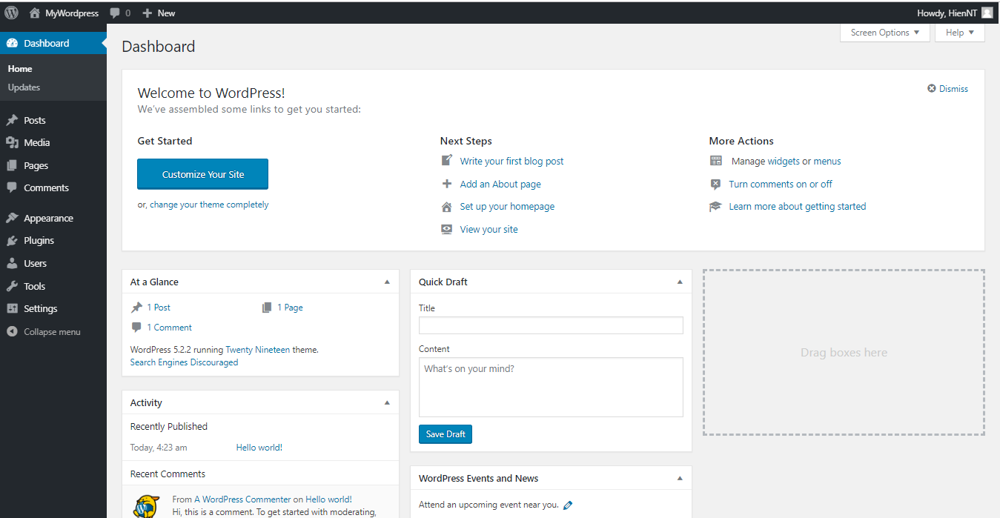 

### Màn hình khi người dùng truy cập vào.    

  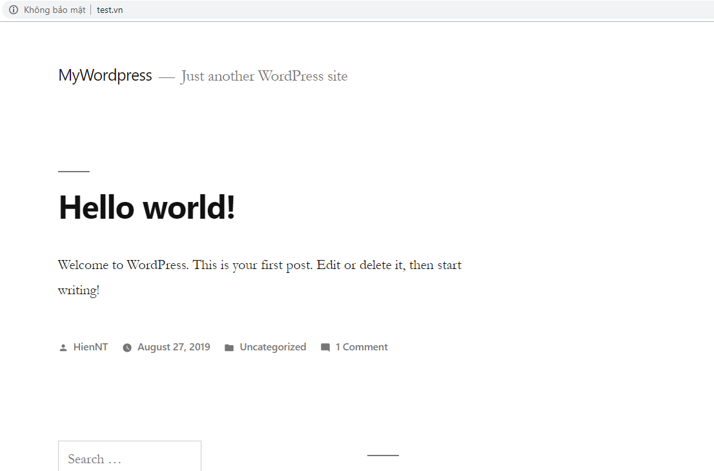

## 2. Tạo tên miền cho Wordpress trên localhost  

#### Ví dụ tạo domain với tên là `test.vn`  

### Bước 1: Tạo 1 thư mục `test.vn` với đường dẫn `/var/www/test.vn`  

  ```sh
    $ sudo mkdir /var/www/test.vn
  ```  

  - Gán quyền sở hữu cho thư mục mới tạo, sử dụng biến môi trường $USER  

    ```sh
      $ sudo chown -R $USER:$USER /var/www/test.vn
    ```

    ```sh
      $ sudo chmod -R 755 /var/www/test.vn 
    ``` 

### Bước 2: Copy các file trong thư mục WordPress tới đường dẫn /var/www/test.vn

  ```sh
    $ sudo cp -Rvf /home/thuyhien/wordpress/* /var/www/test.vn
  ``` 

  - Thực hiện lại [bước 4](1.4) ở phần 1  

### Bước 3: Tạo và chỉnh sửa nội dung virtual host file `test.vn.conf` với đường dẫn `/etc/apache2/sites-available/test.vn.conf` để máy chủ có thể 

  ```sh
    $ sudo vim /etc/apache2/sites-available/test.vn.conf

    <VirtualHost *:80>
    ServerAdmin webmaster@test.vn
    ServerName test.vn
    ServerAlias www.test.vn
    DocumentRoot /var/www/test.vn
    ErrorLog ${APACHE_LOG_DIR}/error.log
    CustomLog ${APACHE_LOG_DIR}/access.log combined

      <Directory "/var/www/test.vn/">
       DirectoryIndex index.php index.html
       Options FollowSymLinks
       AllowOverride All
       Require all granted
      </Directory>
    </VirtualHost>
  ```

  - Kích hoạt virtual host file mới tạo ở trên bằng công cụ `a2ensite`  

    ```sh
      $ sudo a2ensite test.vn.conf
    ```  

  - Vô hiệu hóa trang web mặc định được xác định trong `000-default.conf`  

    ```sh
      $ sudo a2dissite 000-default.conf
    ```  

  - Kiểm tra lỗi cấu hình:  

    ```sh
      $ sudo apache2ctl configtest
    ```  

    OUTPUT:  

    ```sh
    AH00558: apache2: Could not reliably determine the server's fully qualified domain name, using 127.0.1.1. Set the 'ServerName' directive globally to suppress this message
    Syntax OK
    ```  

  - Khởi động lại Apache để thực hiện các thay đổi của bạn:  

    ```sh
      $ sudo systemctl restart apache2
    ```  

### Bước 4: Chỉnh sửa file `/etc/hosts` trên máy ảo và file hosts trên máy thật với địa chỉ IP Server và domain của bạn như dưới    

  ```sh
    $ sudo vim hosts
    192.168.136.132 test.vn
  ```    

### Bước 5: Dùng trình duyệt truy cập vào domain của bạn, kết quả sẽ như hình dưới 
 
  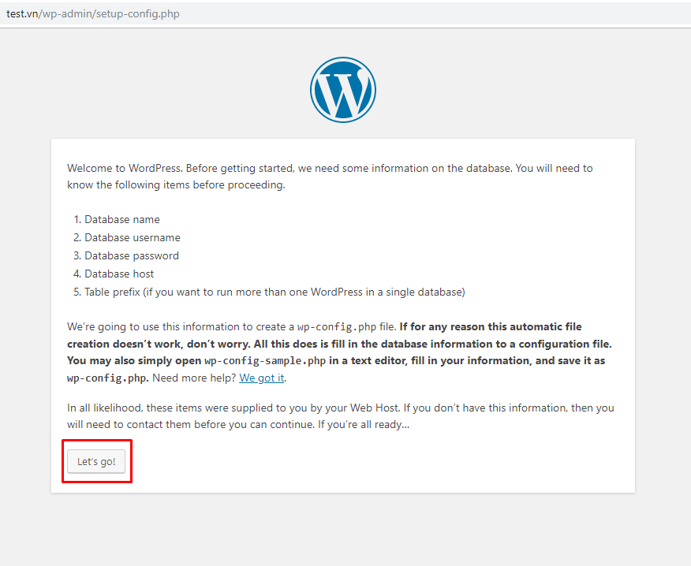

- Nhập vào tên Database, database username và password bạn sử dụng cho trang Wordpress này

  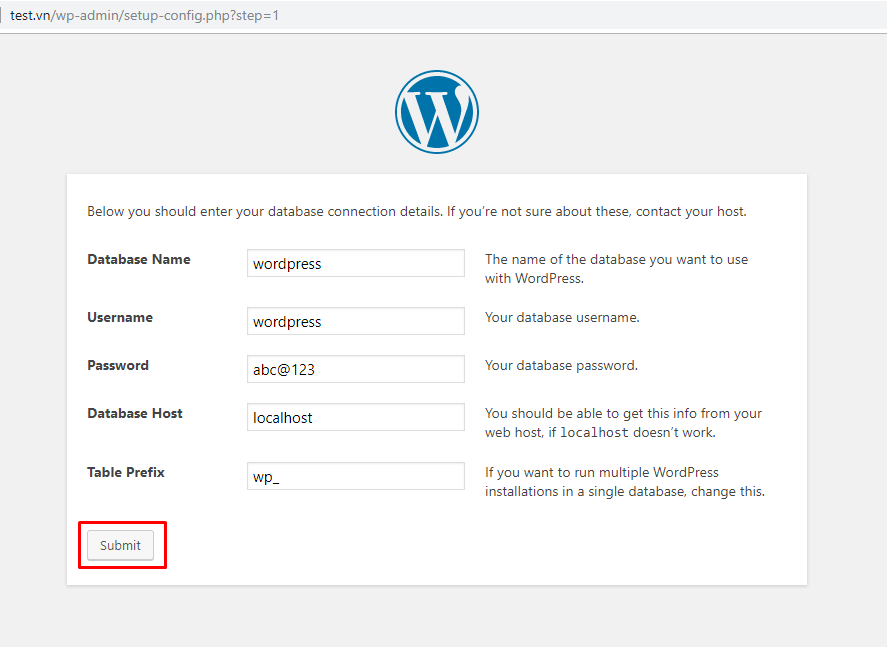

- Nhấn Log in để tiến hành đăng nhập

  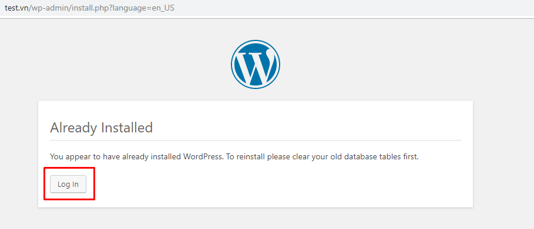  

- Vì ở phần 1 đã cấu hình sẵn username và password đăng nhập và mình có lưu lại nên nó sẽ tự động hiển thị như này  

  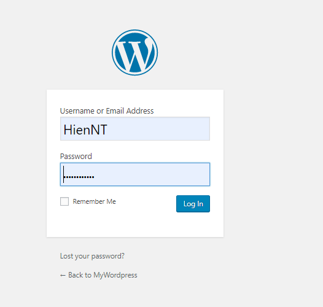

- Giao diện dùng để quản trị của Wordpress  

  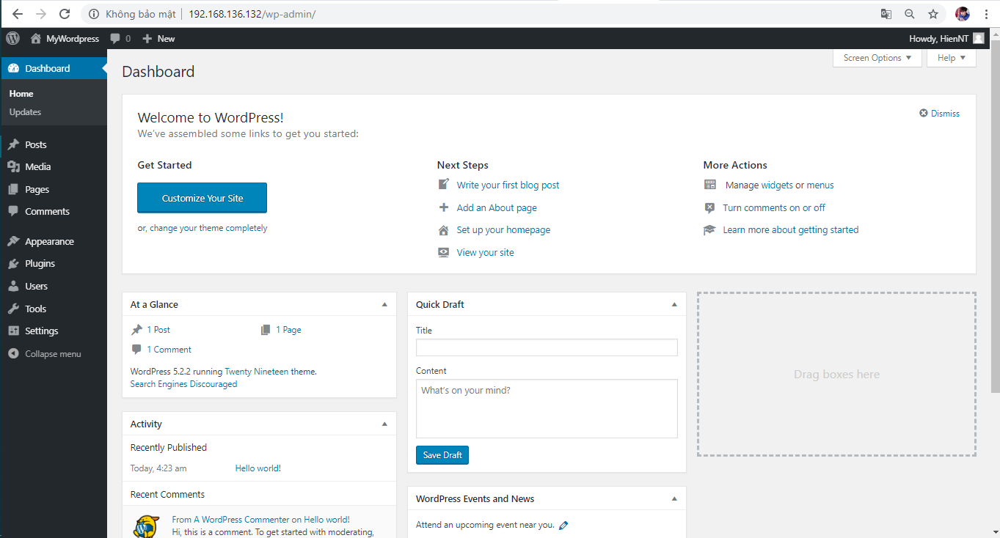

- Giao diện người dùng khi truy cập bằng tên miền `test.vn`   

  