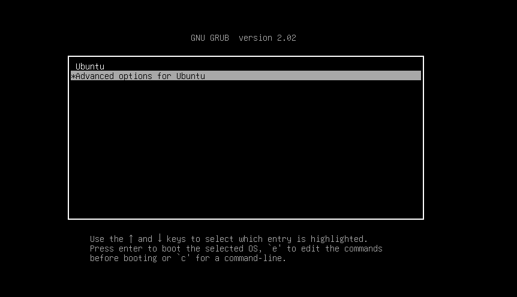
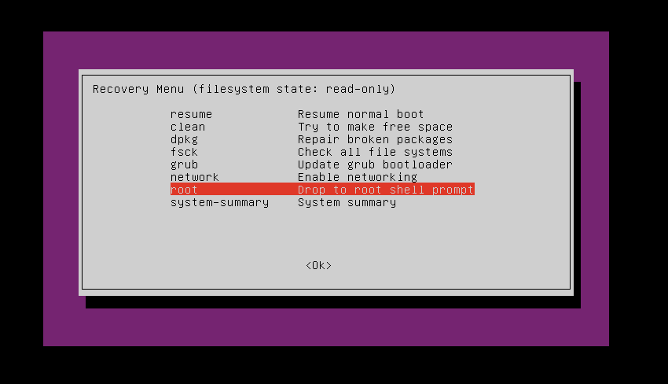
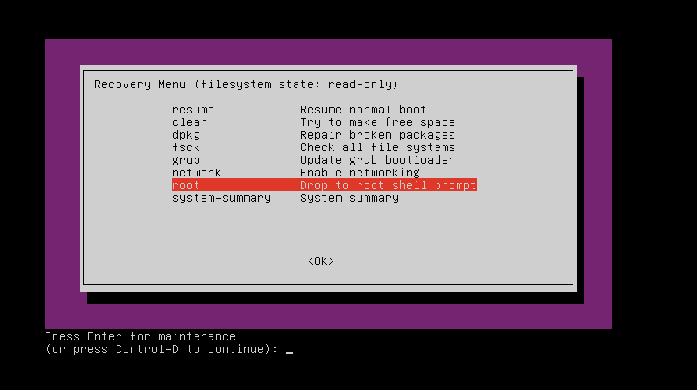
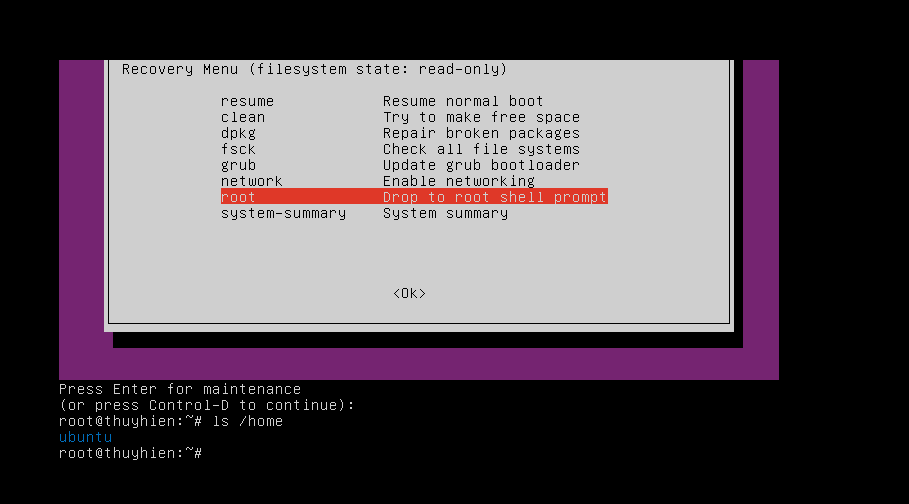

# How To Reset Root Password In Ubuntu?    


- Cách 1: Sử dụng chế độ khôi phục  

  - Khởi động lại máy tính vào **menu grub**:  

    - Nếu máy tính chỉ có 1 hệ điều hành là Ubuntu thì nhấn giữ phím `Shift` trong quá trình khởi động để xuất hiện menu grub.   

    - Nếu trên máy có nhiều hơn 2 HĐH nó sẽ tự động hiển thị menu grub.  

  Nếu bạn đang sử dụng Oracle VirtualBox hoặc VMWare, bạn phải giữ phím `ESC` khi logo của Oracle hoặc VMWare xuất hiện.  

  - Từ menu grub, chọn **Advand...** và Enter  

      
  - Màn hình xuất hiện như hình dưới  

      
  - Chờ tới khi các option được hiển thị, chọn `root Drop...` như hình rồi tab đến OK và nhấn Enter   

      
  - Màn hình hiển thị ra 1 câu hỏi, bấm Enter để vào giao diện dòng lệnh  

      
  - Giao diện dòng lệnh xuất hiện, kiểm tra lại các user có trên máy bằng câu lệnh    

    ```sh
      # ls /home
    ```

      
  - Đặt lại password cho user bạn muốn bằng câu lệnh bên dưới sau đó nhập vào password mới của bạn và xác nhận lại password. Ở đây mình đặt lại pass cho user root 

    ```sh
      # passwd [username]
    ```  

      
  - Sau khi đã reset lại password, dùng exit để trở về màn hình các tùy chọn.  Tại đây bạn chọn `resume Resume normal...` để khởi động lại máy và sử dụng password mới truy cập vào tài khoản.  

- Tham khảo thêm 2 cách khác [tại đây](http://www.linuxandubuntu.com/home/how-to-reset-root-password-in-ubuntu)

