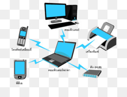
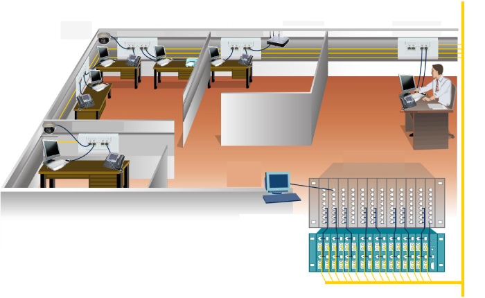
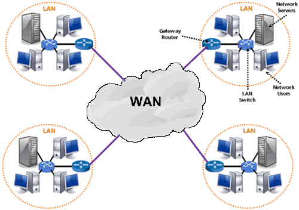
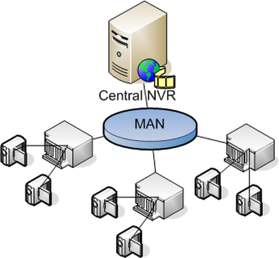
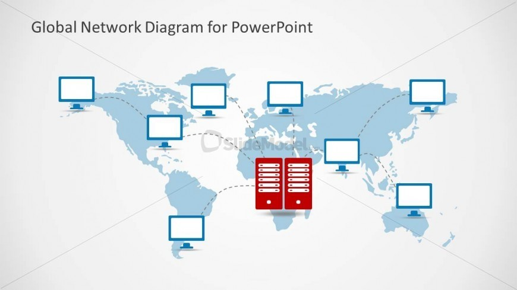
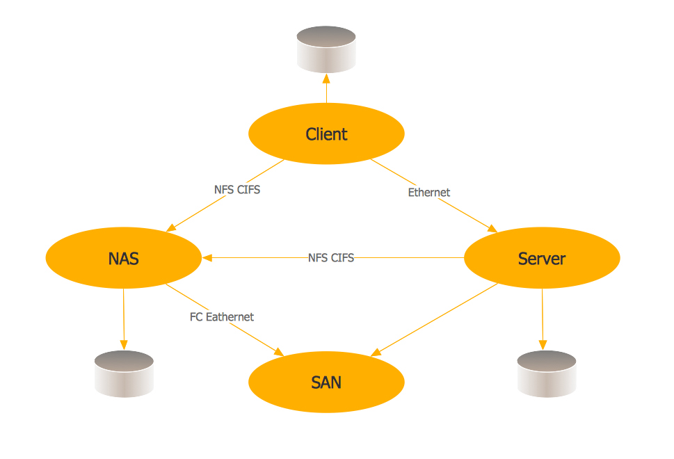

# Mạng truyền thông và công nghệ mạng
Khái niệm mạng(Networking): Chỉ khái niệm các thiết bị kết nối lại với nhau để chia sẻ thông tin.  
> ## **1.Mạng máy tính**  
- Khái niệm: Mạng máy tính là tập hợp các máy tính và thiết bị phụ trợ khác sử dụng chung các giao thức thông qua các phương tiên truyền thông mạng.  
- Các thành phần mạng: thiết bị, nút, máy tính  
- Môi trường truyền thông: Là môi trường vật lý được sử dụng để kết nối các thành phần mạng. Có 2 môi trường phổ biến hiện nay là: - Cáp quang(Cable)- Không dây(wireless)  
- Phương tiện và các giao thức truyền thông mạng: đáp ứng 2 tiêu chí:- Khả năng liên kết: đường truyền hoặc kết nối vật lý giữa các thiết bị  
- Ngôn ngữ: 1 bảng từ vựng các quy tắc áp dụng truyền thông dữ liệu(giống như bộ quy tắc xử sự chung cho 1 môi trường)

> ## **2.Phân loại mạng máy tính**  
*Theo diện hoạt động*  
- Mạng cá nhân - PAN(Personal Area Network): Mạng máy tính nhỏ cho gia đình. Sử dụng để kết nối các thiết bị dùng mạng trong gia đình lại với nhau để dễ dàng quản lý. 

- Mạng cục bộ(địa phương) - LAN(Local Area Network): Mạng dùng ở 1 khu vựa nhỏ, ví dụ như ở các văn phòng có nhiều phòng ban 

 

- Mạng diện rộng - WAN(Wide Area Network): Là sự kết hợp của nhiều mạng LAN khác nhau lại, sử dụng ở bán kính trên 100km. Ví dụ: thị xã, tỉnh, thành phố,quốc gia,..  
	 

- Mạng đô thị - MAN(Metropolitan Area Network): Liên kết mạng của 1 công ty có nhiều chi nhánh trong thành phố. LAN<MAN<WAN

 
	   

- Mạng toàn cầu - GAN(Global Area Network): Tập hợp nhiều mạng WAN. Ví dụ: Kết nối các công ty hoạt động đa quốc gia       

 

- Mạng lưu trữ - SAN(Storage Area Network)  

	
*Theo mô hình ghép nối(theo topo)*  

Topo mạng giống như bản đồ đường phố. Nó mô tả chi tiết cách thức kết nối các thành phần chính của mạng(các nút) và các đường truyền.

- Mô hình Point - to - point: gồm nhiều nút, mỗi nút liên lạc với nhau qua đường liên kết trực tiếp. Nếu một nút cần liên lạc với nút không liền kề, nó buộc phải liên lạc gián tiếp qua các nút khác. 2 dạng topo mạng point to point phổ biến: star(hình sao) và tree(cây)  
    + *Star(Hình sao):* Có 1 hub xử lý trung tâm - hub này là trung tâm truyền tin cho tất cả các nút. Khi hub ngừng hoạt động thì toàn bộ mạng sụp đổ.  
    + *Tree(cây):* Là mô hình mạng phân cấp, các cấp được nối với nhau qua các nút           - Mô hình điểm - nhiều điểm: gồm các nút dùng chung 1 kênh truyền thông. Một số dạng topo phổ biến: Bus và ring.    

*Theo kiểu chuyển:* 
- Mạng chuyển mạch ảo  
- Mạng chuyển gói

> ## **3.Địa chỉ mạng, định tuyến, tính tin cậy, tính liên tác và an ninh mạng**  
- *Địa chỉ:* khái niệm liên quan đến việc gán cho mỗi nút mạng 1 địa chỉ cụ thể duy nhất(giống như địa chỉ nhà) cho phép các thiết bị định vị được nó
- *Định tuyến - Routing:* Xác định tuyến đường mà dữ liệu sẽ đi qua trong quá trình truyền từ nút nhận đến nút gửi. Chức năng này được thực hiện bởi 1 thiết bị gọi là Router. 
- *Tính tin cậy:* Đảm bảo dữ liệu nhận giống dữ liệu truyền đi
- *Tính liên tác:* khả năng liên két các sản phẩm phần cứng và phần mềm của các hãng
- *An ninh:* Bảo vệ mọi thứ trong mạng bao gồm dữ liệ, phương tiện truyền thông và các thiết bị. Ngoài ra: chức năng quản trị, sản phẩm kiểm soát truy cập mạng.         

