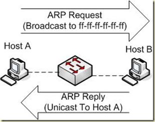
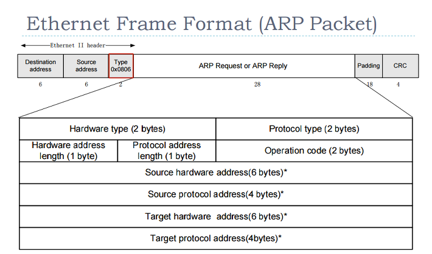

# WAN và Router
> ## **1.WAN**  
### **1.1.Giới thiệu**
- WAN là mạng truyền dữ liệu qua những vùng địa lý rộng lớn như: bang, tỉnh, quốc gia,...
- Một số đặc điểm:  
  - WAN dùng để kết nối các thiết bị ở cách xa nhau bởi những địa lý lớn
  - WAN sử dụng dịch vụ của các công ty cung cấp dịch vụ
  - WAN sử dụng nhiều loại liên kết nối tiếp khá nhau
- Mạng WAN hoạt động chủ yếu ở lớp Vật lý và lơp Liên kết dữ liệu mô hình OSI. WAN thực hiện chuyển đổi các gói dữ liệu giữa các router, switch và các mạng LAN mà nó kết nối.
- Các thiết bị được sử dụng trong WAN: Router, Switch, Modem, Server thông tin liên lạc

### **1.2. Router trong mạng WAN**  
- Các thành phần cơ bản: RAM, NVRAM,Flash, ROM và các cổng giao tiếp
- Chức năng: xác định và lựa chọn đường đi tốt nhất cho dữ liệu, kết nối 2 hệ thống mạng với nhau cho phép 2 hệ thống này có thể liên lạc với nhau.
- Tập tin cấu hình chứa các câu lệnh và các thông số để điều khiển luồng dữ liệu ra vào trên Router. Ngoài ra còn chứa các thông tin để cài đặt và chạy các giao thức định tuyến trên Router.
- Đặc điểm, và chức năng của RAM:
  - Lưu bảng định tuyến
  - Lưu bảng ARP
  - Có vùng bộ nhớ chuyển mạch nhanh
  - Có vùng bộ nhớ đệm cho các gói dữ liệu
  - Cung cấp vùng nhớ đệm cho các gói dữ liệu
  - Duy trì hàng đợi cho các gói dữ liệu
  - Cung cấp bộ nhớ tạm thời cho tập tin cấu hình khi Router đang hoạt động
  - Thông tin trên RAM sẽ bị xóa khi Router khởi động lại hoặc mất điện.
- Đặc điểm, chức năng của NVRAM:
  - Lưu trữ tập tin cấu hình khởi động của router
  - Nội dung của NVRAM vẫn được lưu trữ khi router khởi động lại hoặc tắt điện.
- Đặc điểm và chức năng của bộ nhớ Flash:
  - Lưu trữ hệ điều hành IOS
  - Có thể cập nhật phần mềm lưu trong Flash mà không cần thay đổi chip trên bộ xử lý.
  - Nội dung của Flash vẫn được lưu giữ khi router khởi động lại hoặc bị tắt điện.
  - Có thể lưu nhiều phiên bản khác nhau của phần mềm IOS trong Flash
  - Flash là loại ROM xóa và lập trình được(EPROM)
  
- Đặc điểm và chức năng của cổng giao tiếp:
  - Kết nối Router vào hệ thống mạng nhận và chuyển gói dữ liệu
  - Các cổng có thể gắn trực tiếp trên mainboard hoặc là dưới dạng card dời.

### ***1.1.3. Router LAN và WAN*** 
Một hệ thống mạng cấu hình đúng phải có đầy đủ các đặc điểm:  
- Có hệ thống địa chỉ nhất quán từ đầu cuối đến đầu cuối
- Cấu trúc địa chỉ phải thể hiện được cấu trúc mạng
- Chọn đường đi tốt nhất
- Định tuyến động và tĩnh
- Thực hiện chuyển mạch

### **1.1.4. Vai trò của Router trong mạng WAN** 
  
### **1.1.5.Một số khái niệm khác**   
- ARP là phương thức phân giải địa chỉ động giữa địa chỉ lớp network và địa chỉ lớp datalink.  
ARP được thiết kế cho các thiết bị nằm trong nội mạng, có tính chất local

  
  

  
  

**HDLC** (Điều khiển liên kết dữ liệu mức cao) là giao thức truyền thông mục đích chung điểm-điểm hoạt động ở cấp liên kết dữ liệu. 

**PPP** là một giao thức liên kết dữ liệu, thường được dùng để thiết lập một kết nối trực tiếp giữa 2 nút mạng. Nó có thể cung cấp kết nối xác thực, mã hóa việc truyền dữ liệu...  

**Frame Relay** là một dịch vụ truyền số liệu mạng diện rộng dựa trên công nghệ chuyển mạch gói.  Đặc điểm của Frame Relay là truyền thông tin qua mạng diện rộng bằng việc chia dữ liệu thành những gói tin. Mỗi gói tin đi qua một dãy các thiết bị chuyển mạch trong mạng Frame Relay để đi đến đích. 
