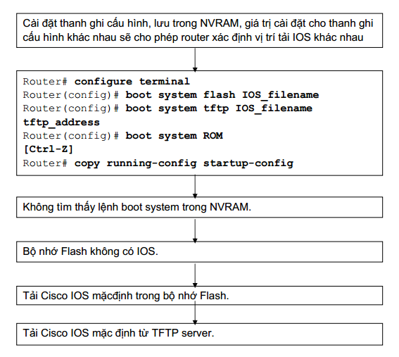

# Cấu hình Router cơ bản

### Các chế độ của Router
- Chế độ người dùng - Router>  
- Chế độ đặc quyền - Router#
- Chế độ cấu hình cục bộ - Router(config)#
- Chế độ cấu hình khác 
### Đặt mật mã cho Router
- Đặt mật mã cho đường Console   
 `Router(config)#line console0`   
 `Router(config-line)#password  < *password* >`  
 `Router(config-line)#login`  
- Đặt mật mã cho đường vty:   
`Router(config)#line vty 0 4`    
`Router(config-line)#password < *password* >`   
`Router(config-line)#login`  
- Đặt mật mã enable secret:   
`Router(config)#enable password < *password* > `   
`Router(config)#enable secret < *password* > ` 
- Mã hoá tất cảcác mật mã hiển thị trên tập tin cấu hình của router:   
`Router(config)#service password-encryption`

Lệnh `service password-encryptio`n sẽ áp dụng một cơ chế mã hoá đơn giản lên tất  các mật mã chưa được mã hoá. Riêng mật má `enable secret` thì sử dụng một 
thuật toán mã hoá rất mạnh là MD5.   

### Kiểm tra bằng các lệnh show 
- `Show interface` - hiển thị trạng thái tất cả các cổng trên Router
- `Show controller serial` - hiển thị các thông tin chuyên biệt về phần cứng của các cổng serial
- `Show clock` - hiển thị đồng hồ được cài đặt trên Router  
- `Show hosts` - hiển thị danh sách tên và địa chỉ tương ứng
- `Show users` - hiển thị tất cả các user đang kết nối vào Router  
- `Show flash` – hiển thị thông tin bộ nhớ Flash và tập tin IOS chứa trong đó.
- `Show ARP` - hiển thị bảng ARP trên router.
- `Show protocol` - hiển thị trạng thái toàn cục và trạng thái của các cổng giao 
tiếp đã được cấu hình giao thức lớp 3.
- `Show startup-configuration` - hiển thị tập tin cấu hình đang chạy trên RAM. 

### Cấu hình thông điệp đăng nhập  
`banner motd # The message of the day goes here #`  

### Phân giải tên máy

#  CHƯƠNG 4 - CẬP NHẬT THÔNG TIN TỪ CÁC THIẾT BỊ KHÁC  
- sử dụng lệnh `show cdp neighbors` để hiển thị
thông tin về các mạng kết nối trực tiếp vào router.
- Chạy CDP, kiểm tra và ghi nhận các thông tin CDP  
- Ping: sử dụng giao thức ICMP để kiểm tra kết nối vật lý và địa chỉ IP của lớp Mạng. Đây là lệnh kiểm tra cơ bản. 
- Telnet: kiểm tra kết nối phần mềm lớp Ứng dụng giữa nguồn và máy đích. Đây là lệnh kiểm tra kết nối hoàn chỉnh.  
- Traceroute: cho phép xác định vị trí lỗi trên đường truyền từ máy nguồn đến máy đích. Lệnh traceroute sử dụng giá trị Time to Live để tạo thông điệp từ mỗi router trên đường truyền.

# CHƯƠNG 5 - QUẢN LÝ PHẦN MỀM CISCO IOS 
## Quá trình khởi động Router:  
- Kiểm tra phần cứng
- Tìm và tải phần mềm Cisco IOS
- Tìm và thực hiện các câu lệnh cấu hình: các giao thức và địa chỉ cho các cổng giao tiếp.

## Quá trình tìm và tải IOS của các thiết bị Cisco
- Lệnh boot system cấu hình cho router nơi mà router tìm
tải IOS. Router sẽ sử  dụng các câu lệnh này theo thứ tự khi khởi động.   
- Nếu trong NVRAM không có các câu lệnh boot system thì 
hệ thống sẽ mặc định là sử  dụng Cisco IOS trong bộ nhớ flash.   
- Nếu trong bộ nhớ flash cũng không có IOS thì router sẽ cố gắng sử dụng TFTP để tải IOS về. Router sẽ sử dụng giá trị cài đặt cấu hình để biết tên tập tin lưu trên server mạng.  

# CHƯƠG 6  - ĐỊNH TUYẾN VÀ CÁC GIAO THỨC ĐỊNH TUYẾN 

- Định tuyến: quá trình tìm đường đi từ mạng này đến mạng khác.    
  - Định tuyến động: Router tự động học những thông tin về đường đi tới mạng khác thông qua các giao thức
  - Định tuyến tĩnh: người quản trị cấu hình thông tin đến các mạng khác cho router.
- Hoạt động của định tuyến tĩnh:
  - Quản trị mạng cấu hình các đường cố định cho router
  - Router cài đặt các đường đi này vào bảng định tuyến
  - Gói dữ liệu được định tuyến theo các đường cố định này.  
 Câu lệnh cấu hình định tuyến tĩnh cho router:  
 `ip route destination net subnetmask gateway`  
 - Các bước cấu hình đường cố định:
   - Xác định tất cả các mạng đích cần cấu hình,subnet mask tương ứng và gateway tương ứng .Gateway có thể là cổng giao tiếp trên router hoặc là địa chỉ của trạm kế tiếp để đến được mạng đích.
   - Vào chế độ cấu hình toàn cục của router
   - nhập lệnh ip route với các địa chỉ ở bước 1
   - lặp lại bước 3 cho những mạng đích khác.
   - thoát và lưu cấu hình.  
- Đường mặc định: trường hợp đặc biệt của đường cố định.  

`Ip route 0.0.0.0.0.0.0.0[next–hop-address/outgoing interface ] ` 
 

## Định tuyến động
- Giao thức định tuyến được sử dụng để các router giao tiếp với nhau.
- Giao thức định tuyến cho phép router này chia sẻ thông tin định tuyến mà nó biết cho các router khác. Từ đó các router có thể xây dựng và bảo  trì bảng định tuyến.
- Một số giao thức định tuyến:
  - Routing Information Protocol(RIP)
  - Interior Gateway Routing Protocol(EGRP)
  - Enhanceed Interior Gateway Routing Protocol(EIGRP)
  - Open Shortest Path First(OSPF)  
- Các giao thức được định tuyến:
  - Internet Protocol(IP)
  - Internetwork Packet Exchange(IPX)
  
`giao thức được định tuyến thì được sử dụng để định hướng cho dữ liệu của người dùng .Một giao thức được định tuyến sẽ cung cấp đầy đủ thông tin về địa chỉ lớp mạng để gói dữ liệu có thể truyền đi từ host này đến host khác dựa trên cấu trúc địa chỉ đó.`

### Autonmous sytem(AS) (Hệ thống tự quản ) 
- Là một tập hợp các mạng hoạt động dưới cùng một cơ chế quản trị về định tuyến
- Một AS bao gồm các router hoạt động dưới cùng 1 cơ chế quản trị.  
 ### Phân loại các giao thức định tuyến
 - Định tuyến theo vecto khoảng cách
 - Định tuyến theo trạng thái đường liên kết
 

