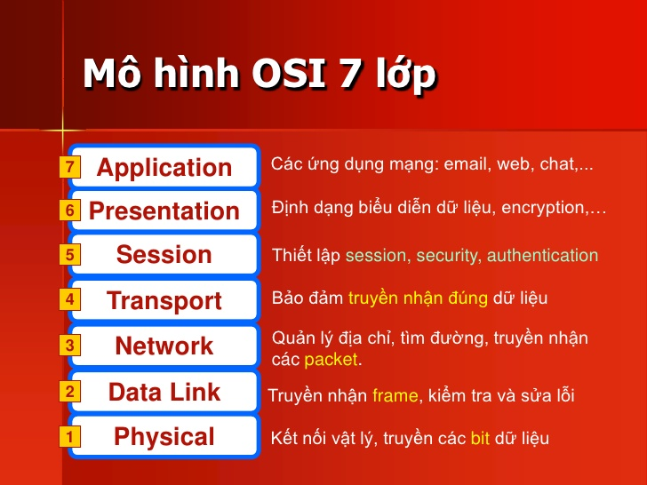
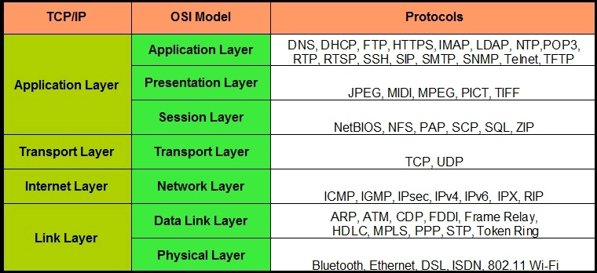

# Mô hình OSI và mô hình TCP/IP
> ## **I-Mô hình OSI(Open Systems Interconnection)** 
### **1.Khái niệm**
- Mô hình liên kết giữa các hệ thống mở.  
- Cho phép 2 hệ thống bất kì truyền thông được với nhau mà không cần thay đổi bất kỳ thiết bị phần cứng hoặc phần mềm nào.
- Không phải là một giao thức, nó là một mô hình cho phép nhận biết và thiết kế một kiến trúc mạng linh động, vững chắc và có khả năng liên tác.
- Mô hình- Được phân tầng với mục đích thiết kế các hệ thống mạng cho phép các hệ thống máy tính khác nhau có thể truyền thông với nhau.- Mô hình OSI gồm 7 tầng riêng biệt nhưng liên quan đến nhau, mỗi tầng định nghĩa một phần trong quá trình truyền thông tin trên mạng.  

### **2,Vai trò của các tầng**
- *`Application Layer(tầng ứng dụng):`* tầng gần nhất với người dùng; trực tiếp tiếp nhận và đưa thông tin đến người dùng. Giao thức được sử dụng: HTTP, Telnet, FTP, SMTP,TFTP,DNS,...  
- *`Presentation Layer(Tầng trình diễn):`* dữ liệu sẽ được gắn vào 1 header mã hóa giúp các lớp có thể nhận ra nhau. Hiểu đơn giản thì tầng này lấy dữ liệu từ tầng 7 sau đó biến đổi chúng thành 1 định dạng chuẩn mà các lớp có thể hiểu được. Giao thức được sử dụng: ASCII, GIF, JPEG,...   
- *`Session Layer(tầng phiên):`* thiết lập, duy trì và ngắt kết nối với thiết bị nhận/gửi. giống như 1 cánh cửa, qua cánh cửa này tin có thể được gửi/nhận. Các giao thức sử dụng: SQL,NFS,...  
- *`Transport Layer(Tầng vận chuyển):`* Đảm bảo dữ liệu chính xác giữa các hệ thống đầu cuối hoặc máy chủ. Đồng thời chịu trách nhiệm cho việc cung cấp vấn đề kiểm tra lỗi và thực hiện khôi phục dữ liệu khi cần thiết. Giao thức được sử dụng: TCP,UDP  
- *`Network Layer(Tầng mạng):`* xác định đường đi, xác định địa chỉ logic(IP nguồn/đích), chia nhỏ dữ liệu để tránh tình trạng dữ liệu vượt quá giới hạn của 1 gói, gán cho mỗi gói 1 thứ tự nhận diện.  
- *`Data link Layer(Tầng liên kết dữ liệu):`* chia nhỏ các gói tin ở tầng 3 thành các frame(khung dữ liệu), thêm vào đó các header chứa địa chỉ phần cứng(MAC) nơi nhận và địa chỉ nguồn. Ngoài ra ở lớp này còn thực hiện kiểm tra lỗi và kiểm soát luồng. Swtich là thiết bị hoạt động ở tầng này. Các giao thức ở lớp này: PPP, Frame Relay, IEEE 802.5/702.2,...  
- *`Physical Layer(Tầng vật lý):`* chuyển các frame thành các bit nhị phân và tiến hành gửi  

> ## **II-Mô hình TCP/IP**
- Là tâp hợp các giao thức điều khiển truyền thông giữa tất cả các máy tính trên Internet.
- Gồm 4 tầng: tầng ứng dụng(Application Layer), tầng giao vận(Transport Layer), tầng mạng(Network Layer) và tầng giao liên mạng(Network Interface Layer).

 

### Cụ thể:   
- *`Tầng ứng dụng:`* gồm nhiều giao thức cung cấp cho các ứng dụng người dùng. Một số giao thức thường dùng: DHCP(Dynamic Host Configuration protocol), DNS(Domain Name System), SNMP(Simple Network Management protocol), FTP(File Transfer protocol), TFTP(Trivial File Transfer Protocol), SMTP(Simple Mail Transfer Protocol), Telnet  
- *`Tầng giao vận:`* thiết lập các phiên truyền thông, qui định cách truyền dữ liệu. 2 giao thức chính được sử dụng: UDP và TCP- UDP(User Datagram Protocol) - giao thức gói người dùng, cung cấp kênh truyền phi kết nối(không yêu cầu bên nhận phản hồi về việc có nhận được gói tin hay không); thường được dùng trong các kênh truyền trực tuyến như là xem phim, live stream,...- TCP(Transmission Control Protocol): cung cấp kênh truyền hướng kết nối, yêu cầu bên nhận phản hồi về việc nhận các gói tin, bảo mật cao.  
- *`Tầng mạng:`* Gán địa chỉ IP, đóng gói dữ liệu và xác định đường đi. Các giao thức được sử dụng:- IP- ARP(Address Resolution Protocol) biên dịch địa chỉ IP máy --> MAC- ICMP(Internet Control Message Protocol): thông báo lỗi trong trường hợp dữ liệu truyền bị hỏng- IGMP(Internet Group Message Protocol): điều khiển truyền thông đa hướng  
- *`Tầng giao liên mạng:`* gồm các thiết bị phần cứng, công việc chính là gửi và nhận dữ liệu. 1 số giao thức: ATM(Asynchronous Transfer Mode), Ethernet, FDDI(Fiber Distributed Data Interface), Frame-Relay  

> ## **So sánh 2 mô hình OSI và TCP/IP** 
*Giống nhau:*
  - Cả 2 đều sử dụng mô hình phân lớp 
  - Đều có tầng Application mặc dù dịch vụ khác nhau 
  - Đều có tầng Transport, Network(ở mô hình TCP/IP là Internet) 
  - Sử dụng kĩ thuật chuyển tin đóng gói   

*Khác nhau:*  
  - TCP/IP chỉ sử dụng 4 lớp trong khi OSI là mô hình 7 lớp  
  - TCP/IP được chuẩn hóa và được sử dụng rộng rãi trên thế giới.  

> ## **Bắt tay 3 bước trong TCP**

1>SYN(Synchronization): các chương trình máy con(như Web Browser, FTP,...) bắt đầu Connection với máy chủ bằng cách gửi packet với cờ "SYN" máy chủ      
