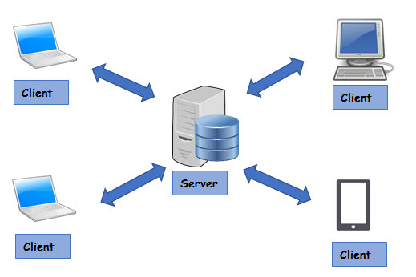
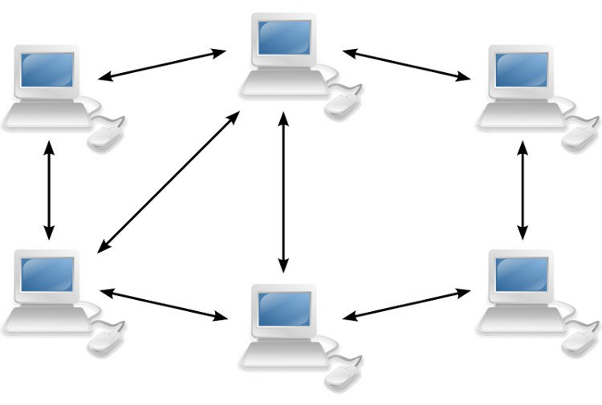

# Tầng ứng dụng

> ## **1,Khái quát** 
- Là tầng đầu tiên trong 4 tầng của mô hình TCP/IP 
- Ứng dụng mạng. Ví dụ:  ứng dụng Web, ứng dụng thư điện tử,...
- Giao thức tầng ứng dụng: là 1 phần quan trọng của ứng dụng mạng

### Mô hình khách hàng - người phục vụ(Client/Server)

 

### Mô hình peer - to - peer(P2P)

 
 

### Mô hình lai 

 

- Một máy chủ làm trung tâm để kiểm soát người sử dụng, thông tin tìm kiếm 
- Các máy khách sẽ liên lạc được với nhau sau khi đăng nhập

> ## **2.Tên miền và dịch vụ tên miền**
