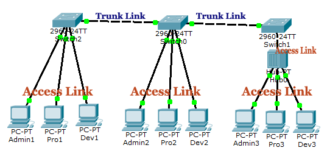
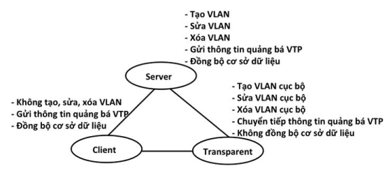

# VLAN- Virtual Local Area Network  
> ## **1,Lý thuyết**
- VLAN:
  - Viết tắt của Virtual Local Area Network 
  - Mạng LAN ảo- Có thể nhóm các cổng chung 1 nhóm và gán vào 1 VLAN tương ứng
  - Giống như những Switch nhỏ trên 1 Switch lớn
  - Được chia trên Switch hỗ trợ chia VLAN
- Các cổng mạng trên Switch được gán cho VLAN1. Khi có nhu cầu chia VLAN người quản trị sẽ chuyển các port vào VLAN tương ứng
- Các VLAN có cùng ID trong các Switch, thiết bị trong VLAN đó có thể tương tác qua lại thông qua cổng đấu nối giữa các Switch. Cổng đó được gọi là cổng trunk, đường đấu nối là trunking.

- Khi Frame của 1 VLAN đi qua đường trunking sẽ được gán thêm 1 tag VLAN để xác định Frame đó là của VLAN ID nào.
- VLAN Trunking:
  - IEEE 802.1q: chuẩn DOT1Q, chuẩn mở, được nhiều hãng sử dụng
  - Cisco Inter-Switch Linl(ISL); là chuẩn Trunking riêng của Cisco
- Vlan Access- Kết nối thiết bị vào VLAN, cho phép truy cập dữ liệu- Kết nối với Access Switch để mở rộng VLAN
- Ưu điểm:
  - Tiết kiệm băng thông do chia nhỏ LAN thành các nhóm nhỏ  
  - Tăng khả năng bảo mật- Dễ dàng thêm hoặc bớt các máy tính vào VLAN  
- Phân loại VLAN
   - VLAN 1: mạng mặc định của các thiết bị chuyển mạng hỗ trợ VLAN, hoạt động ở lớp 2 của mô hình OSI
   - Default VLAN Là kiểu VLAN mặc định ban đầu với tất cả các cổng giao tiếp trên thiết bị chuyển mạch, vì vậy Default VLAN cũng có thể hiểu là VLAN 1, và các VLAN khác như User VLAN, Native VLAN, Management VLAN đều là các thành phần con của Default VLAN.
   - User VLAN (hay Data VLAN) Là VLAN trong đó chứa các tài khoản người dùng thành từng nhóm dựa theo các thuộc tính về đặc thù công việc của từng nhóm làm việc hay theo thuộc tính về vị trí vật lý của các nhóm làm việc này.
   - Native VLAN Là VLAN dùng để cấu hình Trunking do một số thiết bị không tương thích với nhau, lúc này ta phải sử dụng Native VLAN để chúng có thể giao tiếp với nhau. Khi đó, tất cả các khung dữ liệu (frame) của các VLAN khi giao tiếp qua kết nối Trunking đều sẽ được gắn tag của giao thức 802.1Q hoặc ISL, ngoại trừ các frame của VLAN 1. Native VLAN là VLAN mà frame của nó sẽ không được tag trước khi gửi qua đường trunk.
   -  Management VLAN giám sát từ xa các thiết bị chuyển mạch trong hệ thống mạng.

### Dải giá trị VLAN-ID chạy từ 0 – 4095:

	*  1 – 1001 : dải VLAN thường được sử dụng.
	*  1002 – 1005 : dải này dùng để giao tiếp với các kiểu mạng LAN khác.
	* 1006 – 4094: dải VLAN mở rộng, sử dụng khi switch hoạt động ở mode Transparent.
	* 0 và 4095: VLAN dành riêng.
	* VLAN 1, 1002 – 1005: mặc định trên Switch và không thể xóa được.

> ## **2,VTP(Vlan Trunking Protocol)**
VTP giúp cho cấu hình VLAN luôn đồng nhất khi thêm, sửa, xóa thông tin về VLAN trong một hệ thống mạng.Các Switch đồng bộ về tên VLAN và số hiệu VLAN bằng cách cấu hình và quảng bá thông tin VTPVTP hoạt động ở 1 trong 3 chơ chế:  
-  VTP Server: tạo, sửa, xóa VLAN, gửi thông tin quảng bá VTP và đồng bộ cơ sở dữ liệu
- VTP Client:  Không tạo, sửa, xóa VLAN, gửi thông tin quảng bá VTP và đồng bộ cơ sở dữ liệu
- VTP Transperent: tạo, sửa, xóa VLAN, chuyển tiếp thông tin quảng bá VTP, không đồng bộ cơ sở dữ liệu

