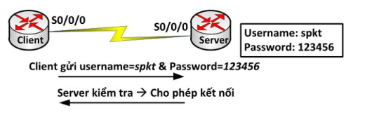
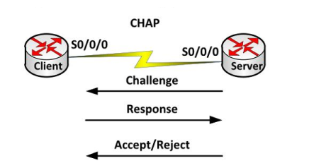

# Tầng liên kết dữ liệu và tầng vật lý
> ## **1.Tầng liên kết dữ liệu**
- Nhiệm vụ:  Chuyển gói dữ liệu tầng mạng giữa 2 nút kế tiếp trên đường truyền.
- Giao thức tầng liên kết dữ liệu gồm: Ethernet, token ring, FDDI và PPP. Ngoài ra còn có ATM và Frame Relay. Các giao thức này được sử dụng để chuyển gói dữ liệu trên môi trường vật lý. Công việc của các giao thức tầng liên kết dữ liệu khi gửi và nhận frame là: phát hiện lỗi, truyền lại, điều khiển lưu lượng và truy cập ngẫu nhiên. Những dịch vụ cung cấp:-
  - Đóng gói dữ liệu(frame) và truy cập đường truyền(link access)
  - Dịch vụ truyền tin cậy: đảm bảo truyền chính xác gói dữ liệu tầng mạng trên một đường truyền.
  - Kiểm soát lưu lượng: Ngăn chặn phía phát gửi quá khả năng nhận của phía thu
  - Phát hiện lỗi: 
  - Sửa lỗi: 

> ##  **2,Giao thức PPP:**
- PPP là một giao thức thường được chọn để triển khai trên một kết nối WAN nối tiếp. PPP có hỗ trợ quá trình xác thực PAP và CHAP
- Quá trình chứng thực trong PPP  
PPP tổ chức gồm 2 giao thức sau:   
*Link Control Protocol (LCP):* sử dụng cho việc thiết lập, cấu hình và kiểm tra kết nối ở tầng liên kết dữ liệu.  
*Network Control Protocol (NCP):* sử dụng cho việc thiết lập và cấu hình các giao thức tầng mạng khác nhau  
- Quá trình thiết lập kết nối PPP  
**Bước 1:** Thiết lập kết nối và thiết lập cấu hình  
**Bước 2:** Quyết định chất lượng kết nối  
**Bước 3:** Thương lượng cấu hình tầng mạng  
**Bước 4:** Kết thúc kết nối  

### Giao thức chứng thực PAP và CHAP
***Chứng thực PPP bằng PAP***  
PAP sử dụng cơ chế bắt tay 2 bước. Đầu tiên Client sẽ gửi username và password cho Server để xác thực. Server sẽ tiến hành kiểm tra, nếu thành công thì sẽ thiết lập kết nối; ngược lại sẽ không thiết lập kết nối với Client.  

Password được gửi dưới dạng không được mã hóa (clear – text) và username/password được gửi đi kiểm tra một lần trước khi thiết lập kết nối.

***Chứng thực PPP bằng CHAP***
- Sử dụng kỹ thuật 3 bước bắt tay (three-way handshake). CHAP được thực hiện ở lúc bắt đầu thiết lập kết nối và luôn được lặp lại trong suốt quá trình kết nối được duy trì.  
- Client muốn thiết lập kết nối với Server, Server gửi một thông điệp “challenge” yêu cầu Client gửi giá trị để Server chứng thực. Thông điệp gửi từ Server có chứa số ngẫu nhiên dùng làm đầu vào cho thuật toán “hash”.  
- Client nhận được thông điệp yêu cầu Server. Nó sẽ sử dụng thuật toán “hash” với đầu vào là hostname, password và ngẫu nhiên vừa nhận được và tính toán ra một giá trị nào đó và gửi giá trị này qua cho Server.  
- Server sẽ kiểm tra danh sách “username” (nếu cấu hình nhiều username) để tìm ra “username” nào giống với hostname của Client. Sau khi tìm được “username” đó, nó dùng thuật toán “hash” để mã hóa password tương ứng và ngẫu nhiên trong thông điệp “challenge” ban đầu mà nó gửi cho Client để tính ra một giá trị nào đó. Và giá trị này sẽ so sánh với giá trị do Client gửi qua, nếu giống nhau thì xác thực thành công; nếu không thành công thì kết nối sẽ bị xóa ngay.  

Mỗi đầu kết nối phải có khai báo username và password. Username bên R1 phải là hostname của R2 và username khai báo bên R2 là hostname của R1, password hai bên phải giống nhau.
