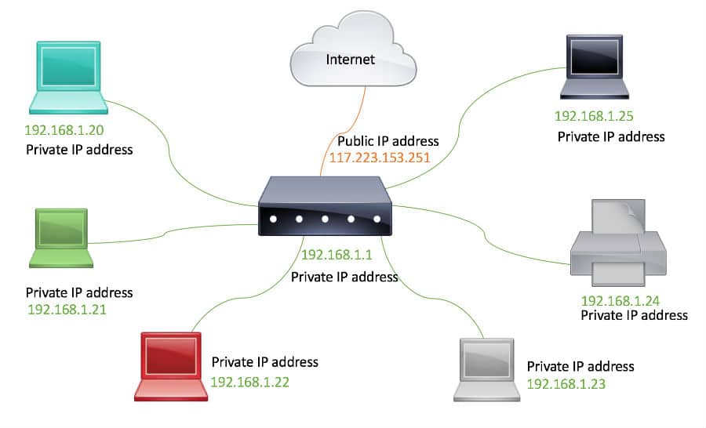
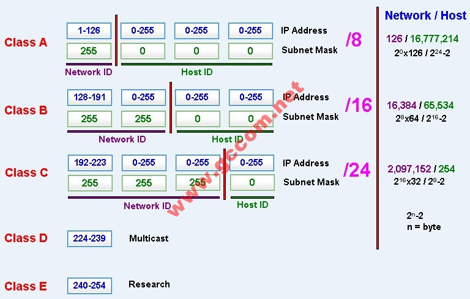
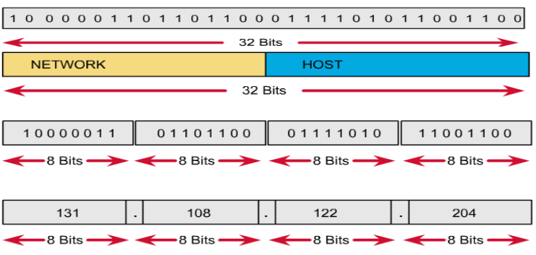
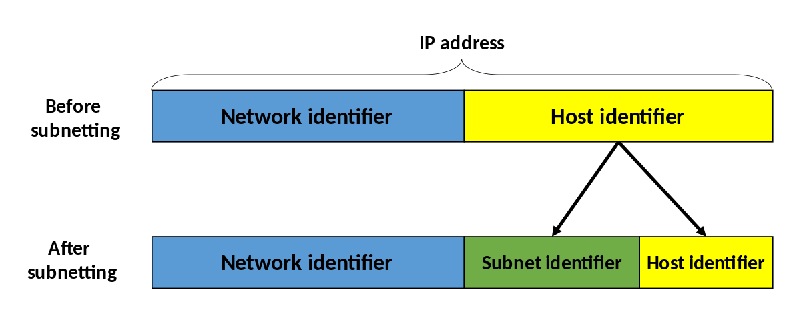

# Địa chỉ IP 

## 1. Địa chỉ IP
- Địa chỉ IP(Internet Protocol) là địa chỉ đơn nhất được gán cho 1 thiết bị trong mạng, có thể là máy tính, máy in,... 
- Các phiên bản: IPv4(32bits) và IPv6(128 bits)   
- Có 2 loại: Private và Publlic  
  - Private IP: địa chỉ nằm trong mạng LAN, sử dụng 3 lớp IP: A,B,C
    - Lớp A: 10.x.x.x
    - Lớp B: 172.16.x.x - 172.31.x.x
    - Lớp C: 192.168.x.x  
  - Public IP: địa chỉ được gán tới mỗi máy tính có kết nối Internet, do nhà cung cấp dịch vụ Internet(ISP) gán nhờ các thiết bị Modem/ASDL, người dùng không thể kiểm soát được.Ngoài ra, IP Loopback --> địa chỉ IP tự trỏ về bản thân nó. Mặc định: 127.0.0.1/localhost.  

    

- IPv4: sử dụng 32 bits, chia thành 4 bộ(octet), mỗi octet 8 bits gồm 2 phần: Net-ID(địa chỉ mạng) và Host-ID(địa chỉ máy)
- Cấu tạo của địa chỉ IP

  Người ta phân địa chỉ IP ra làm 5 lớp (class):

  - Lớp A: gồm các địa chỉ IP có oc-tet đầu tiên mang giá trị nằm trong khoảng từ 1-126. Lớp dành riêng cho địa chỉ của các tổ chức lớn trên thế giới. Lớp A có địa chỉ từ 1.0.0.1 đến 126.0.0.0.
  - Lớp B: gồm các địa chỉ IP có oc-tet đầu tiên mang giá trị nằm trong khoảng từ 128-191. Lớp dành cho tổ chức hạng trung trên thế giới. Lớp B có địa chỉ từ 128.1.0.0 đến 191.254.0.0
  - Lớp C: gồm các địa chỉ IP có oc-tet đầu tiên mang giá trị nằm trong khoảng từ 192-223. Được sử dụng trong các tổ chức nhỏ, trong đó có cả máy tính cá nhân. Lớp C có địa chỉ từ 192.0.1.0 đến 223.255.254.0
  - Lớp D: gồm các địa chỉ IP có oc-tet đầu tiên mang giá trị nằm trong khoảng từ 224-239. Lớp D có 4 bit đầu tiên luôn là 1110. Được dành cho phát các thông tin (multicast/broadcast), có địa chỉ từ 224.0.0.0 đến 239.255.255.255
  - Lớp E: gồm các địa chỉ IP có oc-tet đầu tiên mang giá trị nằm trong khoảng từ 240-255. Lớp E có 4 bit đầu tiên luôn là 1111. Được dành riêng cho việc nhiên cứu, có địa chỉ từ 240.0.0.0 đến 254.255.255.255
  - Loopback : địa chỉ 127.x.x.x được dùng riêng để kiểm tra vòng lặp quy hồi (loopback).  
  
  Trong thực tế, chỉ có các địa chỉ lớp A,B,C là được dùng để cài đặt cho các nút mạng. Địa chỉ lớp D được dùng trong một vài ứng dụng dạng truyền thông đa phương tiện. Riêng lớp E vẫn còn nằm trong phòng thí nghiệm và dự phòng.

      

      

- Static IP  
  - Các thiết bị có cùng Net-ID thì có thể liên lạc được với nhau mà không cần thông qua 1 thiết bị Router nào  
  - Ngược lại, với các thiết bị có Net-ID khác nhau muốn giao tiếp được phải gửi khai báo Default Gateway về Router.

## 2. Subnetmask
- Subnet mask: Subnet mask là các số dạng 32 hoặc 128 bit dùng để phân đoạn địa chỉ IP đang tồn tại trên mạng TCP / IP, chia địa chỉ đó thành địa chỉ network và địa chỉ host riêng biệt. Quá trình subnetting có thể chia nhỏ hơn nữa phần host của một địa chỉ IP thành các subnet phụ để định tuyến lưu lượng trong các subnet lớn hơn.

  

  Các bit nhị phân đại diện cho một mạng được biểu diễn bằng số 1 trong subnet mask và các bit đại diện cho một máy chủ là các số 0. Sử dụng subnet mask sẽ giúp router không phải xử lý toàn bộ 32 bit mà chỉ cần nhận diện những bit đã được lựa chọn.

- Lợi ích của việc chia subnet:
  - Giảm giao dịch trên mạng: lúc này router sẽ kiểm soát các gói tin trên mạng – chỉ có gói tin nào có địa chỉ đích ở ngoài mới đựoc chuyển ra
  - Quản lý đơn giản hơn và nếu có sự cố thì cũng dễ kiểm tra và xác định đựơc nguyên nhân gây lỗi hơn là trong một mạng lớn.

## 3. Định nghĩa, nguyên tắc hoạt động của NAT
- Là kỹ thuật để biên dịch địa chỉ Private thành địa chỉ Public(thay đổi địa chỉ được dùng bên trong một mạng sang địa chỉ công cộng)  
- NAT làm việc như 1 router, công việc của nó là chuyển tiếp các gói tin(packets) giữa các lớp mạng khác nhau trên một mạng lớn.  
- NAT sử dụng địa chỉ IP của chính nó cho mỗi máy con(Client)

### **NAT giải quyết những vấn đề nào?**

    – Ban đầu, NAT được đưa ra nhằm giải quyết vấn đề thiếu hụt địa chỉ của IPv4.  
    – NAT giúp chia sẻ kết nối Internet (hay 1 mạng khác) với nhiều máy trong LAN chỉ với 1 IP duy nhất.  
    – NAT che giấu IP bên trong LAN  
    – NAT giúp quản trị mạng lọc các gói tin được gửi đến hay gửi từ một địa chỉ IP và cho phép hay cấm truy cập đến một port cụ thể.  

### **Các khái niệm cơ bản.**

***1. Inside local address*** – Địa chỉ IP được gán cho một host của mạng trong. Đây là địa chỉ được cấu hình như là một tham số của hệ điều hành trong máy tính hoặc được gán một cách tự động thông qua các giao thức như DHCP. Địa chỉ này không phải là những địa chỉ IP hợp lệ được cấp bởi NIC (Network Information Center) hoặc nhà cung cấp dịch vụ Internet  

***2. Inside global address*** – Là một địa chỉ hợp lệ được cấp bởi NIC hoặc một nhà cung cấp dịch vụ trung gian. Địa chỉ này đại diện cho một hay nhiều địa chỉ IP inside local trong việc giao tiếp với mạng bên ngoài.  

***3. Outside local address*** – Là địa chỉ IP của một host thuộc mạng bên ngoài, các host thuộc mạng bên trong sẽ nhìn host thuộc mạng bên ngoài thông qua địa chỉ này. Outside local không nhất thiết phải là một địa chỉ hợp lệ trên mạng IP (có thể là địa chỉ private).  

***4. Outside global address*** – Là địa chỉ IP được gán cho một host thuộc mạng ngoài bởi người sở hữu host đó. Địa chỉ này được gán bằng một địa chỉ IP hợp lệ trên mạng Internet  

### **Các kỹ thuật NAT**
- ***Static NAT - NAT tĩnh***  
  Nat tĩnh hay còn gọi là Static NAT là phương thức NAT một đổi một. Nghĩa là một địa chỉ IP cố định trong LAN sẽ được ánh xạ ra một địa chỉ IP Public cố định trước khi gói tin đi ra Internet. Phương pháp này không nhằm tiết kiệm địa chỉ IP mà chỉ có mục đích ánh xạ một IP trong LAN ra một IP Public để ẩn IP nguồn trước khi đi ra Internet làm giảm nguy cơ bị tấn công trên mạng.    

   Phương án này có nhược điểm là nếu trong LAN có bao nhiêu IP muốn đi ra Internet thì ta phải có từng đó IP Public để ánh xạ. Do vậy phương án NAT tĩnh chỉ được dùng với các máy chủ thuộc vùng DMZ với nhiệm vụ Public các Server này lên Internet.  

- ***Dynamic NAT-NAT động***  
  Nat động (Dynamic NAT) là một giải pháp tiết kiệm IP Public cho NAT tĩnh. Thay vì ánh xạ từng IP cố định trong LAN ra từng IP Public cố định. LAN động cho phép NAT cả dải IP trong LAN ra một dải IP Public cố định ra bên ngoài.
