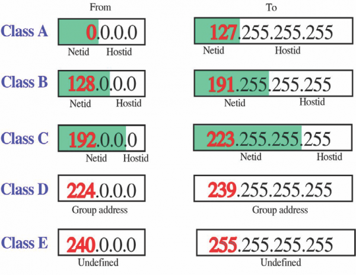

# Địa chỉ IP 

> ## **1,Địa chỉ IP**  
- Địa chỉ IP(Internet Protocol) là địa chỉ đơn nhất được gán cho 1 thiết bị có kết nối đến mạng.  
- Các phiên bản: IPv4(32bits) và IPv6(128 bits)   
- Có 2 loại: Private và Publlic  
  - Private IP: địa chỉ nằm tring mạng LAN, sử dụng 3 lớp IP: A,B,CLớp A: 10.x.x.xLớp B: 172.16.x.x-172.31.x.xLớp C: 192.168.x.x  
  - Public IP: địa chỉ được gán tới mỗi máy tính có kết nối Internet, do nhà cung cấp dịch vụ Internet(ISP) gán nhờ các thiết bị Modem/ASDL, người dùng không thể kiểm soát được.Ngoài ra, IP Loopback --> địa chỉ IP tự trỏ về bản thân nó. Mặc định: 127.0.0.1/localhostNAT - được sử dụng để chuyển đổi giữa IP Private và IP Public  
- IPv4: sử dụng 32 bits, chia thành 4 bộ(octet) 8 bits. Gồm 2 phần: Net-ID(xác định mạng mà thiết bị kết nối) và Host-ID(xác định thiết bị của mạng)  
- Subnet mask: đi kèm với địa chỉ IPv4, xác định phần "Net-ID" của địa chỉ đó. Subnet mask cũng là 1 dải 32 bits chia ra 4 bộ 8 bits như địa chỉ IP. Bao gồm các bit 1 và phần còn lại là bit 0. Subnet mask có bao nhiêu bit 1 thì địa chỉ IP sẽ có bấy nhiêu bit phần "Net-ID".  
Các máy tính cùng "Net-ID" thì mặc định là liên lạc được với nhau.  
- Các lớp địa chỉ IP(5 lớp): A,B,C,D,E   
    + Lớp A: gồm các địa chỉ IP có oct đầu trong khoảng 1-126. Ví dụ: 10.10.3.1/8  
    + Lớp B: gồm các địa chỉ có oct đầu trong khoảng 129-191. Ví dụ: 126.43.22.100/16  
    + Lớp C: gồm các địa chỉ có oct đầu trong khoảng 192-223. Ví dụ: 192.168.1.5/24  
    + Lớp D : gồm các địa chỉ có oct đầu trong khoảng từ 224-239    
    + Lớp E: gồm các địa chỉ có oct đầu trong khoảng từ 240-255.

      

      

- Static IP  
  - Các thiết bị có cùng Net-ID thì có thể liên lạc được với nhau mà không cần thông qua 1 thiết bị Router nào  
  - Ngược lại, với các thiết bị có Net-ID khác nhau muốn giao tiếp được phải gửi khai báo Default Gateway về Router.

> ## **2,Định nghĩa, nguyên tắc hoạt động của NAT**  
- Là kỹ thuật để biên dịch địa chỉ Private thành địa chỉ Public(thay đổi địa chỉ được dùng bên trong một mạng sang địa chỉ công cộng)  
- NAT làm việc như 1 router, công việc của nó là chuyển tiếp các gói tin(packets) giữa các lớp mạng khác nhau trên một mạng lớn.  
- NAT sử dụng địa chỉ IP của chính nó cho mỗi máy con(Client)

  ### **NAT giải quyết những vấn đề nào?**

    – Ban đầu, NAT được đưa ra nhằm giải quyết vấn đề thiếu hụt địa chỉ của IPv4.  
    – NAT giúp chia sẻ kết nối Internet (hay 1 mạng khác) với nhiều máy trong LAN chỉ với 1 IP duy nhất.  
    – NAT che giấu IP bên trong LAN  
    – NAT giúp quản trị mạng lọc các gói tin được gửi đến hay gửi từ một địa chỉ IP và cho phép hay cấm truy cập đến một port cụ thể.  

   ### **Các khái niệm cơ bản.**

***1. Inside local address*** – Địa chỉ IP được gán cho một host của mạng trong. Đây là địa chỉ được cấu hình như là một tham số của hệ điều hành trong máy tính hoặc được gán một cách tự động thông qua các giao thức như DHCP. Địa chỉ này không phải là những địa chỉ IP hợp lệ được cấp bởi NIC (Network Information Center) hoặc nhà cung cấp dịch vụ Internet  

***2. Inside global address*** – Là một địa chỉ hợp lệ được cấp bởi NIC hoặc một nhà cung cấp dịch vụ trung gian. Địa chỉ này đại diện cho một hay nhiều địa chỉ IP inside local trong việc giao tiếp với mạng bên ngoài.  

***3. Outside local address*** – Là địa chỉ IP của một host thuộc mạng bên ngoài, các host thuộc mạng bên trong sẽ nhìn host thuộc mạng bên ngoài thông qua địa chỉ này. Outside local không nhất thiết phải là một địa chỉ hợp lệ trên mạng IP (có thể là địa chỉ private).  

***4. Outside global address*** – Là địa chỉ IP được gán cho một host thuộc mạng ngoài bởi người sở hữu host đó. Địa chỉ này được gán bằng một địa chỉ IP hợp lệ trên mạng Internet  

### **Các kỹ thuật NAT**
- ***Static NAT - NAT tĩnh***  
  Nat tĩnh hay còn gọi là Static NAT là phương thức NAT một đổi một. Nghĩa là một địa chỉ IP cố định trong LAN sẽ được ánh xạ ra một địa chỉ IP Public cố định trước khi gói tin đi ra Internet. Phương pháp này không nhằm tiết kiệm địa chỉ IP mà chỉ có mục đích ánh xạ một IP trong LAN ra một IP Public để ẩn IP nguồn trước khi đi ra Internet làm giảm nguy cơ bị tấn công trên mạng.    

   Phương án này có nhược điểm là nếu trong LAN có bao nhiêu IP muốn đi ra Internet thì ta phải có từng đó IP Public để ánh xạ. Do vậy phương án NAT tĩnh chỉ được dùng với các máy chủ thuộc vùng DMZ với nhiệm vụ Public các Server này lên Internet.  

- ***Dynamic NAT-NAT động***  
Nat động (Dynamic NAT) là một giải pháp tiết kiệm IP Public cho NAT tĩnh. Thay vì ánh xạ từng IP cố định trong LAN ra từng IP Public cố định. LAN động cho phép NAT cả dải IP trong LAN ra một dải IP Public cố định ra bên ngoài.
