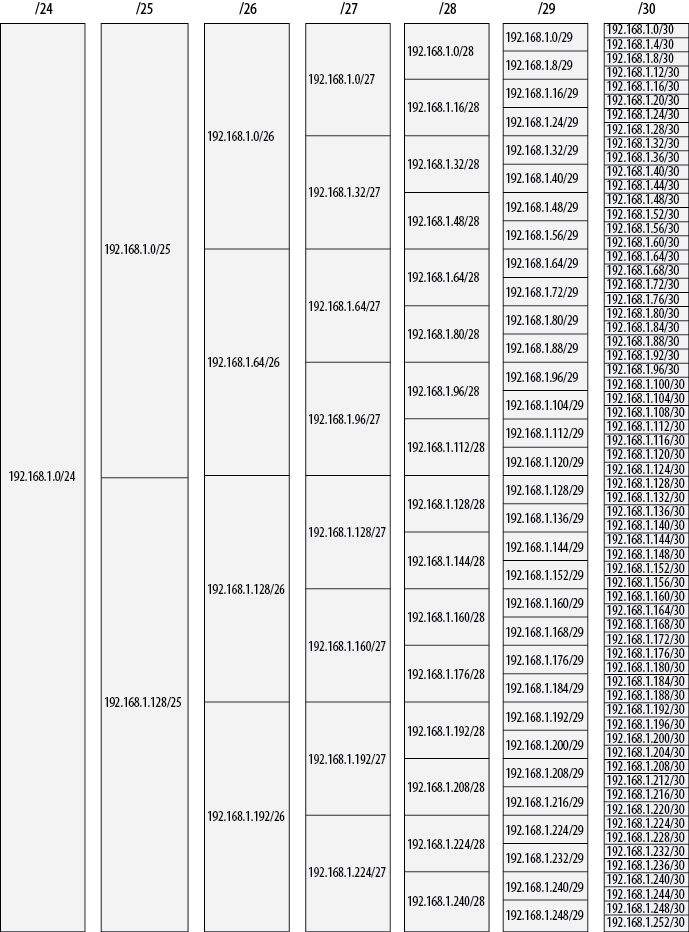
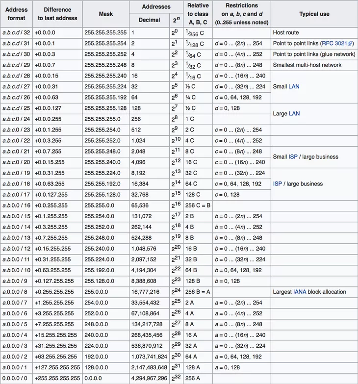

# Định tuyến không theo lớp địa chỉ

> ## **1,VLSM(Veriable Length Subnet Masking)**
- VLSM Kĩ thuật được dùng để chia subnet  

Ví dụ bảng chia dải 192.168.1.0/24

> ## **2,CIDR(Classless Interdomain ROuting)**
- CIDR là một lược đồ địa chỉ IP giúp phân bổ địa chỉ IP. Có cấu trúc giống như 1 địa chỉ IPv4

> # **`TÀI LIỆU THAM KHẢO`**  
- https://cuongquach.com/tu-hoc-ccna-phuong-phap-chia-mang-con-vlsm.html  
- https://www.keycdn.com/support/what-is-cidr

