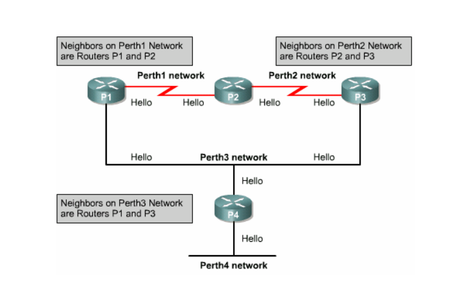
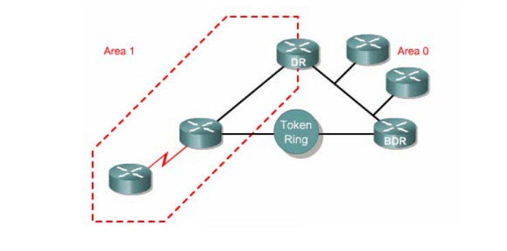
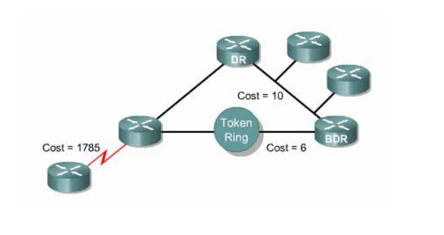
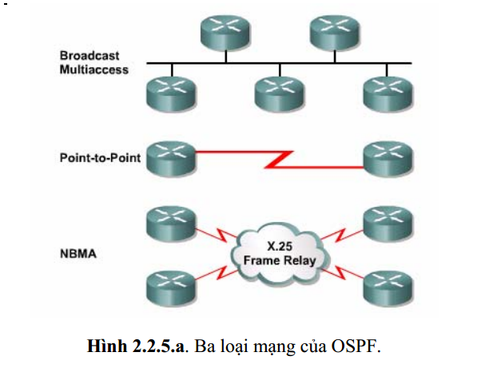
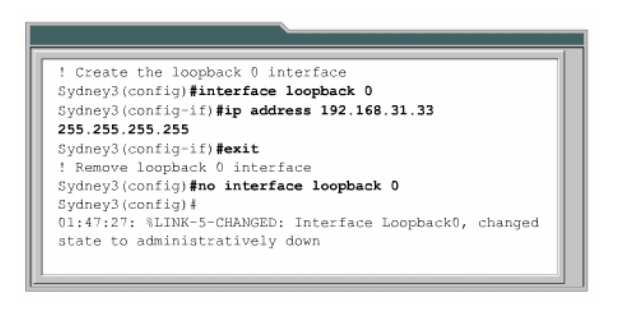

## **Những vấn đề của định tuyến theo vecto khoảng cách**  
   - Router sử dụng giao thức định tuyến theo vecto khoảng cách học thông tin định tuyến bằng cách cập nhật bảng định tuyến của các router láng giềng.
   - Cách cập nhật theo định kỳ này chiếm băng thông cao và cách học thông tin định tuyến như vậy làm cho tốc độ hội tụ mạng chậm. 

> ## **1,Đặc điểm của giao thức định tuyến theo trạng thái đường liên kết**  
- Giao thức định tuyến theo trạng thái đường liên kết thu thập thông tin từ tất cả các router khác trong cùng 1 hệ thống mạng hoặc một vùng đã được xác định. Khi các thông tin đã được thu thập đầy đủ thì các router sẽ tự tính toán để tìm ra đường đi tốt nhất của nó đến mạng đích trong hệ thống mạng.
- Hoạt  động của giao thức định tuyến theo trạng thái đường liên kết:  
  - Mỗi router sẽ gửi multicast gói Hello tới các router láng giềng. Gói Hello mang thông tin về các mạng được kết nối trực tiếp vào router.  

  

  

   - Sử dụng thuật toán SPF để tính toán và tìm ra đường đi ngắn nhất đến từng mạng.  
   - Lưu kết quả chọn đường trong bảng định tuyến.
 
> ## **2,Giao thức OSPF**
- Giao thức OSPF là một trong những giao thức quan trọng nhất của loại giao thức định tuyến theo trạng thái đường link được triển khai dựa trên các chuẩn mở.  
- Hoạt động của giao thức OSPF
  - Chọn Router-ID(giá trị duy nhất dùng để định danh cho các router chạy OSPF trong cùng 1 phân vùng, có định dạng là 1 địa chỉ IP). Mặc định tiến trình OSPF trên router sẽ bầu chọn địa chỉ IP cao nhất trên các cổng đang active, ưu tiên cổng loopack.    

    Có một cách khác để thiết lập lại giá trị router – id là sử dụng câu lệnh “router-id” để thiết lập bằng tay giá trị này trên router:  

    `Router (config) # router ospf 1`  
    `Router (config-router) # router-id A.B.C.D`

    Bên cạnh đó, nếu tiến trình OSPF đã chạy và router – id đã được thiết lập trước đó, ta phải khởi động lại tiến trình OSPF thì mới áp dụng được giá trị router – id mới được chỉ ra trong câu lệnh “router – id”. Câu lệnh khởi động lại tiến trình OSPF:

    `Router (config) # clear ip ospf proccess`  
  `Reset ALL OSPF proccess? [no]: yes`  
   - Thiết lập quan hệ láng giềng: router chạy OSPF sẽ gửi gói tin Hello tới tất cả các cổng chạy ospf, mặc định 10s/lần. Gói tin này được gửi đến địa chỉ multicast dành riêng cho ospf là 224.0.0.5, đến tất cả các router chạy ospf khác trên cùng 1 phân đoạn mạng. Mục đích của gói tin Hello là giúp các router tìm kiếm, thiết lập và duy trì quan hệ láng giềng.  
   - Trao đổi LSDB(Link State Database): LSDB là một tấm bản đồ mạng và router sẽ căn cứ vào đó để xác định bảng định tuyến. LSDB giống nhau giữa tất cả các router cùng vùng. Các router sẽ không trao đổi với nhau cả bảng LSDB mà sẽ trao đổi với nhau từng đơn vị thông tin gọi là LSA(Link State Advertisement). Các đơn vị thông tin này lại được chứa trong các gói tin cụ thể LSU(Link State Update) mà các router sẽ trực tiếp trao đổi với nhau.  
   - Tính toán xây dựng bảng định tuyến:   
   Metric = cost = 10^8/bandwidth (đơn vị bps)    
   Ethernet (BW = 10Mbps) → cost = 10   
   Fast Ethernet (BW = 100Mbps) → cost = 1  
   Serial (BW = 1.544Mbps) → cost = 64 
> ## **3,Thuật ngữ của OSPF**    
- Link - một cổng trên Router, Link state: trạng thái của 1 đường liên kết giữa 2 router, bao gồm trạng thái của 1 cổng trên router và mối quan hệ giữa nó với router láng giềng kết nối vào cổng đó.  

   

 -  Link-state database (Topolological  database) – danh sách các thông tin về mọi đường liên kết trong vùng.   
    
 - Area - tập hợp các mạng và các router có cùng chỉ số danh định vùng. Mỗi router trong 1 vùng chỉ xây dựng cơ sở dữ liệu về trạng thái các đường liên kết trong vùng đó. Các router trong 1 vùng sẽ có trạng thái liên kết giống nhau trong vùng đó. Các router  trong cùng một vùng được gọi là router nội vùng.  
    
 - Cost -  giá trị chi phí đặt cho một đường liên kết. Giao thức định tuyến theo trạng thái đường liên kết tính chi phí dựa trên băng thông và tốc độ của đường liên kết đó.  
   
 - Routing table - bảng định tuyến là kết quả của thuật toán chọn đường dựa trên cơ sở dữ liệu về trạng thái các đường liên kết.  
   
 - Adjacency database – danh sách các router láng giềng có mối quan hệ hai chiều. Mỗi router sẽ có một danh sách khác nhau.   
   
 - Design Router (DR) và Backup Designated Router (BDR) là router được tất cả các router khác trong cùng một mạng LAN bầu ra làm đại diện. Mỗi một mạng sẽcó một DR va BDR riêng.  

   

> ## **4,Các loại mạng OSPF**    
Giao tiếp OSPF nhận biết 3 loại mạng:
- Mạng quảng bá đa truy cập, ví dụ như Ethernet
- Mạng điểm nối điểm
- Mạng không quảng bá đa truy cập (NBMA-Nonbroadcast multi-access), ví dụ như Frame Relay.
Mạng thứ 4 là mạng điểm đến nhiều điểm có thể được người quản trị mạng cấu hình cho 1 cổng trên Router   

 

> ## **5,Các bước hoạt động của OSPF**   

 - Bước 1: Phát hiện các router láng giềng. 

  

 - Bước 2: Bầu chọn DR và BDR
 - Bước 3: Áp dụng thuật toán SPF vào bảng cơ sở dữ liệu để chọn đường đi tốt nhất.

> ## **6,Cấu hình OSPF** 
- Cấu hình tiến trình định tuyến OSPF 
   - Khởi động định tuyến OSPF  
`Router (config)#router ospf  process-id`   
Process-id là chỉ số xác định tiến trình định tuyến OSPF trên router. Có thể khởi động nhiều tiến trình OSPF trên cùng một router. Chỉ số này có thể là bất kỳ
giá trị nào trong khoảng từ 1 đến 65.535.   
    - Khai báo địa chỉ mạng cho OSPF   
`Router(config-router)#network address wildcard-maskarea area-id `
- Cấu hình địa chỉ loopback cho OSPF và quyền ưu tiên cho router 
    
   - Tạo cổng loopback và đặt địa chỉ IP cho nó  
   `Router (config)#interface loopback number`  
`Router (config-if)#ip address  ip-address subnet-mask`  
  

 Cổng loopback chỉ là một cổng phần mềm. Để xoá cổng loopback dùng dạng no của câu lệnh tạo cổng.   
  - Trong mạng quảng bá đa truy cập có nhiều hơn 2 router do đó OSPF bầu ra 1 router đại diện(DR-Designated Router) làm điểm tập trung tất cả các thông tin quảng cáo và cập nhật trạng thái các đường liên kết. BDR là router đại diện dự phòng. Việc bầu chọn này dựa trên giá trị OSPF ưu tiên của các router, khi các giá trị này bằng nhau thì sẽ xét đến giá trị Router ID, router nào có giá trị ID lớn nhất sẽ được chọn. Có thể thay đổi giá trị ưu tiên của router kết nối vào mạng để thay đổi kết quả bầu chọn DR. Giá trị ưu tiên nằm trong khoảng 0-255, giá trị 0 sẽ làm cho router không được chọn.  

  `Router(config-if)#ip ospf priority number`  
  
`Router#show ip ospf interfacetype number`  

   
- Thay đổi giá trị chi phí của OSPF.    

  - Cấu hình băng thông đúng cho cổng của 
router. 

      `Router (config)#interface serial 0/0`  
       `Router(config-if)#bandwidth 64 `  
Giá trị băng thông mặc định của cổng Serial Cisco là 1,544Mbps hay 1544kbs 
   - Cài đặt giá trị chi phí cho cổng:  
   
`Router (config-if)#ip ospf cost number`   

  

- Cấu hình quá trình xác minh cho OSPF  
   - Câu lệnh để cấu  hình mật mã xác minh cho một cổng OSPF:   
   `Router (config-if)#ip ospf authentication-key password `
   - Sau khi cấu hình mật mã xong, bạn cần bật chế độ xác minh cho OSPF:   
`Router(config-router)#areaarea-numberauthentication`  
   - Với cơ chế xác minh đơn giản trên, mật mà được gửi đi dưới dạng văn bản. Do đó nó dễ dàng được giải mã nếu gói OSPF bị những kẻ tấn công bắt được. Chính vì vậy các thông tin xác minh nên được mật mã lại. Để đảm bảo an toàn hơn và thực hiện mật mã thông tin xác minh, bạn nên cấu hình mật mã message-digest bằng câu lệnh dưới trên cổng tương ứng của router.  
   `Router( config-ì)#ip ospf message-digest-key  key-id encryption-type md5 key `   
   key-id là một con số danh định có giá trị từ 1 đến 255. Tham số **key** là phần khai báo mật mã có thể dài tới 16 kí tự. Các router láng giềng phải có cùng giá trị *key-id* và *key*
   - Sau khi cấu hình mật mã MD5 xong bạn cần bật chế độxác minh message-digest trong OSPF:  
   `Router(config-router)#areaarea-id authentication message-digest `    

     

- Cấu hình các thông số thời gian của OSPF:
Mặc định thời gian bất động gấp 4 lần thời gian Hello. Trong mạng OSPF quảng bá, khoảng thời gian Hello mặc định là 10s, khoảng thời gian bất động mặc định là 40s. Trong mạng không quảng bá, khoảng thời gian Hello mặc định là 30s, thời gian bất động mặc định là 120s.   
Câu lệnh thay đổi cấu hình mặc định:   
`Router (config-if)#ipospf hello-interval seconds`  
`Router (config-if)#ip ospf dead-interval seconds`   

   

- OSPF thực hiện quảng bá đường mặc định   
Định tuyến OSPF đảm bảo các con đường tới mạng đích trong hệ thống không bị lặp vòng. Để đến được các mạng nằm ngoài hệ thống thì OSPF cần phải biết về mạng đó hoặc là phải có đường mặc định.  
Trên router có cổng kết nối ra ngoài, bạn cấu hình mặc định bằng câu lệnh sau  

`Router (config)#ip route 0.0.0.0 0.0.0.0 [interface | next-hop address ]`   
Sau khi cấu hình đường mặc định xong, bạn cấu hình cho OSPF chuyển thông tin về đường mặc định cho mọi router khác trong vùng OSPF:   
`Router (config-router) #default – information originate `  
 - Các lệnh show dùng để kiểm tra cấu hình OSPF  
   -  ***Show ip protocol:*** Hiển thịcác thông tin vềthông sốthời gian, thông số định tuyến, mạng định tuyến và nhiều thông tin khác của tất cả các giao thức định tuyến đang hoạt động trên router.   
   - ***Show ip route:*** Hiển thịbảng định tuyến của router, trong đó là danh sách các đường tốt nhất đến các mạng đích của bản thân router và cho biết router học được càng đường đi này bằng cách nào    
   - ***Show ip ospf interface:*** Lệnh này cho biết cổng của router đã được cấu hình đúng với vùng mà nó thuộc về hay không. Nếu cổng loopback không được cấu hình thì ghi địa chỉ IP của cổng vật lý nào có giá trị lớn nhất sẽ được chọn làm router ID. Lệnh này cũng hiển thị khoảng thời gian Hello và khoảng thời gian bất động trên cổng đó đồng thời cho biết các router láng giềng thân mật kết nối vào cổng đó.  
   - ***Show ip ospf:*** Lệnh này cho biết số lần đã sử dụng thuật toán SPF, đồng thời cho biết khoảng thời gian cập nhật khi mạng không có gì thay đổi.  
   - ***Show ip ospf neighbor detail:*** Liệt kê các chi tiết láng giềng, giá trị ưu tiên của chúng và trạng thái của chúng.  
   - ***Show ip ospf database:*** Hiển thị nội dung về cơ sở dữ liệu về cấu trúc hệ thống mạng trên router, đồng thời cho biết router ID, ID của tiến trình OSPF.  

- Các lệnh clear và debug dùng đểkiểm tra hoạt động OSPF.   

  

 

 

> # **`TÀI LIỆU THAM KHẢO`**  
- https://tailamblog.wordpress.com/2017/08/11/cac-lsa-types-trong-ospf/  
- https://vnpro.vn/thu-vien/cau-hinh-dinh-tuyen-dong-ospf-2351.html  
- https://nguyenvcuong.blogspot.com/2012/05/ospf-desginated-and-backup-designated.html