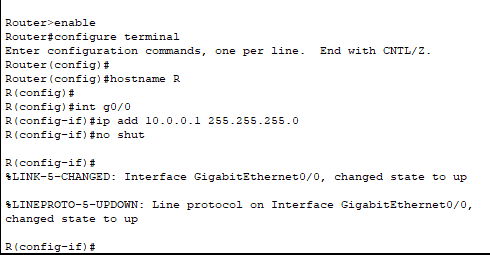
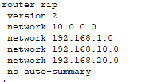
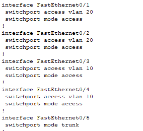

# Cấu hình DHCP  
> ## Mô hình bài lab cấu hình DHCP trên Router để cấp IP cho các PC trong LAN  

  

> ### Cấu hình  
- Cấu hình Router cấp IP động: 
  - Trên Router:
    - Cấu hình cơ bản cho Router : đặt IP 

     

    ``` 
    Code:  
    Router(config)#interface g0/0  
    Router(config-if)#ip address 10.0.0.1 255.255.255.0   
    Router(config-if)#no shutdown  
    ```   

    - Bật dịch vụ DHCP:    

    ```  
    Router(config)#service dhcp
    ``` 
    - Tạo 1 pool để cấp IP cho client     

    ```  
    Router(config)#ip dhcp pool Network_10 <-- đặt tên cho pool cấp IP  
    Router(dhcp-config)#network 10.0.0.0 255.255.255.0
    Router(dhcp-config)#default-router 10.0.0.1
    Router(dhcp-config)#dns-server 8.8.8.8  
    ```  
    - Taọ 1 dải Ip loại trừ, IP này sẽ không được cấp cho các Client, nó được dùng để cấp cho các Server.
    ```  
    Router(config)#ip dhcp excluded-address 10.0.0.1 10.0.0.10 // dải IP này sẽ không được cấp cho các client  
    ```
    - Xem lại cấu hình DHCP  
    ```  
    Router(config)#show ip dhcp binding  
    ```  

> ## Mô hình bài lab cấu hình cấp địa chỉ IP từ DHCP Server  
<center></center>  

> ### Cấu hình  
- Khai báo nhóm địa chỉ IP trong tab DHCP của máy chủ như hình: 

  
 
 - Cấu hình trên Router 0   
 ```  
 interface GigabitEthernet0/0
 ip address 192.168.1.2 255.255.255.0
 duplex auto
 speed auto
!
interface GigabitEthernet0/0.10
 encapsulation dot1Q 10
 ip address 192.168.10.1 255.255.255.0
 ip helper-address 172.16.24.2
!
interface GigabitEthernet0/0.20
 encapsulation dot1Q 20
 ip address 192.168.20.1 255.255.255.0
 ip helper-address 172.16.24.2
!
interface GigabitEthernet0/1
 ip address 10.6.8.1 255.255.255.252  
 ``` 
 <center></center>  

 ```  
 router rip
 version 2
 network 10.0.0.0
 network 192.168.1.0
 network 192.168.10.0
 network 192.168.20.0
 no auto-summary  
 ```   
  <center></center>  

  - Cấu hình trên Router 1:  
  ```  
  interface GigabitEthernet0/0
 ip address 10.6.8.2 255.255.255.252
 duplex auto
 speed auto
!
interface GigabitEthernet0/1
 ip address 172.16.24.1 255.255.255.0
 ip helper-address 172.16.24.2
 duplex auto
 speed auto  
 ```  

 <center> </center>  

 ```  
 router rip
 version 2
 network 10.0.0.0
 network 172.16.0.0
 network 192.168.10.0
 network 192.168.20.0
 no auto-summary  
 ```  

 <center></center>  

 - Cấu hình trên Switch  
 ```  
 interface FastEthernet0/1
 switchport access vlan 20
 switchport mode access
!
interface FastEthernet0/2
 switchport access vlan 20
 switchport mode access
!
interface FastEthernet0/3
 switchport access vlan 10
 switchport mode access
!
interface FastEthernet0/4
 switchport access vlan 10
 switchport mode access
!
interface FastEthernet0/5
 switchport mode trunk  
 ```  
  
  <center>  

  


​

  

  
    
  
   

    


