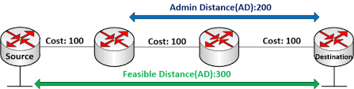

# EIGRP - Enhanced Interior Gateway Routing Protocol
> ## **1,Đặc điểm**
- Là một giao thức định tuyến độc quyền của Cisco.  
- Có hỗ trợ định tuyến không liên miền(CIDR) và VLSM.  
- Thường được xem là giao thức lai vì nó kết hợp các ưu điểm của cả 2 giao thức định tuyến theo vecto khoảng cách và định tuyến theo trạng thái đường liên kết.  
> ## **2,Các khái niệm và thuật ngữ của EIGRP**  
- ***EIGRP có 3 loại bảng:***  
   - **Bảng láng giềng(Neighbor Table):** là bảng quan trọng nhất của EIGRP, mỗi router lưu giữ một bảng láng giềng trong đó là các router thân mật với nó.  
   - **Bảng cấu trúc mạng(Topology Table):** Router lưu lại các bảng Neighbor, Sau đó  nó sẽ sử dụng một thuật toán DUAL (Diffusing Update Algorithm) để tính rồi đưa ra đường đi tốt nhất. Khi có đường đi tốt nhất nó sẽ gửi sang bảng Router table.  
   - **Routing Table:** làm nhiệm vụ định tuyến. Nó định tuyến rất nhanh vì đã có thông tin sẵn được Topology gửi sang.  
- ***Thuật toán DUAL - Diffusing Update Algorithm:***  
   - Thuật toán để tính toán đường đi và chống loop; thời gian hội tụ nhanh; sử dụng băng thông tối thiểu cho bản tin update; tìm kiếm những tuyến đường backup mà có thể sử dụng ngay khi mạng có vấn đề.    
    - Những thuật ngữ trong DUAL.
      - Reported Distance: là giá trị từ router láng giềng đến mạng đích.  
      - Successor: là tuyến đường có chi phí thấp nhất tới đích.  
      - Feasible Successor: là tuyến đường backup cho successor đến cùng một mạng đích. 
      - Feasibility Distance: là tuyến đường có metric thấp nhất để đến đích.  

      <center>  

> ## **3,Nguyên lý hoạt động**  
- Neighbor: Các Router sẽ định kì 5s gửi gói tin Hello / thời gian giữ gói tin hello là 15s (holdtimer). Sau 15s nó coi hàng xóm là chết. Hello và Holdtime ở 2 cổng kết nối 2 Router không cần phải giống nhau (OSPF phải giống).  
- Router sẽ trao đổi 5 bản tin là:  Hello, Reply, Request, update, ACK  
  - **Gói tin Hello:**là đưa ra lời chào trước rồi mới thương thảo. Thiết lập mối quan hệ hàng xóm giữa các Router chạy EIGRP. Chỉ khi quan hệ này được thiết lập các rouer này mới gửi định tuyến cho nhau.
  - **Gói Reply:** Trả lời lại để xác nhận thông tin  
  - **Gói Request:** Gửi yêu cầu cập nhật bảng Neighbor  
  - **Gói Update:** Cập nhật thông tin các bảng Neighbor  
  - **Gói ACK:** EIGRP dùng giao thức vận chuyển tin cậy   (Reliable Transprot Protocol - RTP) để gửi thông điệp cập nhật. EIGRP gửi cập nhật, chờ thông tin xác nhận ACK từ mỗi router nhận. Nếu một ACK không nhận được sau 16 lần truyền lại, Router láng giềng sẽ coi như bị chết. (Acknowledgement)  

> ## **4,Tính toán Metric với EIGRP**  
- Công thức:  
```
metric = ([K1 * bandwidth + (K2 * bandwidth) / (256 - load) + K3 * delay] * [K5 / (reliability + K4)]) * 256  
```
  *Trong đó:*
   - `Bandwitdh` ( băng thông ) đơn vị là `kbps`  
   - `Delay` ( độ trễ ) đơn vị là `10 microsecond`
   - `Load` ( khả năng truyền tải ) , `Reliability` ( độ tin cậy ) là các đại lượng vô hướng không có đơn vị .
   - Giá trị k mặc định là `k1 = k3 = 1` ; `k2 = k4 = k5 = 0`

==> Công thức mặc định:  
     `metric = bandwidth + delay`  

   <center></center> 

> ## **5,Cấu trúc lệnh** 
- Kích hoạt giao thức **EIGRP**  
   ```  
   Router(config) # router eigrp [autonomous-system]
   Router(config) # network [network join EIGRP]
   Router(config) # no auto-summary  
   ```  
   Trong đó **AS** có giá trị từ 1-65535, giá trị này phải giống nhau ở tất cả các router chạy EIGRP.  
- Kiểm tra cấu hình **EIGRP** 
    ```
    Router # show ip eigrp neighbors
    Router # show ip eigrp topology
    Router # show ip route
    Router # show ip route eigrp
    Router # show ip protocols
    Router # show ip eigrp traffic   
    ```  
- Cân bằng tải trên những đường không đều nhau: 
    ```
    Router(config) # router eigrp [AS]
    Router(config-router) # variance [number]
    ```  
- Chứng thực trong EIGRP ( chỉ hỗ trợ MD5 ) : 
   ```  
   Router(config) # key chain [keychain]
   Router(config-keychain) # key [key-id]
   Router(config-keychain-key) # key-string [password]
   Router(config) # interface [name]
   Router(config-if) # ip authentication mode eigrp [AS] md5
   Router(config-if) # ip authentication key-chain eigrp [AS] [keychain]  
   ```  

> ## Tài liệu tham khảo:  
- https://vnitnews.com/dual-trai-tim-cua-eigrp/  
- https://www.cisco.com/c/en/us/support/docs/ip/enhanced-interior-gateway-routing-protocol-eigrp/16406-eigrp-toc.html  
- 