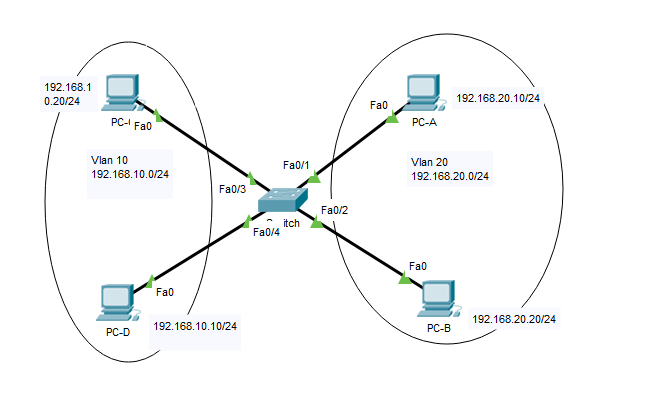
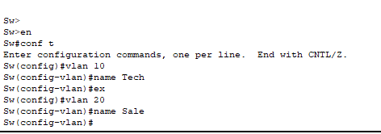

# Chia VLAN  
> ## **Mô hình**  

 

> ## **Các bước cấu hình**
### 1. Kiểm tra thông tin mặc định trên Switch bằng cách sử dụng lệnh `show vlan` 

   

### 2. Tạo thêm Vlan trên Switch  

  

### 3. Gán các port vào Vlan vừa tạo.  

  

### 4. Đặt địa chỉ IP cho các Vlan  
 

  

### 5. Đặt địa chỉ IP cho các máy tính

  

### 6. Kiểm tra

