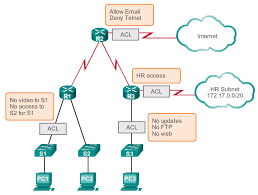

 # Access Control Lists  

> ## ACLs là gì?    
- ACLs là một danh sách các câu lệnh điều khiển truy cập được áp đặt vào các cổng(interface) của router. Danh sách này chỉ cho router biết packet nào được chấp nhận(allow),packet nào được loại bỏ(deny). Sự chấp nhận và hủy bỏ này có thể dựa vào địa chỉ nguồn, địa chỉ đích hoặc chỉ số port.   
- ACLs thường được sử dụng cho 2 mục đích:  
  - Lọc lưu lượng
  - Phân loại dữ liệu   

  <center>  


> ## Phân loại ACL cơ bản  
- Standard ACL: 
  - gồm các câu lệnh ACL đơn giản nhất. 
  - Được đánh số từ 1-99 hoặc từ 1300-1999
  - chỉ lọc địa chỉ nguồn trong header của IP packet, vì thế chúng hoạt động tại lớp 3 trong mô hình OSI hay lớp internet trong mô hình TCP/IP.  
  - Đặt càng gần đích càng tốt.  
-  Extended ACL:  
    - là những câu lệnh ACL mở rộng, lọc dựa trên các tiêu chí như port number (application), source-destination IP address , protocol và nhiều tùy chọn. Vì thế extended ACL hoạt động tại lóp 3 và lớp 4 mô hình OSI.    
    - Extended ACL được đánh số từ 100 đến 199  hoặc từ 2000 -2699.  
    - Extended ACL lọc chính xác source/destination IP Address nên ta hay đặt ACL này gần nguồn để tránh tình trạng hao tổn băng thông mạng không cần thiết khi gói tin “lang thang” trước khi bị deny.  
> ## Numbered ACL và Named ACL  
- Numbered ACL: không cho phép chèn, sửa , xóa trên từng dòng mà phải viết lại ACL nếu sai sót.  
- Named ACL: cho phép, chèn, sửa, xóa từng dòng.  
> ## Cấu hình ACL  
### **Cấu hình ACL gồm 2 bước:**
- Định nghĩa một danh sách ACL  
- Gán ACL vào port number.   

### **Numbered ACL**  
- Standard ACL:  
  - Cấu hình 1 ACL:  

  ```
  Router(config) # access-list [number] [permit|deny] [source IP] [wildcard mask]  
  Router(config) # access-list [number] [deny|permit] any   
  ```   
        
     Ví dụ:  
    *Deny một dải mạng:*  
     ``` 
    Router(config) # access-list 1 deny 192.168.10.0 0.0.0.255  
    Router(config) # access-list 1 permit any  
    ```  
    *Deny một host trong mạng:*  
    ``` 
    Router(config) # access-list 1 deny 192.168.10.2 0.0.0.0
    ```

    hoặc 
    ```
    Router(config) # access-list 1 deny host 192.168.10.2
    Router(config) # access-list 1 permit any  
    ```  
  - Áp ACL lên một cổng:  
    ```  
    Router(config-if) # ip access-group [number] [in|out]  
    ```  
  - Gỡ bỏ ACL:  
    ```  
    Router(config) # no access-list [number]  
    Router(config) # interface [name]  
    Router(config-if) # no ip access-group [number] [in|out]    
    ```  
   - Kiểm soát **Telnet**  
    ```  
    Router(config) # line vty 0 4
    Router(config-line) # access-class [number] [in|out]  
    ```   

    Ví dụ: 
    ```   
    R2(config) # access-list 10 deny 192.168.10.0 0.0.0.255  
    R2(config) # access-list 10 permit any
    R2(config) # line vty 0 4
    R2(config-line) # access-class 10 in    
    ```  
   - Kiểm tra **Acess-List**  
    ```  
    Router# show access-list  
    ```  

- Extended ACL:  
  - Cấu hình 1 ACL:  
  `Router(config) # access-list [number] [permit|deny] [protocol] [source IP] [wildcard mask] [operator port] [destination IP] [wildcard mask] [operator port]`  
    - Trong đó :  
      - **Protocol : IP , ICMP , TCP , UDP** ,... ( chặn **IP** là chặn tất cả )
      - **Operator Port :** [ **lt** ( less than ) , **gt**( greater than ) , **eq**( equal ) ] + [ services port ]
    - Ví dụ: 
       - Deny dịch vụ HTTP đến 1 Web Server 192.168.20.2 ( port TCP/80 ) 

       `Router(config) # access-list 100 deny tcp 192.168.10.0 0.0.0.255 host 192.168.20.2 eq 80( hoặc eq www)`

       - Deny dịch vụ TFTP đến 1 TFTP Server 192.168.20.3 ( port UDP/69)

       `Router(config) # access-list 100 deny udp 192.168.10.0 0.0.0.255 host 192.168.20.3 eq 69( hoặc eq tftp)` 
   - Kiểm soát ping: 

    `Router(config) # access-list [number] [deny|permit] icmp [source network|host] [des network|host]`


### **Named ACL**  
     ```  
    Router(config) # ip access-list [standard|extended] [name]
    Router(config) # [permit|deny] . . .
    Router(config) # interface [name]
    Router(config-if) # ip access-group [name] [in|out]  
    ```  


> ### Ưu và nhược điểm của ACLs:  

***Ưu điểm:***

- Tốc độ xử lý gói tin nhanh

- Mềm dẽo trong triển khai chính sách bảo mật

***Nhược điểm:***

- Cấu hình phức tạp

- Không thể ngăn chặn tấn công ở tầng ứng dụng

- Nhạy cảm với các loại tấn công giao thức TCP/IP

- Không hỗ trợ xác thực người dùng của các kết nối

- Giới hạn khả năng ghi lại sự kiện: chúng không ghi lại nội dung thực sự của gói tin để xác định ai cố gắng làm gì.  

 
> # VÍ DỤ CỤ THỂ:
 


