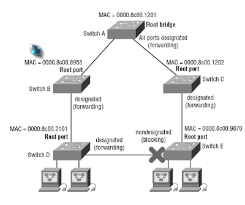

# Spanning Tree Protocol
Trong một mạng xảy ra nối vòng (vòng lặp) sẽ xuất hiện các hiện tượng sau:  

  

- *Broadcast storm:* Là hiện tượng rất nhiều frame chạy liên tục trong môi trường các Switch đấu vòng – dự phòng khi chưa thực hiện chống loop –STP.Làm cho tốc độ hệ thống mạng chậm và có thể làm treo các switch tốc tộ thấp  

  

- *Multi Frame copy:* hiện tượng đa bản sao frame (1 thiết bị nhận rất nhiều frame giống nhau)  

    

- *Instability MAC table:* hiện tượng bảng MAC không ổn định.  

 

> ## **1,Định nghĩa**  
- Spanning Tree Protocol là một giao thức ngăn chặn sự lặp vòng được định nghĩa trong chuẩn IEEE.802D  
> ## **2.Tiến trình bầu chọn và hoạt động của Giao thức Spanning Tree**  
Hoạt động bầu chọn của một tiến trình STP :
   - Thực hiện bầu chọn Root-Bridge
   - Bầu chọn Root-Port
   - Lựa chọn các Designated-port
   - Blocking các port còn lại  

### 2.1. Chọn Root-Bridge  
- Khi tiến trình STP được bật,các Sw sẽ gửi các gói tin BPDU (Bridge Protocol Data Unit) để trao đổi giữa các Switch với nhau, BPDU là một gói tin quan trọng trong tiến trình STP, BPDU chứa một thông tin quan trọng là Bridge-ID của các switch, giá trị này dùng để dịnh danh mỗi Switch khi náo tham gia tiến trình STP.  
Bridge-ID dài 8byte:
   - *`Số Priority(2byte)`*: có giá trị từ 0 – 65535 mặc định là 32768
   - *`MAC address(6byte)`*
- Tiến trình bầu chọn Root-Bridge:
   - So sánh số Priority: Sw nào có số Priority thấp nhất sẻ là Root-Bridge
   - Các Sw được thiết lập số Priority bằng nhau thì tiến trình thứ 2 là so sánh MAC sẻ thực hiện, Sw nào có MAC nhỏ nhất sẻ làm Root-Bridge. MAC là địa chỉ duy nhất trên thế giới nên sẻ không xảy ra trùng lập được. VD như hình trên SW1 có MAC nhỏ nhất nên sẻ được bầu chọn làm Root-Bridge.
   - Sau khi đã bầu chọn được Root-Bridge thì chỉ có SW làm root mới gửi BPDU ra khỏi cổng để duy trì tiến trình STP ( gửi 2s/lần). Các SW con chỉ nhận, bổ xung thông tin BPDU và forward thông tin BPDU này.

> ## Tài liệu tham khảo  
- http://svuit.vn/threads/bai-19-tim-hieu-giao-thuc-spanning-tree-protocol-163/  
- https://hohoangvi.wordpress.com/2014/10/03/qua-trinh-hoat-dong-cua-stp/  
