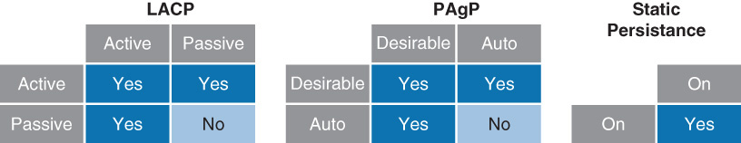

# Công nghệ Ehernet Channel  
> ## **1,Bài toán thực tế**
Khi có nhiều kết nối giữa 2 Switch mà băng thông bị hạn chế --> phải tăng băng thông lên bằng cách gắn thêm 1 sợi dây giữa 2 Sw. Kết quả là dẫn tới Spanning-tree vì STP luôn tồn tại trong Sw. ==> Tìm giải pháp khác hiệu quả hơn.

> ## **2,Công nghệ Ethernet Channel là gì?**
- Là công nghệ kết hợp các đường link lại để tăng băng thông.  

  

- Đặc điểm:  
   - Băng thông là tổng băng thông của các cổng vật lý  
   - Loadbalancing tốt  
   - Port-Channel có thể hỗ trợ cả Layer và Layer 3:
      - Khi ở layer 2 thì cần lưu ý cost của port channel trong spanning-tree
      - Khi ở layer 3 thì giống như SVI  
   - Mỗi cổng Ethernet bó đượcc tối đa 8 cổng vật lý cùng loại.
   - Tất cả các ports channel phải thống nhất về:     - Các chuẩn Trungking: `ISL` hoặc `802.1Q` 
     - Cùng 1 trong số các mode trunking: Auto, On, Desirable hoặc cùng nằm ở mode Access. Không thể gộp cổng trunk và Access lại thành 1 đường EtherChannel.  
     - Phương thức STP trên các cổng thành phần: cost, priority.
     - Speed và Duplex: các cổng thành phần được yêu cầu phải thông nhất về `speed` cà `duplex` 

> ## **3,Giao thức chạy trong EtherChannel**  
- EtherChannel có 2 loại:
  - PAgP - Port Aggregation Protocol: độc quyền của Cisco
    - Tự động tạo của EtherChannel bằng việc trao đổi gói tin PAgP giữa các EtherChannel Port.
    - Trong PAgP group port phải cùng speed, duplex mode, native VLAN, VLAN range, trunking status và type, sau khi chạy EtherChannel.
    - PAgP chỉ gửi và nhận PAgP PDUs trên các ports đã up và có bật tính năng PAgP mode auto hoặc desirable.
  - LACP - Link Aggregation Control Protocol: IEEE
    - các thiết bị chạy LACP sẻ trao đổi gói tin LACP giữa các Channel. 
    - Cùng speed, duplex mode, native VLAN, VLAN range, trunking status và type.  Sau khi chạy 802.3ad, LACP cũng tiến hành đưa group vào STP như là một single switch port.  

### - **Các mode trên PAgP:**  
   - On : cấu hình thủ công EtherChannel, sẽ đưa tất cả các port tham gia vào Channel mà không cần trao đổi gói tin. Chỉ lên được Channel khi cả 2 cổng cùng ở trạng thái mode on, cùng speeed và duplex. Nếu không sẽ xảy ra mất gói hoặc loops STP sẽ xảy ra.
   - Auto : Các port sẻ **`phản hồi`** gói tin PAgP từ đầu khác nhưng không tự gửi gói tin PAgP. Thiết kế mode này giảm thiểu các gói tin PAgP.
   - Desirable : Các port ở trạng thái này sẻ **`tự gửi`** negotiate đến những ports khác để thương lượng lên được 802.3ad.
   - Các trạng thái có thể lên được Channel:
     - Auto - Desirable(chủ động - bị động)
     - Desirable - Desirable(chủ động - chủ động)
     - Auto - Auto(bị động - bị động) sẽ không lên được Channel

   ```  
   Switch(config-if)#channel-protocol pagp
   Switch(config-if)#channel-group number mode {on | auto | desirable}  
   ```  

### - **Các mode trên LACP:**  
- On : như PAgP
- Active: Port sẽ **`tự gửi`** negotiate bằng các gói tin LACP đến những ports khác để thương lượng lên được 802.3ad bằng việc trao đổi gói tin LACP.
- Passive: Các port sẻ **`phản hồi`** gói tin LACP từ đầu khác mà nó nhận được nhưng không tự gửi gói tin LACP. Thiết lập này để giảm thiểu việc truyền tải các gói tin LACP.
- Các trạng thái có thể lên được Channel:
  - Active - Passive(Chủ động - Bị động) 
  - Active - Active (Chủ động - Chủ động)  

### **Cấu hình LACP:**  

 ```
Switch(config)#lacp system-priority priority
Switch(config-if)#channel-protocol lacp
Switch(config-if)#channel-group number mode {on | passive | active}
Switch(config-if)#lacp port-priority priority 
``` 
     

  


    


> ## TÀI LIỆU THAM KHẢO  
- https://itforvn.com/cong-nghe-etherchannel.html/  
- http://svuit.vn/threads/bai-23-huong-dan-cau-hinh-etherchannel-184/  
- https://itforvn.com/cong-nghe-etherchannel.html/
- 

