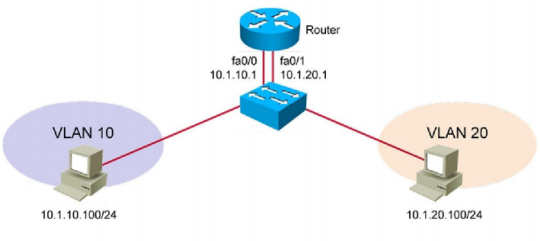
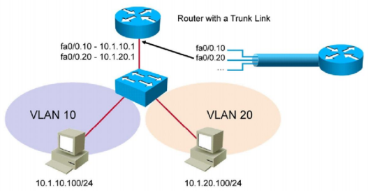
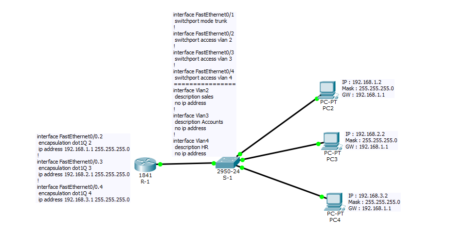
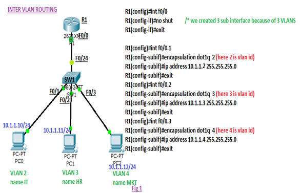
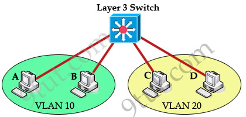

# Inter-Vlan Routing  
> ## **1,Định nghĩa**  
- Là kỹ thuật định tuyến liên mạng được sử dụng để định tuyến giữa các Vlan với nhau.
- Bao gồm 3 thành phần:
  - Router-on-a-Stick  
  - Router-on-a-Stick sử dụng Trunks
  - Switch Layer 3  
> ##  **2,Các hướng sử dụng**  
- Dùng router kết nối với Switch, mỗi cổng của router tương ứng với 1 Vlan.
  - Ưu điểm: Cấu hình đơn giản, chỉ cần gán IP để làm Default Gateway cho Vlan.
  - Nhược điểm: Chỉ sử dụng được trong mô hình nhỏ với số lượng Vlan ít(2 Vlan) do số lượng interface trên router là có giới hạn.  


    

- Dùng router kết nối với Switch, chia sub-interface tương ứng với các Vlan  
  - Ưu điểm: sử dụng được trong mô hình nhiều Vlan, chi phí thấp  
  - Nhược điểm: khả năng dự phòng thấp, toàn bộ băng thông đổ dồn lên 1 đường link dẫn đến tắc nghẽn và quá tải.  

    

- Dùng Switch Layer 3 để thay thế.  

  

> ## **3,Cấu hình**  
- Cấu hình `Router on a stick` 

  

- Cấu hình `Router-on-a-Stick sử dụng Trunk`  

  

- Sử dụng Switch Layer 3: 

  

### **Switch configuration**

```  
ip routing
!
interface FastEthernet0/1
switchport access vlan 10
switchport mode access
!
interface FastEthernet0/2
switchport access vlan 20
switchport mode access

interface Vlan10
ip address 192.168.10.1 255.255.255.0
!
interface Vlan20
ip address 192.168.20.1 255.255.255.0  
```

> ## **4,Tài liệu tham khảo**  
- https://www.9tut.com/intervlan-routing-tutorial  
- http://svuit.vn/threads/lab-9-cau-hinh-inter-vlan-tren-router-cisco-157/  
- http://svuit.vn/threads/lab-9-1-cau-hinh-inter-vlan-switch-layer-3-158/


