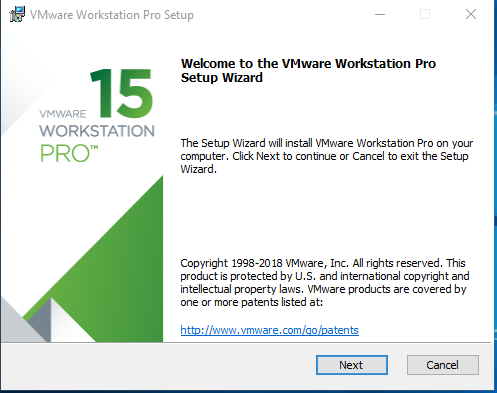
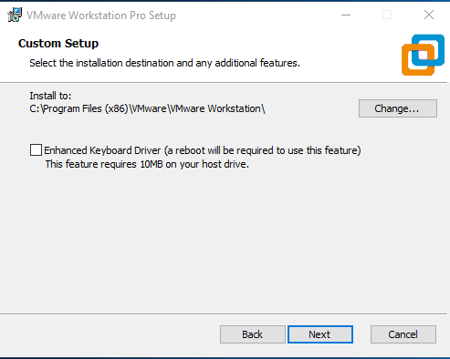
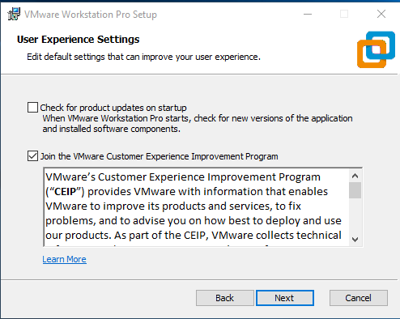
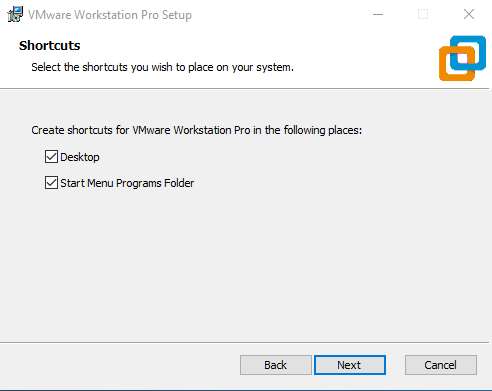
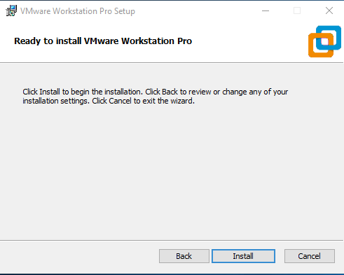
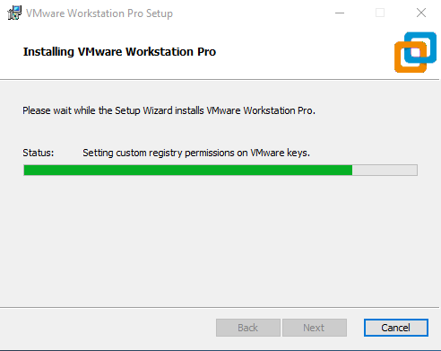
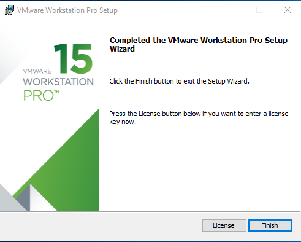

#VMware Workstation 15 Pro  

I.Hướng dẫn cài đặt VMware Workstation
Bước 1:  Click vào file cài đặt đã chuẩn bị trước. Ở màn hình Welcome click Next.      
  
   

Bước 2:  Trên màn hình “license Agreement” tick chọn “I accept the terms in the license agreement”. Sau đó click Next

 

Bước 3:  Ở tùy chọn cài đặt này, bạn có thể không cần đánh dấu chọn vào dòng “Enhanced Keyboard Driver” cũng được. Tùy chọn này sẽ giúp máy ảo nhận diện bàn phím với các phím ký tự ngoài hệ chữ La-tinh (ví dụ tiếng Nhật, tiếng Hàn,…). Nhấn Next để tiếp tục.

 

Bước 4:  Tới bước tùy chỉnh trải nghiệm người dùng. Bạn có thể đánh chọn vào “Check for product updates on startup” để nhận cập nhật phần mềm từ nhà sản xuất hoặc tích vào "Join..." để có thể cùng những người dùng khác của VMware chia sẻ và sửa lỗi khi phần mềm xảy ra lỗi. Ở đây mình chỉ chọn cái thứ 2.Nhấn Next để tiếp tục.

 

Bước 5:  Đánh dấu chọn vào cả 2 trường như trong hình nếu muốn đặt shortcut ở Desktopvà trong Start Menu.

 
Bước 6: Nhấn Install để bắt đầu cài đặt

  

Bước 7: Quá trình cài đặt diễn ra tầm 2, 3 phút tùy cấu hình máy.

 

Bước 8:  Sau khi cài đặt hoàn tất, ta tới màn hình thông báo thành công. Ở đây, nếu có License thì bạn có thể nhấp vào nó và điền vào License để kích hoạt phần mềm. Nếu không, có thể nhấp vào Finish để sử dụng dùng thử.

 
