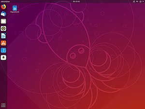
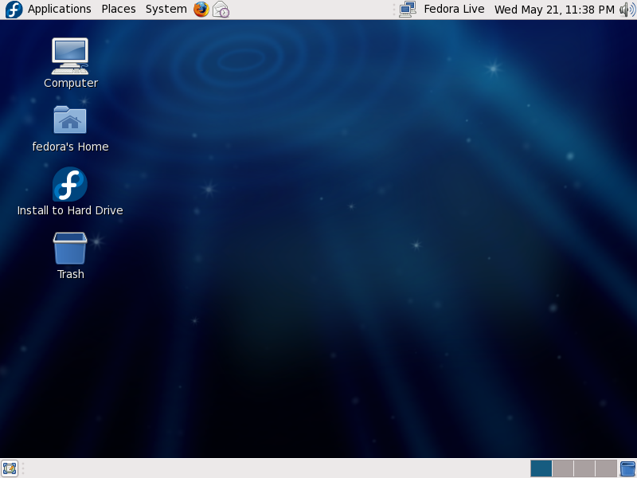

Tìm hiểu về Distro
====
# Mục lục
- [1.Tổng quan](#1tổng-quan)
- [2.Lịch sử](#2lịch-sử)
- [3.Một số bản phân phối phổ biến](#3một-số-bản-phân-phối-phổ-biến)
    - [3.1.Debian](#3.1Debian)
    - [3.2.Ubuntu](#3.2Ubuntu)
- [4.Tài liệu tham khảo](#4tài-liệu-tham-khảo)
## 1.Tổng quan
Linux Distro (hay Linux Distribution) được gọi là các bản phân phối hệ điều hành đưọc xây dụng từ hạt nhân Linux với các hệ thống quản lí gói tin.

Một Linux Distro điển hình bao gồm một hạt nhân Linux, các công cụ và thu viện GNU, window manager, các phần mềm được thêm vào, window system và môi trường làm việc Desktop.

Hiện nay có tới hơn 600 bản phân phối Linux khác nhau với gần 500 bản liên tục đưuọc cập nhật và phát triển liên tục. Các bản phân phối được phát triển đa dạng với nhiều hình thức trên nhiều thiết bị khác nhau như: Laptop, máy tính bảng, điện thoại di động. Có nhiều bản phân phối ra đời với các mục đích hỗ trợ thương mại (OpenSUSE, Ubuntu, Fedora), hoặc mục đích cộng đồng (Debian, SlackWare, Gentoo).

Bạn có thể theo dõi các bản phân phối Linux tại [đây](https://upload.wikimedia.org/wikipedia/commons/5/58/Linux_Distribution_Timeline_with_Android.svg).
## 2.Lịch sử
Với sự đa dạng về các bản phân phối của Linux, ta sẽ cùng tìm hiểu về lịch sử hình thành của Linux.

Linus Torvalds được biết đến như người phảt triển Linux Kernel. Năm 1991, ông cho ra đời phiên bản Linux 0.01. Về cơ bản thì Linux ban đầu bao gồm 2 cặp ảnh đĩa mềm có thể tải xuống. Một cái có thể tự khởi động và chứa hạt nhân Linux, Cái khác đực tích hợp các công cụ và tiện ích GNU giúp thiết lập hệ thống tập tin. Vì quá trình cài đặt khá phức tạp nên các bản phân phối sau này xuất hiện để đơn giản hoá quá trình này.

Ban đầu những bản phân phối chỉ đơn giản là những tiện ích. Dần dần, các bản phân phối thu hút người dùng, thay thế MacOS và Window. Người dùng tại các công sở và trường học cũng đã chấp nhận làm quen với Linux. Linux đã chứng minh cho thấy sức mạnh của mình chủ yếu trên các thiết bị nhúng, Web server, LAMP.

## 3.Một số bản phân phối phổ biến
### 3.1.Debian

Debian là một trong những bản phân phối đầu tiên của Linux. Bản phân phối này được công bố lần đầu vào ngày 16 tháng 8 năm 1993 bởi Ian Murdock, phát hành lần đầu vào ngày 15 tháng 9 năm 1993. Năm 1996, phiên bản ổn định của Debian được phát hành đã trở thành nền tảng cho nhiều bản phân phôi khác được ra đời.

Debian nổi tiếng với hệ thống quản lí gói cao cấp APT (Advanced Packaging Tool). APT là một công cụ cho phép cài đặt các gói từ kho phần mềm. 
- Aptitude là công cụ yêu cầu người dùng gõ lệnh, có khả năng tìm kiếm gói tốt hơn thông qua metadata.
- apt-get, apt-cache là lệnh quản lí gói theo chuẩn apt. Apt-get là cài đặt gói, apt-cache là tìm kiếm và hiển thị thông tin gói.

### 3.2.Ubuntu

Ubuntu là một bản phân phối Linux được xây dựng dựa trên Debian GNU/Linux, và cũng là bản phân phối thông dụng nhất hiện nay chiếm 30% số bản Linux được cài (năm 2007). Bản phát hành đầu tiên của Ubuntu vào ngày 20 tháng 10 năm 2004.

Ubuntu là hệ điều hành mã nguồn mở được tài trợ bởi Canonical Ltd. Họ tạo doanh thu bằng cách hỗ trợ kĩ thuât. Với việc để cho Ubuntu mã nguồn mở, họ đã tận dụng được các nhà phát triển bên ngoài mà không phải tự mình phát triển.

### 3.3.Fedora
Fedora là một dự án phát triển dựa theo cộng đồng được phát trienr bởi RedHat. Fedora (hay Fedora Core) được phát triển nhắm tới mục đích tạo ra hệ điều hành mã nguồn mở hoàn chỉnh sử dụng cho các mục đích tổng quát.

Các thiết kế giao diện đơn giản, chương trình cài đặt mang giao diện đồ hoạ. Các gói phần mềm được tải xuống dễ dàng với công cụ Yum.

## 4.Tài liệu tham khảo
https://vi.wikipedia.org/wiki/B%E1%BA%A3n_ph%C3%A2n_ph%E1%BB%91i_Linux

https://vi.wikipedia.org/wiki/Debian

https://vi.wikipedia.org/wiki/Ubuntu

