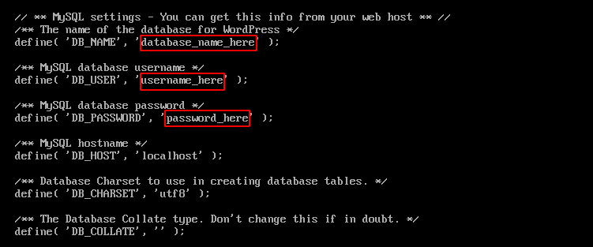
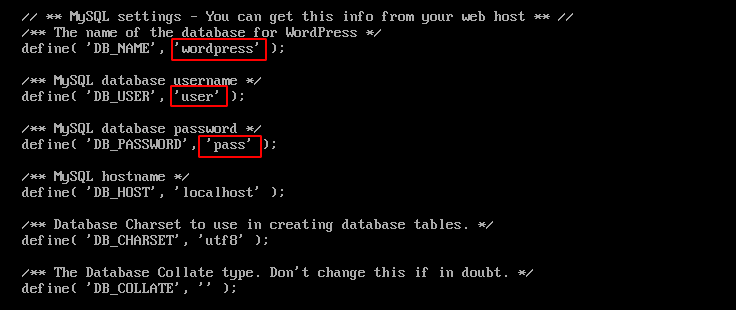
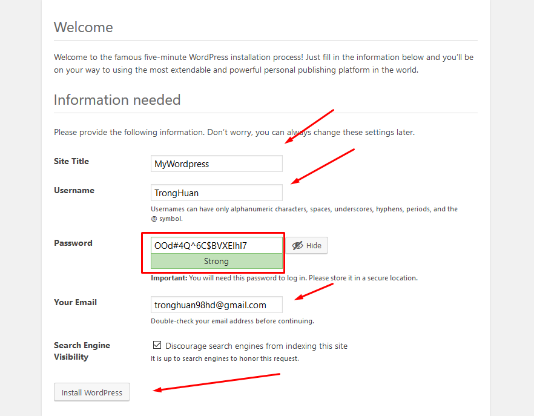
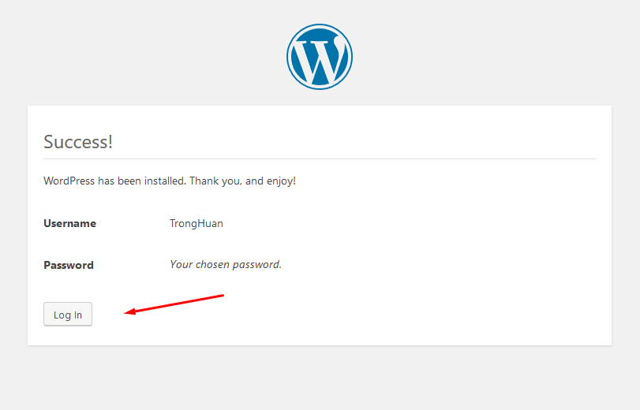
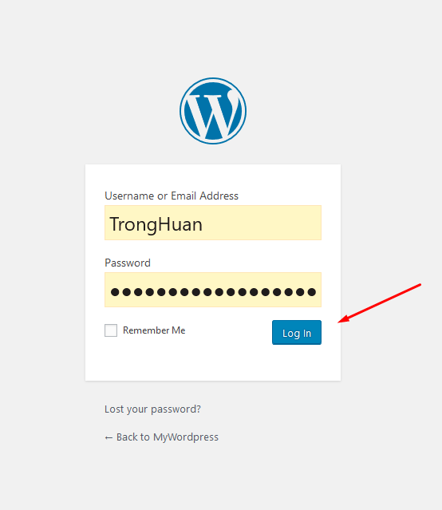
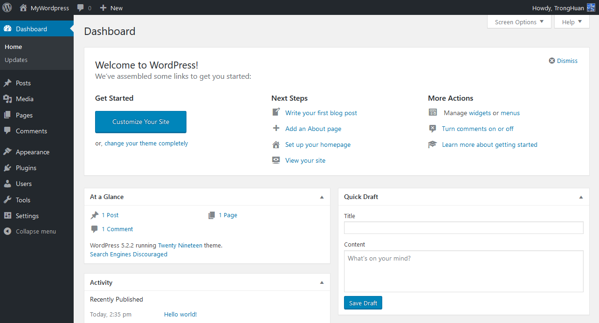

Cài đặt Wordpress trên máy CentOS
===
## Mục lục
1. [Tổng quan](#1-Tổng-quan)
2. [Các bước cài đặt](#2-Các-bước-cài-đặt)
3. [Tài liệu tham khảo](#3-Tài-liệu-tham-khảo)
## 1. Tổng quan

Wordpress là một hệ thống quản lí nội dung miễn phí và mã nguồn mở xây dựng dựa trên PHP và MySQL. Được phát hành vào năm 2003, đến nay Wordpress đã trở thành một trong những hệ thống quản lí website phổ biến nhất thế giới với hơn 60 triệu website(số liệu năm 2019).


Trong bài này, mình sẽ hướng dẫn cài đặt Wordpress trên hệ điều hành CentOS 7.

## 2. Các bước cài đặt
### Bước 1: Chuẩn bị.
Trước khi tiến hành cài đặt Wordpress, bạn phải cài đặt bộ LAMP trên máy của bạn. Bạn có thể tham khảo cách cài đặt LAMP tại [đây](install_lamp.md).

### Bước 2: Tạo cơ sở dữ liệu và tài khoản cho Wordpress

Ở bước chuẩn bị, mình đã cài mariadb cho cơ sở dũ liệu. Bạn cũng có thể thao tác tương tự với MySQL. Đầu tiên, ta cần đăng nhập vào tài khoản root của cơ sở dữ liệu bằng câu lệnh:

```
$ mysql -u root -p
```

Bạn cần nhập password mà bạn đã thiết lập lúc cài đặt mariadb. Khi nhập xong, terminal sẽ chuyển sang mariadb.

Tiếp theo bạn sẽ tạo cơ sở dữ liệu cho wordpress. Bạn có thể sử dụng một cái tên bất kì. Trong bài, mình sẽ đặt tên là **wordpress**.
```
CREATE DATABASE wordpress;
```

Bạn cần tạo một tài khoản riêng để quản lí cơ sở dữ liệu cho Wordpress. Trong bài mình sẽ đặt tên cho tài khoản là **user** và mật khẩu là **pass**, như sau:

```
CREATE USER user@localhost IDENTIFIED BY 'pass';
```

Tiến hành cấp quyền quản lí cơ sở dữ liệu wordpress cho user mới tạo.

```
GRANT ALL PRIVILEGES ON wordpress.* TO user@localhost IDENTIFIED BY 'pass';
```

Sau đó xác thực lại những thay đổi về quyền:
```
FLUSH PRIVILEGES;
```

Sau khi hoàn tất, thoát khỏi mariadb:
```
exit
```

### Bước 3: Tải và cài đặt Wordpress

Trước khi bắt đầu tiến hành cài gói hỗ trợ php-gd:
```
$ yum install php-gd
```

Tiến hành tải xuống Wordpress với phiên bản mới nhất.
```
$ wget http://wordpress.org/latest.tar.gz
```
> Lưu ý: Bạn cần để ý tới thư mục đang lưu trữ file wordpress đang được tải xuống. Ở đây mình lưu tại thư mục `/root`.

Tiến hành giải nén file `latest.tar.gz`:
```
$ tar xvfz latest.tar.gz
```
> Lưu ý: giải nén sẽ ra thư mục wordpress có đường dẫn `/root/wordpress`.

Copy các file trong thư mục Wordpress tới đường dẫn `/var/www/html` như sau:
```
cp -Rvf /root/wordpress/* /var/www/html
```
### Bước 4: Cấu hình Wordpress
Ta cần đổi đường dẫn tới thư mục chứa các file cài đặt Wordpress như sau:
```
cd /var/www/html
```
File cấu hình wordpress là `wp-config.php`. Tuy nhiên tại đây chỉ có file `wp-config-sample.php`. Tiến hành copy lại file cấu hình như sau:
```
cp wp-config-sample.php wp-config.php
```

Mở file config với vi để sửa:
```
vi wp-config.php
```

Trong file này, ta tìm tới dòng như hình dưới đây.



Tiến hành thay đổi thông tin cơ sở dũ liệu, tài khoản, mật khẩu như đã thiết lập ở bước 2. Ví dụ như sau:



Gõ ESC -> :wq để lưu và thoát khỏi chế độ chỉnh sửa.

###  Bước 5: Hoàn tất phần cài đặt giao diện

Trên trình duyệt, gõ địa chỉ ip server trên thành url, trình duyệt sẽ xuất hiện như sau:



Tiến hành nhập thông một số thông tin cần thiết rồi chọn **`Install Wordpress`**.



Như vậy là bạn đã thiết lập thành công. Tiến hành đăng nhập vào Wordpress:



Như vây là bạn đã có thể sử dụng Wordpress rồi.



## 3. Tài liệu tham khảo
1. [Giới thiệu về Wordpress](https://en.wikipedia.org/wiki/WordPress)
2. [Trang chủ Wordpress](https://wordpress.com/)
3. [Hướng dẫn cài đặt Wordpress trên CentOS 7](https://www.digitalocean.com/community/tutorials/how-to-install-wordpress-on-centos-7)