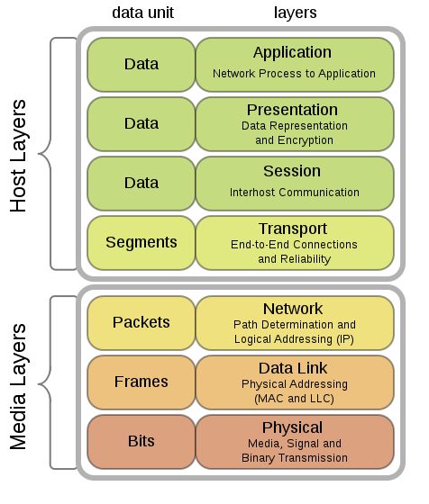
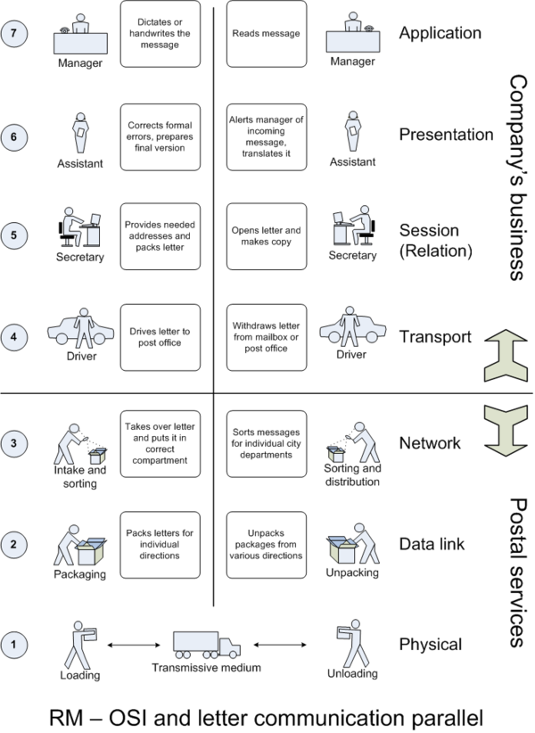

Mô hình OSI và cơ chế truyền tin
====
# Mục lục
- [1.Tổng quan](#1tổng-quan)
- [2.Mô hình OSI](#2mô-hình-OSI)
    - [2.1.Tầng vật lí](#2.1Tầng-vật-lí-(physic-layer))
    - [2.2.Tầng liên kết dữ liệu](#2.2Tầng-liên-kết-dữ-liệu-(data-link-layer))
    - [2.3.Tầng mạng](#2.3Tầng-mạng-(network-layer))
    - [2.4.Tầng giao vận](#2.4Tầng-giao-vận-(Transport-layer))
    - [2.5.Tầng phiên](#2.5Tầng-phiên-(session-layer))
    - [2.6.Tầng trình diễn](#2.6Tầng-trình-diễn-(presentation-layer))
    - [2.7.Tầng ứng dụng](#2.7Tầng-ứng-dụng-(Application-layer))
- [3.Cơ chế truyền tin trong mô hình OSI](#3Cơ-chế-truyền-tin-trong-mô-hình-OSI)
    - [3.1.Phía máy gửi](#3.1phía-máy-gửi)
    - [3.2.Phía máy nhận](#3.2phía-máy-nhận)
- [4.Tài liệu tham khảo](#4Tài-liệu-tham-khảo)

## 1.Tổng quan
Mô hình OSI (Open Systems Interconnection Reference Model) là mô hình đưowjc thiết kế theo triết lí tầng lớp, lý giải trìu lượng nguyên lí truyền dữ liệu giữa các máy tính trong mô hình mạng.
## 2.Mô hình OSI
Mô hình tham chiếu OSI là một cấu trúc phả hệ 7 tầng được định nghĩa bởi tổ chức tiêu chuẩn hoá quốc tế. Các tầng trong mô hình OSI được định nghiã như sau:

### 2.1.Tầng vật lí (physic layer)

Tầng vật lí đặc tả tất cả các kết nối về mặt vậy lí như các cáp nối, các chân cắm pin,... Các thiết bị của tầng này như Hub, repeater, thiết bị chuyển đổi, network adapter, Host Bus Adapter. Chức năng can bản của tầng vật lí là:
- Thiết lập, ngắt mạch kết nối điện với môi trường truyền dẫn điện.
- Tham gia chỉ sẻ tài nguyên một cách hiệu quả cho người dùng.
- Điều chế, biến đổi dữ liệu số với tín hiệu tương ứng được truyền qua.

Dữ liệu ở tầng này sẽ được truyền tải theo các chuỗi bit.

### 2.2.Tầng liên kết dữ liệu (Data-link layer)

Tầng liên kết dữ liệu sẽ cung cấp các phương tiện truyền dữ liệu giữa các thục thể mạng (phát hiện và sửa lỗi trong tầng vật lí nếu có). Thiết bị sử dụng chủ yếu ở tầng này là Switch. Kết nối chỉ được cung cấp giữa các nút mạng với nhau trong mạng nội bộ.

### 2.3.Tầng mạng (Network layer)

Tầng mạng cung cấp các chức năng và quy trình truyền các chuỗi dữ liệu có độ dài khác nhau từ một nguồn tới đích thông qua nhiều mạng mà vẫn duy trì chất lương dịch vụ của tầng giao vận. Tầng mạng thực hiện chức năng định tuyến. Các thiết bị mạng ở tầng này (chủ yếu là router) sẽ gửi dữ liệu ra khắp mạng mở rộng.

### 2.4.Tầng giao vận (Transport layer)

Tầng giao vận cung cấp các dịch vụ truyền dữ liệu giữa các người dùng đầu cuối. Tầng này kiểm soát độ tin cậy của một kết nối được cho trước. Ở tầng này, dữ liệu sẽ được chuyển thành các gói tin TCP hoặc UDP. Địa chỉ sẽ đưuọc đánh address port, thông qua đó có thể phân biệt được ứng dụng trao đổi.

### 2.5.Tầng Phiên (Session layer)

Tầng phiên sẽ kiểm soát các phiên hội thoại trên máy tính bao gồm thiết lâp, quản lí và kết thúc trình ứng dụng địa phương và từ xa. Tâng này hỗ trợ hoạt động **song công**, **bán song công** và **đơn công** đồng thời giúp phục hồi truyền thông nhanh khi có lỗi xảy ra.

### 2.6.Tầng trình diễn (Presentation layer)
Lớp trình diễn có nhiệm vụ dich dữ liệu được gửi từ tầng Application sang dạng Fomat chung rồi làm ngược lại chuyển từ Format chung sang định dạng của tầng Application. Tầng thực hiện các chức năng sau:
- Dịch mã kí tự từ ASCII -> EBCDIC
- Chuyển đỏi dữ iệu (VD: interger -> số dấu phẩy động)
- Nén dữ liệu để giảm lượng dữ liệu truyền trên mạng.
- Mã hoá, giải mã dữ liệu.

### 2.7.Tầng ứng dụng (Application layer)

Tầng này là tầng gần với nguwoif dùng nhất. Nó cung cấp các phương tiện nhập thông tin và dữ liệu trên mạng thông qua các chương trình ứng dụng. Tầng này cung cấp các giao diện đồ hoạ để tương tác với người dùng.

## 3.Cơ chế truyền tin trong mô hình OSI

### 3.1.Phía máy gửi
- Tầng 7: Người dùng sẽ tiến hành đưa thông tin cần gửi vào máy tính. Các dữ liệu được gửi ở đây có thể là: ảnh, âm thanh,...
- Tầng 6: Các dữ liệu khi gửi xuống tầng này sẽ đưuọc định dạng chung để mã hoá và nén dữ liệu.
- Tầng 5: Tầng này sẽ bổ sung thông tin cần thiết cho phiên giao dịch gửi-nhận.
- Tầng 4: Ở tầng này, dữ liệu sẽ được chia làm các _segment_, bổ sung thêm thông tin về phương thức truyền dữ liệu, đảm bảo tính tin cậy trong đường truyền mạng.
- Tầng 3: Các _segment_ khi tới tầng này sẽ được chia nhỏ thành các _package_, bổ sung thêm thông tin định tuyến giúp định đường đi cho gói tin dữ liệu.
- Tầng 2: Các _package_ sẽ tiếp tục được băm nhỏ thành các _frame_, bổ sung thêm thông tin kiểm tra chứa dữ liệu để kiểm tra ở máy nhận.
- Tầng 1: Các _frame_ sẽ được chuyển thành các chuỗi bit và phát tín hiệu trên đường truyền dẫn và tiến hành truyền dữ liệu tới máy nhận, hoàn thành quá trình truyền tin.

### 3.2.Phía máy nhận
- Tầng 1: Phía máy nhận ở tầng 1 sẽ nhận được các bit và đưa nó tới vùng đệm rồi thông báo cho tầng data-link là dữ liệu đã được nhận.
- Tầng 2: Tầng Data-link sẽ kiểm tra các _frame_ xem có lỗi hay không. Nếu có lỗi thì _frame_ đó sẽ bị huỷ. Sau đó sẽ kiểm tra lớp địa chỉ MAC xem có đúng với địa chỉ máy nhận hay không. Nếu đúng thì phần header sẽ gỡ bỏ và chuyển lên tầng tiếp theo.
- Tầng 3: Tầng Network sẽ tiến hành kiểm tra địa chỉ IP của gói tin xem có đúng địa chỉ máy nhận hay không. Nếu đúng sẽ gỡ bỏ header và chuyển qua tầng tiếp theo.
- Tầng 4: Tầng Transport sẽ phục hồi và xử lí lỗi bằng cách gửi lại các ACK, NAK xem các gói tin đó đã được nhận hết chưa. Khi phục hồi xong, dữ liệu sẽ dược đóng gói và chuyển lên tầng tiếp theo.
- Tầng 5: Tầng Session sẽ dảm bảo tính toàn vẹ của gói tin. Sau đó sẽ gỡ bỏ Header rồi gửi lên tầng tiếp theo.
- Tầng 6: Tầng Presentation sẽ xử lí gói tin, chuyển gói tin về định dạng phù hợp rồi gửi lên tâng tiếp theo.
- Tầng 7: Tầng Application sẽ gỡ bỏ header cuối cùng, hoàn thành quá trình nhận tin.

## 4.Tài liệu tham khảo

https://vi.wikipedia.org/wiki/M%C3%B4_h%C3%ACnh_OSI

https://www.digistar.vn/quy-trinh-truyen-goi-tin-trong-mo-hinh-osi/