PS Command: Tìm hiểu và hướng dẫn sử dụng
===
## Mục lục
1. [Tổng quan](#1.-Tổng-quan)
2. [Cách sử dụng](#2.-Cách-sử-dụng)
3. [Ý nghĩa một số trường thông tin](#3.-Ý-nghĩa-một-số-trường-thông-tin)
4. [Lệnh pstree](#4.-Lệnh-pstree)
5. [Trạng thái của một tiến trình](#5.-Trạng-thái-của-một-tiến-trình)
6. [Tài liệu tham khảo](#6.-Tài-liệu-tham-khảo)
## 1. Tổng quan
`ps` (hay Process Status) là một tiện ích của Unix/Linux dùng để xem thông tin của các tiến trình đang chạy trong hệ thống. Đây có thể nói là một tiện ích quan trọng các tiến trình, giúp bạn hiểu chuyện gì đang diễn ra trên hệ thống của bạn.

Tiện ích `ps` sẽ đọc thông tin tiến trình từ một file ảo nằm trong thư mục `/proc`. Nó sẽ cung cấp một số tuỳ chọn để cho bạn dễ dang xem thông tin của các tiến trình. Trong bài này mình sẽ giới thiệu một vài câu lệnh phổ biến.

## 2. Cách sử dụng

Về cơ bản cấu trúc của câu lệnh sẽ là:
```
ps [option]
```

> Lưu ý: bạn có thể xem qua các option bằng lệnh `man ps`

### Ví dụ 1: Để xem thông tin shell hiện tại, gõ:
```
ps
```
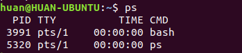

Trong bảng này, ta sẽ thấy các thông tin sau:

|Mục|Ý nghĩa|
|---|---|
|PID|Id của tiến trình|
|TTY|Thông tin terminal mà người dùng đăng nhập|
|TIME|Lượng CPU tính bằng phút giây mà tiến trình đó chạy|
|CMD|Câu lệnh để thực hiện process đó|

> Lưu ý: Một số tiến trình ghi TIME là 00:00:00 (như trong ví dụ) thì các tiến trình đó không sử dụng bất cứ thời gian CPU nào. Thường đó sẽ là tiến trình cha (Parent process), các tiến trình con sẽ sử dụng nó để thực thi.

### Ví dụ 2: Xem thông tin đầy đủ của tiến trình

Ta có thể xem thông tin của tiến trình theo [cú pháp tiêu chuẩn hoặc cú pháp BSD](https://askubuntu.com/questions/484982/what-is-the-difference-between-standard-syntax-and-bsd-syntax).

- Theo cú pháp tiêu chuẩn:
```
ps -ef
ps -eF
ps -ely
```

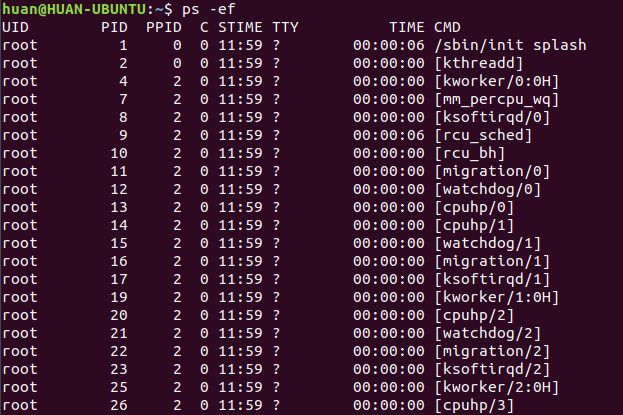

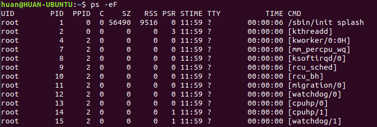

- Theo cú pháp BSD:
```
ps ax
ps aux
```

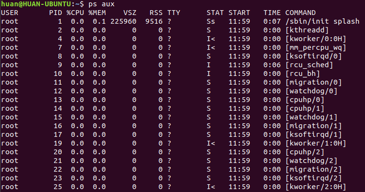

> Lưu ý: một số trường mình sẽ giải thích cụ thể bên dưới.

### Ví dụ 3: in các tiến trình theo dạng cây phân cấp.

Vì các tiến trình được phân cấp theo cha - con nên ta có thể theo dõi thông tin đó theo câu lệnh sau:
```
ps -ejH
ps axjf
```

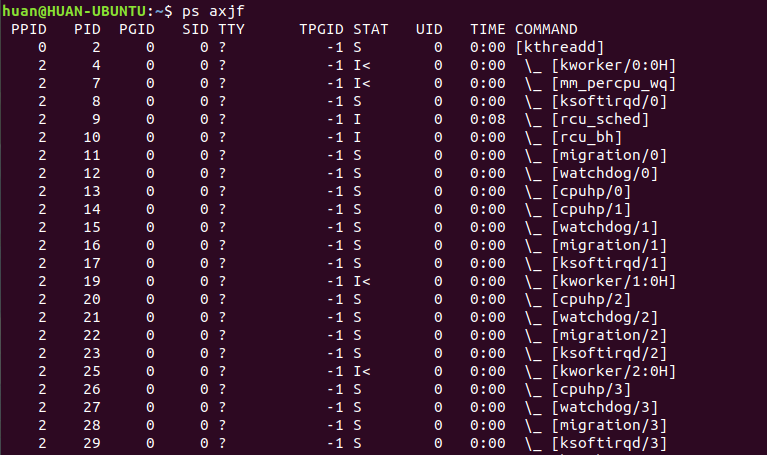

### Ví dụ 4: Hiển thị thông tin về luồng (Thread)

Ngoài thông tin về tiến trình, bạn có thể xem các thông tin về luồng bằng câu lệnh:
```
ps -eLf
ps axms
```

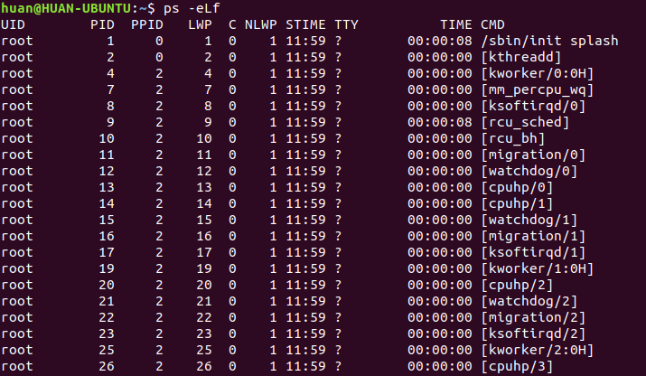

### Ví dụ 5: để xem thông tin tiến trình thuộc nhóm người dùng nhất định.

Ta dùng lệnh như sau:
```
ps -fG [tên user]
```


### Ví dụ 6: In ra thông tin tiến trình chạy dưới quyền root.

Ta dùng câu lệnh:
```
ps -U root -u root u
```

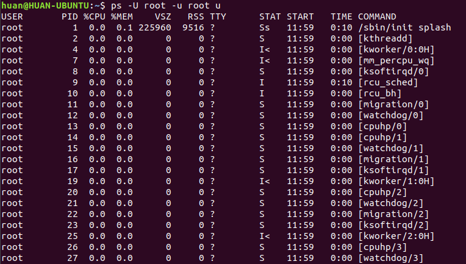

### Ví dụ 7: In ra thông tin theo một số trường cụ thể.

Ngoài những thông tin có sẵn của các option (tuỳ chọn), ta có thể thêm một số trường thông tin khác để đưa ra ngoài bằng tuỳ chọn `-o`. Ví dụ, ta muốn xem thông tin `pid, ppid, cmd, %mem, %cpu` của tất cả các tiến trình đang chạy bằng lệnh:
```
ps -eo pid,ppid,cmd,%mem,%cpu
```

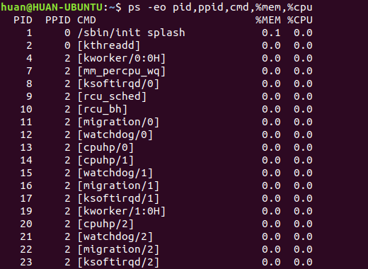

## 3. Ý nghĩa một số trường thông tin
|Tên trường|Ý nghĩa|
|---|---------|
|CMD|Câu lệnh thực thi tiến trình|
|%CPU|Lượng cpu sử dụng|
|%MEM|Lượng Ram tiêu thụ|
|PID|Mã tiến trình|
|PPID|Mã của tiến trình cha|
|UID|mã người dùng|
|USER|Tên người dùng|
|PRI|độ ưu tiên của tiến trình|
|RSS|Lượng bộ nhớ sử dụng thực|
|VSZ or SZ|Lượng bộ nhớ ảo sử dụng|
|S or STAT|Chứa đoạn mã code mô tả trạng thái của tiến trình|
|Start or STIME|Thời gian mà câu lệnh đó khởi động. Nhỏ hơn 24h là "HH:MM:SS", lớn hơn là "Mmm dd"|
|TTY|Terminal liên quan tới tiến trình|

## 4. Lệnh pstree

Ngoài lệnh `ps` ta cũng có thể sủ dụng lệnh `pstree`. Lệnh này còn giúp ta nhìn cấu trúc cây phân cấp của tiến trình một các dễ dàng.

Cú pháp câu lệnh:
```
pstree [option]
```
>Lưu ý: Ở một số hệ điều hành, tiện ích này không có sẵn. Tiến hành cài đặt nó:
```
# Trên Fedora/Red Hat/CentOS
sudo yum -y install psmisc

#Trên Ubuntu/Debian APT
sudo apt-get -y install psmisc
```

### Ví dụ 1: Xem thông tin tiến trình hiện tại
Lệnh:
```
pstree
```
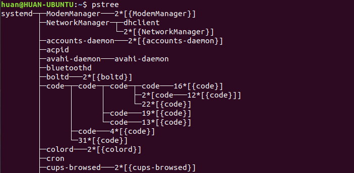

### Ví dụ 2: Xem tiến trình cùng với PID của nó.
Lệnh:
```
pstree -p
```

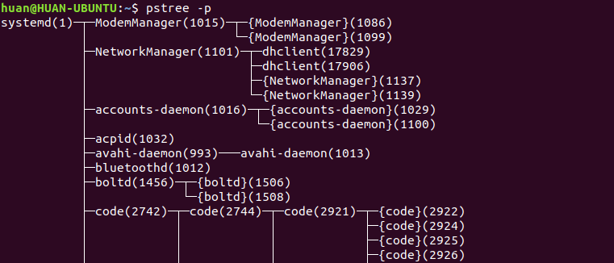

### Ví dụ 3: Xem tiến trình cùng với câu lệnh của nó
Lệnh:
```
pstree -a
```

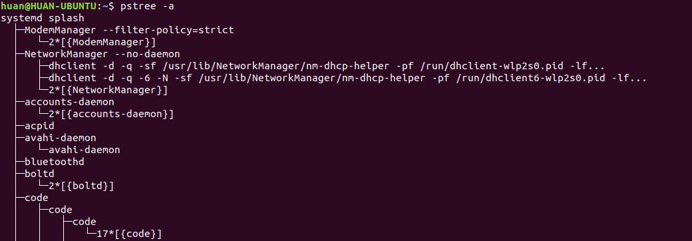

### Ví dụ 4: Xem tiến trình cụ thể với highlight
Lệnh:
```
pstree -H [PID]]
```

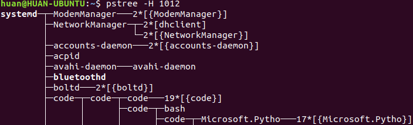

### Ví dụ 5: Xem cây tiến trình theo thứ tự PID
Kết hợp với tuỳ chọn -p để xem PID của tiến trình:
```
pstree -np
```
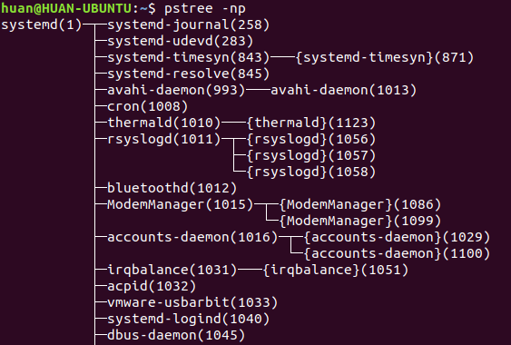

### Ví dụ 6: Xem các tiến trình theo cây thuộc người dùng nào đó
Lệnh:
```
pstree [Tên người dùng]
```


## 5. Trạng thái của một tiến trình
Khi sử dụng lệnh `ps`, ta có thể xem được trạng thái của tiến trình đó là gì, thông qua trường STAT theo kí hiệu như sau:

|Kí hiệu|Giải thích|
|---|---|
|D|Tiến trình ngủ liên tục (Uninterruptible)|
|R|Tiến trình đang sẵn sàng hoặc đang chạy|
|S|Tiến trình ngủ ngắt quãng (Interruptible)|
|T|Đã bị dừng bởi tín hiệu kiểm soát hoặc bị theo dõi|
|W|Phân trang (không có sẵn sau bản kernel 2.6.xx))|
|X|Dead (ít gặp)|
|Z|Zombie process|

Một số kí tự đi kèm

|Kí hiệu|Giải thích|
|---|---|
|<|Ưu tiên cao|
|N|Ưu tiên thấp|
|L|có trang bị khoá trong bộ nhớ (do thời gian thực hoặc IO)|
|s|Session leader|
|\||Tiến trình đa luồng (CLONE_THREAD)|
|+|Tiến trình thuộc nhóm Foreground|

Mô hình hoạt động:
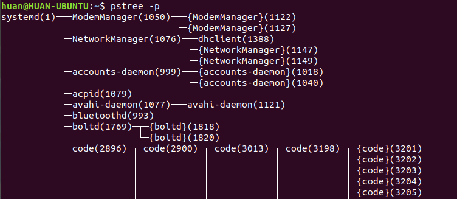

Một tiến trình sẽ bắt đầu chu trình bằng trạng thái 'R' và sẽ bị kết thúc khi tiến trình cha đưa nó về trang thái 'Z'

## 6. Tài liệu tham khảo
1. [Câu lệnh ps](https://www.geeksforgeeks.org/ps-command-in-linux-with-examples/)
2. [Câu lệnh pstree](https://www.howtoforge.com/linux-pstree-command/)
3. [Tài liệu tiếng việt về ps command](https://blogd.net/linux/cac-vi-du-ve-lenh-ps-theo-doi-tien-trinh-tren-linux/)
4. [Process status code](https://idea.popcount.org/2012-12-11-linux-process-states/)
