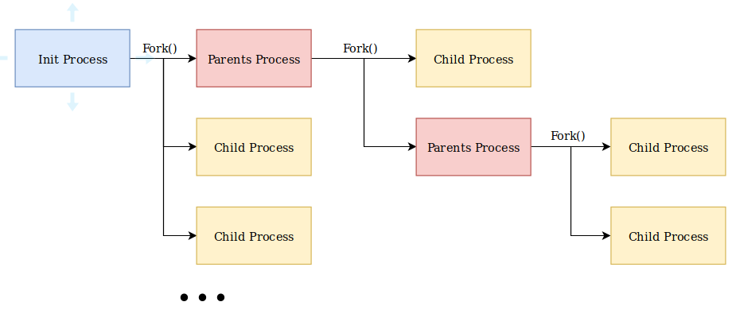
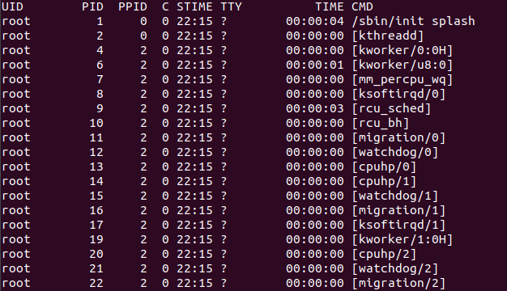

Tiến trình và phân loại tiến trình
===
## Mục lục
1. [Tiến trình](#1.-tiến-trình)
2. [Phân loại tiến trình](#2.-phân-loại-tiến-trình)
3. [Tài liệu tham khảo](#3.-Tài-liệu-tham-khảo)
## 1. Tiến trình
Tiến trình (processes) được hiểu đơn giản là một chương trình đang chạy trong trong hệ điều hành. Môt tiến trình có thể phân thành một hay nhiều tiến trình con khác.
## 2 Phân loại tiến trình

### 2.1. Init process

Init process là tiến trình đầu tiên được khỏi động sau khi bạn lựa chọn hệ điều hành trong boot loader. Trong cây tiến trình, init process là tiến trình cha của các tiến trình khác. Init process có đặc điểm sau:
- PID = 1
- không thể kill init process

### 2.2. Parents process - Child process
Trong hệ điều hành linux các tiến trình được phân thành parents process và child process. Một tiến trình khi thực hiện lệnh fork() để tạo ra một tiến trình mới thì đưọc gọi là parents process. Tiến trình mới tạo được gọi là child process.



Một parents process có thể có nhiều child process nhưng một child process chỉ có một parents process. Khi quan sát thông tin của một tiến trình, ngoài PID (Processes ID) ta cần để ý tới PPID (Parent Processes ID). Nó sẽ cho ta thông tin về parents process của tiến trình đó:
```
ps -ef
```


### 2.3. Orphan process - Zombie Process

Khi parents process - child process hoạt động sẽ xảy ra một số trường hợp đặc biệt. Lúc đó Orphan process - Zombie Process sẽ được hình thành.

Khi một parents process bị tắt trước khi child process được tắt, tiến trình con đó sẽ trở thành một orphan process. Lúc này init process sẽ trở thành cha của orphan processes và thực hiện tắt chúng.

Khi một child process được kết thúc, mọi trạng thái của child process sẽ được thông báo bởi lời gọi hàm wait() của parents process. Vì vậy, kernel sẽ đợi parents process trả về hàm wait() trước khi tắt child process. Tuy nhiên vì một vài lí do mà parents process không thể trả về hàm wait(), khi đó child process sẽ trở thành một zombie process. Khi ở trạng thái này, tiến trình sẽ gần như giải phóng bộ nhớ hoàn toàn, chỉ lưu giữ một số thông tin như PID, lượng tại nguyên sử dụng,... trên bảng danh sách tiến trình.

Tuy giải phóng bộ nhớ hoàn toàn nhưng các zombie process không bị kết thúc. Vì vậy nếu lượng zombie process lớn sẽ nắm giữ lượng lớn các PID. Nếu lượng PID đầy, sẽ không có tiến trình mới được tạo thêm. Các zombie process sẽ chỉ bị kết thúc nếu như parents process của chúng bị kill.

Để tìm các zombie process ta gõ kiểm tra trạng thái của tiến trình theo lệnh sau:
```
ps -lA | grep '^. Z'
```

### 2.4 Daemon Process

Một Daemon Process là một tiến trình chạy nền. Nó sẽ luôn trong trạng thái hoạt động và sẽ được kích hoạt bởi một điều kiện hoặc câu lệnh nào đó. Trong Unix, các daemon thường được kết thúc bằng "d" ví dụ như httpd, sshd, crond, mysqld,...

Chúng ta có thể chạy một đoạn script bash shell, python, java,... dưới dạng một daemon process bằng cách sử dụng dấu `&` ví dụ
```
./simpleshell.sh &
```
Tuy nhiên, vấn đề ở đây là tiến trình đó sẽ không có tiến trình cha và sẽ trở thành một orphan process. Để giải quyết vấn đề này, ta sẽ cho shell chạy với tư cách là tiến trình con của init process bằng cách dùng `nohup` như sau:
```
nohup ./simpleshell.sh &
```

## 3. Tài liệu tham khảo

1. [Processes](https://www.tutorialspoint.com/process-vs-parent-process-vs-child-process)
2. [Phân loại processes](https://www.ibm.com/developerworks/community/blogs/58e72888-6340-46ac-b488-d31aa4058e9c/entry/an_overview_of_linux_processes21?lang=en)