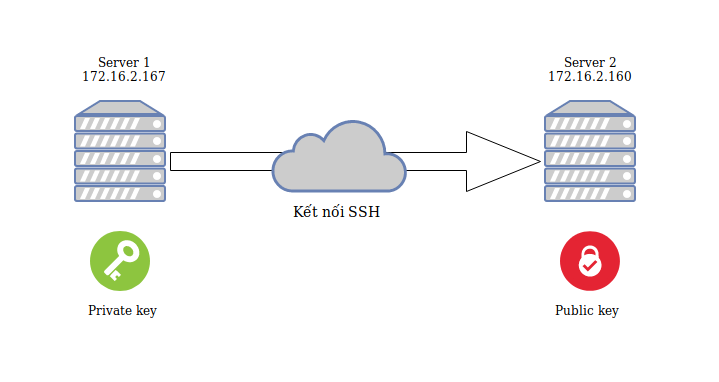
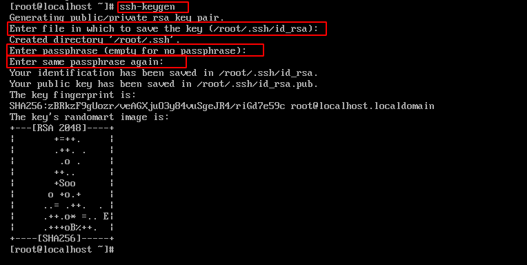
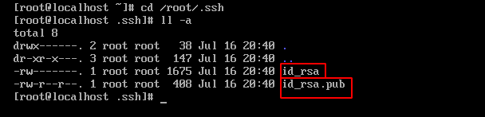
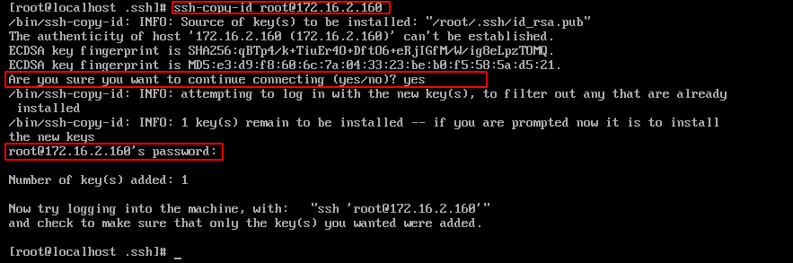
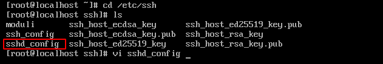
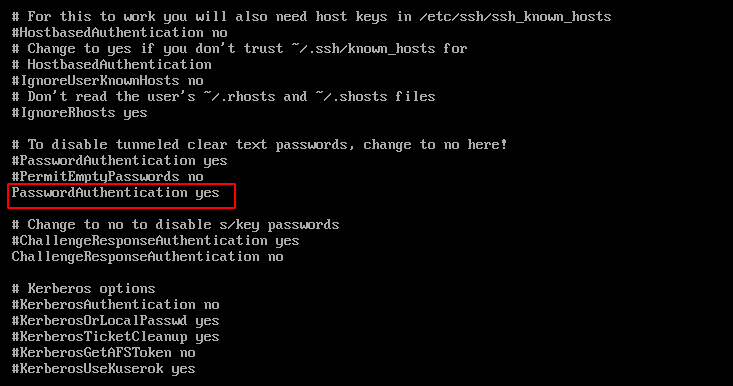

Kết nối 2 máy Server sử dụng SSH theo cơ chế Key pairs
===
## Mục lục
1. [Tổng quan](#1-Tổng-quan)
2. [Mô hình hoạt động](#2-Mô-hình-hoạt-động)
3. [Các bước thực hiện](#3-Các-bước-thực-hiện)
4. [Một số lưu ý](#4-Một-số-lưu-ý)
5. [Tài liệu tham khảo](#5-Tài-liệu-tham-khảo)
## 1. Tổng quan

Bạn có cảm thấy phiền khi mỗi lần kết nối với máy chủ, bạn phải gõ đi gõ lại mật khẩu không? Rồi khi bạn quản lí một hệ thống máy chủ lớn, bạn sẽ phải nhớ kha khá lượng password nữa. Không những thế, việc xác thực bằng mật khẩu tiềm ẩn rủi ro bị tấn công cao.

Để khắc phục những vấn đề trên, người ta thường sử dụng cơ chế xác thực bằng Key (thay vì dùng mật khẩu). Với việc sử dụng cách này, chúng ta sẽ thực hiện giao thức SSH để kết nối các máy chủ mà không phải xác thực bằng mật khẩu. Cơ chế này còn được gọi là SSH less.

## 2. Mô hình hoạt động

Cơ chế này khá giống với cơ chế chìa khoá và ổ khoá. Nghĩa là máy chủ thứ nhất sẽ thực hiện việc tạo 2 key là private key và public key, sau đó máy chủ 1 sẽ tiến hành gửi public key tới máy chủ 2 để thực hiện cơ chế xác thực bằng key pairs. Đồng thời trên máy chủ 2 cũng sẽ tiến hành tắt tính năng xác thực bằng mật khẩu để chỉ có thể kết nối SSH bằng key.



Bài này mình sẽ hướng dẫn kết nối trên 2 máy chủ chạy hệ điều hành CentOS 7 với quyền root. Máy chủ 1 có địa chỉ ip là `172.16.2.167`, máy chủ 2 có địa chỉ là `172.16.2.160`.

## 3. Các bước thực hiện
### Bước 1: Kiểm tra kết nối.

Trước khi bắt đầu thức hiện kết nối SSH, ta phải đảm bảo 2 máy chủ được kết nối với nhau. Bạn có thể kiểm tra bằng cách ping địa chỉ ip như sau:

```
# ping <địa chỉ ip>
```

Trên máy chủ 1, ta kiểm tra kết nối với máy chủ 2 là `172.16.2.160`.


### Bước 2: Tạo key pairs

Ở đây mình sẽ tạo key trên máy chủ 1. Trên của sổ terminal, gõ lệnh:
```
# ssh-keygen
```


Lập tức trên terminal xuất hiện một số yêu cầu sau:

```
Enter file in which to save the key (/root/.ssh/id_rsa): 
```

Bạn sẽ điền tên của file key. Thư mục lưu trữ file key đó là thư mục `/root/.ssh/`. Nếu bạn không nhập bất cứ gì, tên file sẽ mặc định là **id_rsa**.

```
Enter passphrase (empty for no passphrase): 
Enter same passphrase again: 
```

Tiếp theo là tạo passphrase. Bước này sẽ giúp bảo mật key bằng mật khẩu. Nếu không muốn tạo mật khẩu cho key, nhấn Enter để bỏ qua.

Bạn cũng có thể kiểm tra key mà mình đã tạo bằng cách di chuyển tới thư mục `/root/.ssh`, bạn sẽ thấy key **id_rsa** và **id_rsa.pub** đã được tạo ở đây.




Như vậy, bạn đã tạo xong key trên máy chủ 1. Bây giờ thì tiến hành gửi key public tới máy chủ 2.

### Bước 3: Gửi key public

Nói chung bước này khá là nhiều giai đoạn tuy nhiên có một cách khá đơn giản để rút ngắn một mớ các giai đoạn phức tạp đó là sử dụng tiện ích **ssh-copy-id**. 

> Ngoài ra nếu bạn không muốn sử dụng tiện ích này thì cũng có thể thực hiện một số cách khác như sao chép key qua SSH bằng mật khẩu hay sao chép thủ công.

Đầu tiên, trên cửa sổ Terminal, gõ lệnh:

```
# ssh-copy-id <người dùng>@<địa chỉ ip>
```



Trên Terminal sẽ hiện một loạt các dòng lệnh, trong đó có các yêu cầu sau.

```
Are you sure you want to continue connecting (yes/no)?
```

Máy hỏi bạn có muốn tiếp tục kết nối hay không. Bạn chỉ cần gõ **YES**.

```
root@172.16.2.160's password: 
```

Tiếp tục, máy yêu cầu bạn nhập mật khẩu cho máy nhận public key (máy chủ 2), nhập mật khẩu vào là bạn đã hoàn thành xong việc gửi public key tới máy nhận.

Bây giờ, trên cửa sổ Terminal của máy khách, gõ lệnh:

```
# ssh <người dùng>@<địa chỉ ip>
```

Như vậy là bạn đã có thể đăng nhập vào máy chủ 2 bằng key vừa tạo.

### Bước 4: Tắt chức năng xác thực bằng mật khẩu.

Để thực hiên tắt chức năng xác thực bằng mật khẩu, bạn phải tiến hành tắt tính năng đó trong file config. Trên của sổ terminal của máy 2 (hoặc terminal máy 1 đã SSH vào máy 2), ta thực hiện các bước sau:

Di chuyển đến thư mục chứa file config
```
# cd /etc/ssh/
# ls
```
Tìm file sshd_config và sửa nó với vi
```
# vi sshd_config
```



Trong file đó, tìm đến dòng PasswordAuthentication và đổi nó thành **NO**.
```
...
PasswordAuthentication no
...
```



Sau đó thoát ra ngoài bằng `ESC` -> gõ `:wq` ([tham khảo thêm tài liệu về Vim](https://vim.rtorr.com/)). Tiến hành restart lại sshd:

```
# sudo systemctl restart sshd.service
```

Như vậy là bạn đã hoàn toàn chỉ có thể kết nối ssh bằng key với máy chủ 2.

## 4. Một số lưu ý

Nếu tên file key khác với tên mặc định (không phải **id_rsa**) bạn phải thêm cờ **-i** và tên key đó khi thực hiện **ssh-copy-id**. Ví dụ:
```
# ssh-copy-id -i abc.key root@172.16.2.167
```

Khi thực hiện ssh, nếu muốn sử dụng một key khác để đăng nhập, bạn cũng thêm cờ **-i** kèm theo địa chỉ thư mục chứa key, ví dụ như sau:

```
# ssh -i /home/user/abc.key user@172.16.2.167
```

Nếu muốn thực hiện kết nối ngược lại từ máy 2 về máy 1, ta cũng thực hiện y hệt các bước bên trên nhưng ngược lại.

## 5. Tài liệu tham khảo

[1. Hướng dẫn SSH bằng key pairs](https://www.digitalocean.com/community/tutorials/how-to-set-up-ssh-keys-on-centos7
)

[2. Câu lệnh ssh-copy-id](https://www.ssh.com/ssh/copy-id)

[3. Cơ bản về SSH](https://en.wikipedia.org/wiki/Secure_Shell)
