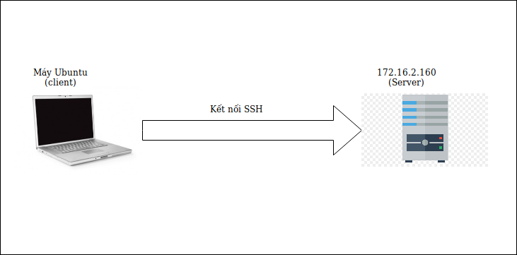
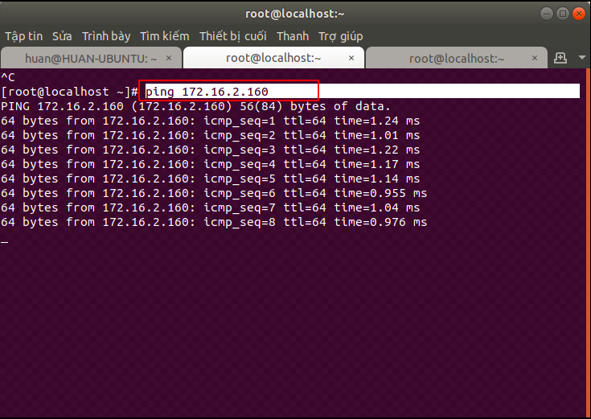
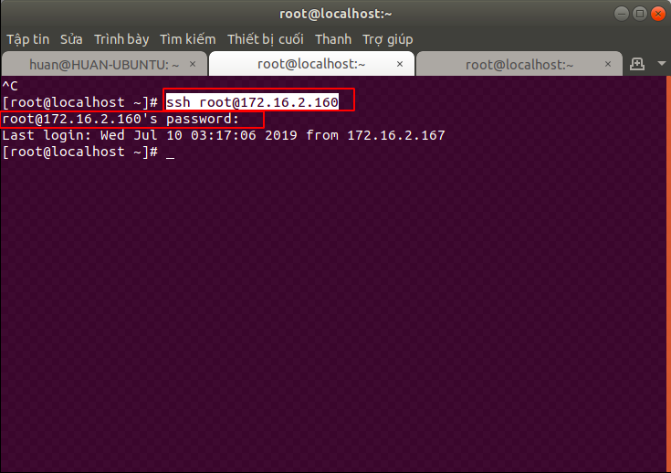
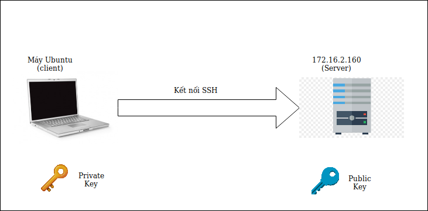
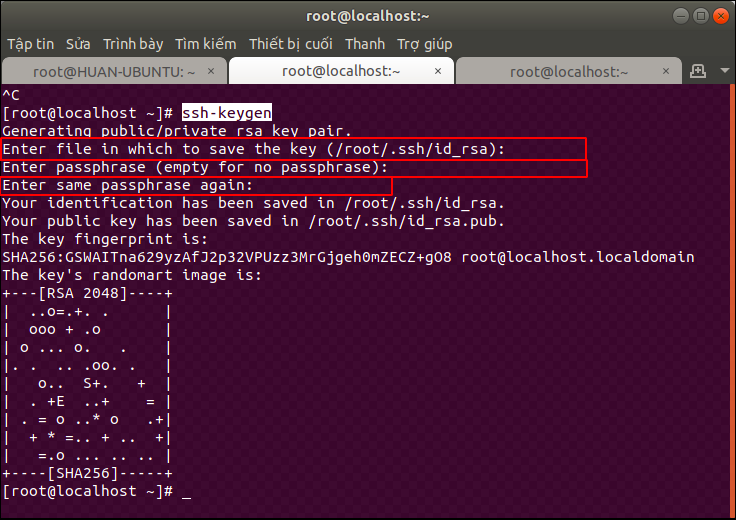
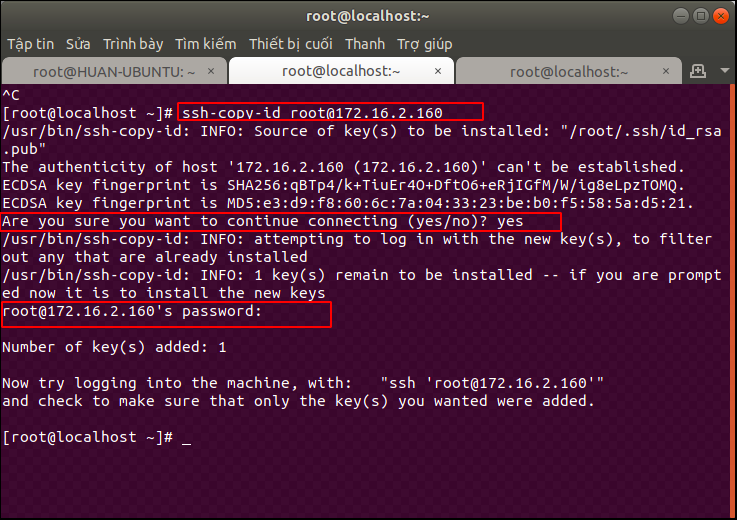
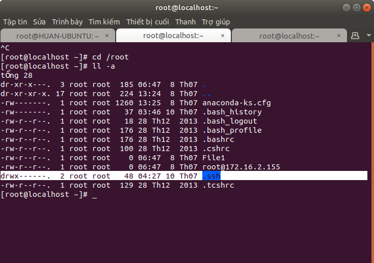
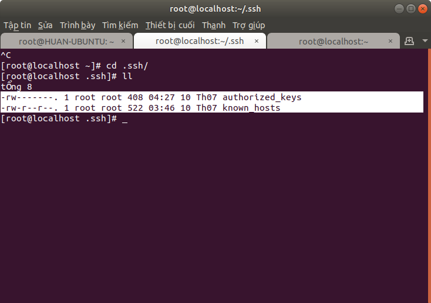

Cách kết nối vào máy chủ bằng SSH trên Ubuntu
===
## Mục lục
1. [Tổng quan về SSH](#1Tổng-quan-về-SSH)

2. [Mô hình kết nối SSH](#2Mô-hình-kết-nối-SSH)

3. [Thực hiện SSH bằng mật khẩu](#3Thực-hiện-SSH-bằng-mật-khẩu)

4. [Thực hiện SSH bằng cơ chế key pairs](#4Thực-hiện-SSH-bằng-cơ-chế-key-pairs)

5. [Một số lưu ý](#5Một-số-lưu-ý)
6. [Tài liệu tham khảo](#6Tài-liệu-tham-khảo)

## 1.Tổng quan về SSH
SSH (hay Secure Shell) là một giao thức mạng được mã hoá để vận hành các dịch vụ mạng một cách an toàn. SSH cung cấp một kênh kết nối bảo mật trong mô hình kết nối client-server. SSH sử dụng cổng TCP tiêu chuẩn là 22. Việc sử dụng giao thức SSH để kết nối sẽ tránh được các rủi ro trong việc nghe lén và đánh cắp thông tin.

Để thực hiện kết nối SSH, bạn có thể làm một vài cách như sau:
- Sử dụng mật khẩu để xác thực.
- Sử dụng cơ chế Key pairs

## 2.Mô hình kết nối SSH



Trong bài này, mình sẽ sử dụng một máy khách dùng Ubuntu với user root để kết nối với máy chủ có địa chỉ là `172.16.2.160`.

Về cơ bản, để thực hiện được kết nối này, bạn phải đảm bảo chắc chắn máy tính của bạn phải kết nối được với máy chủ. Để kiểm tra, bạn mở Terminal và gõ:
```
# ping <địa chỉ ip>
```


Khi đã có kết nối, chúng ta sẽ tiến hành kết nối với máy chủ.

## 3.Thực hiện SSH bằng mật khẩu

Với cách này, bạn cần nắm được mật khẩu đăng nhập người dùng trên máy chủ. Để thực hiện, bạn gõ trên Terminal như sau:
```
# ssh <người dùng>@<địa chỉ ip>
```



Nếu là lần kết nối đầu tiên, thì máy sẽ hỏi lại bạn có muốn tiếp tục hay không. Bạn chỉ cần gõ **YES**, sau đó nhập pass. Như vậy, bạn đã thục hiện xong việc kết nối.

## 4.Thực hiện SSH bằng cơ chế key pairs
Đôi khi việc sử dụng password để đăng nhập sẽ khiến bạn mất công nhớ mật khẩu và tiềm ẩn khả năng bị tấn công cao. Vì vậy, bạn có thể thực hiện việc kết nối thông qua sử dụng cơ chế key pairs.



Cơ bản thì ở máy khách sẽ tiến hành tạo cặp key là private key và public key, sau đó sẽ gửi key public tới máy chủ và giữ lại private key. Khi muốn thực hiện đăng nhập từ xa, máy khách sẽ gửi yêu cầu kèm key private tới máy chủ. Máy chủ sẽ tiến hành kiểm tra private key có trùng với public Key không. Nếu có thì sẽ đăng nhập thành công.

### Bước 1: Tạo key pairs

Đầu tiên, bạn phải tiến hành tạo SSH key trên máy của mình. Ở đây mình sẽ tạo key trên máy Ubuntu. Trên Terminal, bạn gõ:

```
# ssh-keygen
```



Lập tức trên terminal xuất hiện một số yêu cầu sau:

```
Enter file in which to save the key (/root/.ssh/id_rsa): 
```

Bạn sẽ điền tên của file key. Thư mục lưu trữ file key đó là thư mục `/root/.ssh/`. Nếu bạn không nhập bất cứ gì, tên file sẽ mặc định là **id_rsa**.

```
Enter passphrase (empty for no passphrase): 
Enter same passphrase again: 
```

Tiếp theo là mật khẩu cho key. Bước này sẽ khiến bạn phải xác thực lại key bằng mật khẩu. Nếu không muốn nhập mật khẩu, nhấn Enter để bỏ qua.

Như vậy, bạn đã tạo xong key trên máy của mình. Bây giờ thì tiến hành gửi key public tới máy chủ.

### Bước 2: Gửi key public
Nói chung bước này khá là nhiều bước tuy nhiên có một cách khá đơn giản để thực hiện một mớ các thao tác này đó là sử dụng tiện ích **ssh-copy-id**. 

> Ngoài ra nếu bạn không muốn sử dụng tiện ích này thì cũng có thể thực hiện một số cách khác như sao chép key qua SSH bằng mật khẩu hay sao chép thủ công.

Đầu tiên, trên cửa sổ Terminal, gõ lệnh:

```
# ssh-copy-id <người dùng>@<địa chỉ ip>
```



Trên Terminal sẽ hiện một loạt các dòng lệnh, trong đó có các yêu cầu sau.

```
Are you sure you want to continue connecting (yes/no)?
```

Máy yêu cầu cần xác thực bạn có muốn tiếp tục kết nối hay không. Bạn chỉ cần gõ **YES**.

```
root@172.16.2.160's password: 
```

Tiếp tục, máy yêu cầu bạn nhập mật khẩu cho máy nhận public key (máy chủ), nhập mật khẩu vào là bạn đã hoàn thành xong việc gửi public key tới máy nhận.

Bây giờ, trên cửa sổ Terminal của máy khách, gõ lệnh:

```
# ssh <người dùng>@<địa chỉ ip>
```

Như vậy là bạn đã hoàn toàn đăng nhập vào máy server mà không cần nhập mật khẩu.

### * Giải thích bước 2

Sau khi thực hiện copy và ssh thành công, trên máy server 2 sẽ có một số thay đổi như sau.

Đầu tiên, trên terminal của máy chủ (hoặc máy khách đã SSH) gõ:
```
# cd /root
# ll -a
```
Terminal sẽ hiện lên như sau:



Bạn có thể thấy có 1 thư mục tên là `.ssh` được tạo ra được cấp quyền là 700 (ý nghĩa con số 700 xem ở [đây](https://en.wikipedia.org/wiki/Chmod#Numerical_permissions)).

Di chuyển tới thư mục `.ssh`:
```
# cd .ssh
# ll
```


Ta thấy có 2 file ở trong thư mục này với các chức năng sau:
- authorized_keys: được cấp quyền 600, lưu trữ thông tin về key public được gửi.
- known_hosts: cấp quyền 644, lưu trữ thông tin nhưng máy đã từng đăng nhập bằng SSH.

Như vậy, ta có thể thấy, tiện ích **ssh-copy-id** đã giúp thực hiện một mớ các thao tác phức tạp về lại một câu lệnh đơn giản và tiện lợi.
### 5.Một số lưu ý

Nếu tên file key khác với tên mặc định (không phải **id_rsa**) bạn phải thêm cờ **-i** và tên key đó khi thực hiện **ssh-copy-id**. Ví dụ:
```
# ssh-copy-id -i abc.key root@172.16.2.167
```

Khi thực hiện ssh, nếu muốn sử dụng một key khác để đăng nhập, bạn cũng thêm cờ **-i** kèm theo địa chỉ thư mục chứa key, ví dụ như sau:

```
# ssh -i /home/user/abc.key user@172.16.2.167
```

Nếu bạn muốn tắt tính năng đăng nhập bằng mật khẩu, chỉ đăng nhập bằng key pairs. Bạn phải tiến hành tắt tính năng đó trên file config theo các bước sau:
Di chuyển đến thư mục chứa file config
```
# cd /etc/ssh/
# ls
```
Tìm file sshd_config và sửa nó với vi
```
# vi sshd_config
```

Trong file đó, tìm đến dòng PasswordAuthentication và đổi nó thành **NO**.
```
...
PasswordAuthentication no
...
```
Sau đó thoát ra ngoài bằng `ESC` -> gõ `:wq` ([tham khảo thêm tài liệu về Vim](https://vim.rtorr.com/)). Tiến hành restart lại sshd:

```
# sudo systemctl restart sshd.service
```

## 6.Tài liệu tham khảo

[1. Hướng dẫn SSH bằng key pairs](https://www.digitalocean.com/community/tutorials/how-to-set-up-ssh-keys-on-ubuntu-1604
)

[2. Câu lệnh ssh-copy-id](https://www.ssh.com/ssh/copy-id)

[3. Cơ bản về SSH](https://en.wikipedia.org/wiki/Secure_Shell)
