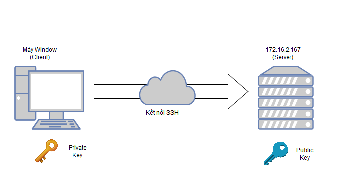
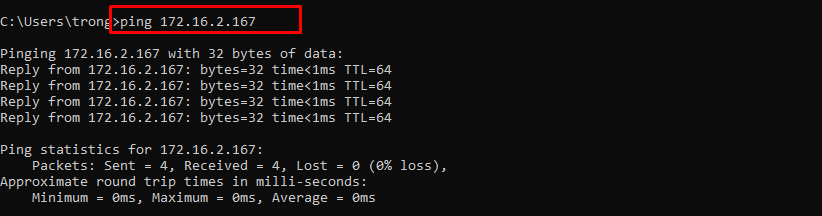
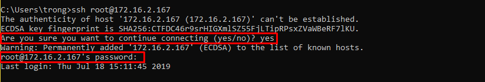
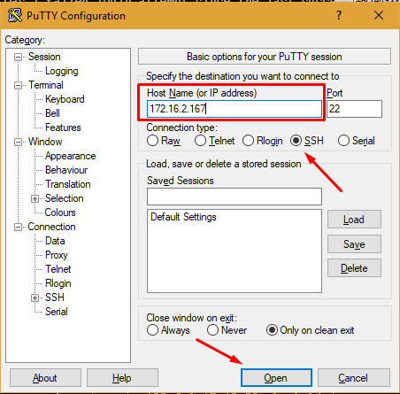
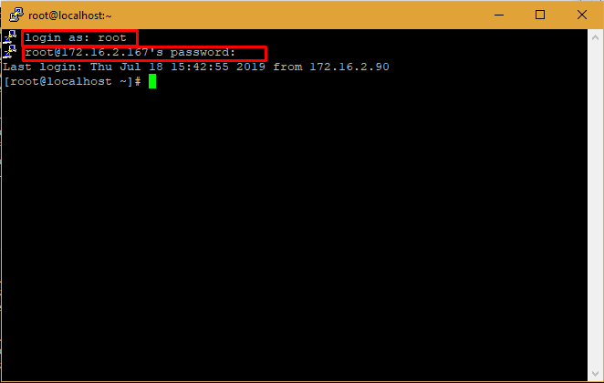
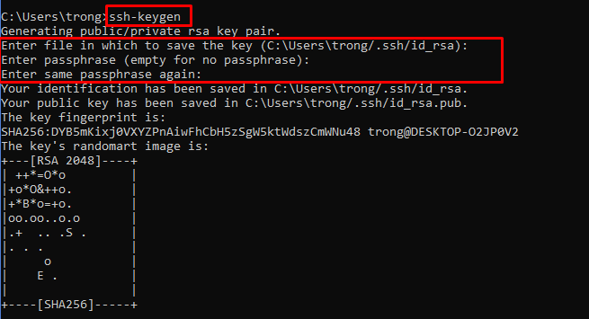
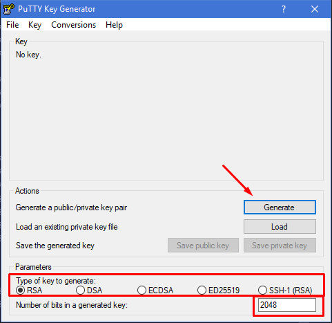
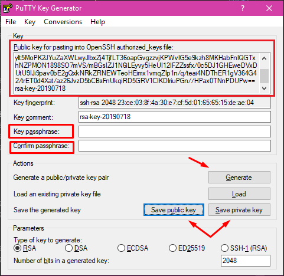
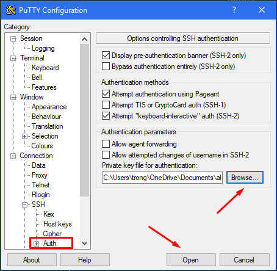

Hướng dẫn kết nối SSH trên Windows
===
## Mục lục
1. [Tổng quan](#1-Tổng-quan)
2. [Mô hình kết nối SSH](#2-Mô-hình-kết-nối-SSH)
3. [Kết nối SSH sử dụng mật khẩu](#3-Kết-nối-SSH-sử-dụng-mật-khẩu)
4. [Kết nối SSH sử dụng key](#4-Kết-nối-SSH-sử-dụng-key)
5. [Tài liệu tham khảo](#5-Tài-liệu-tham-khảo)
## 1. Tổng quan
SSH (hay Secure Shell) là một giao thức mạng được mã hoá để vận hành các dịch vụ mạng một cách an toàn. SSH cung cấp một kênh kết nối bảo mật trong mô hình kết nối client-server. SSH sử dụng cổng TCP tiêu chuẩn là 22. Việc sử dụng giao thức SSH để kết nối sẽ tránh được các rủi ro trong việc nghe lén và đánh cắp thông tin.

## 2. Mô hình kết nối SSH

Để thực hiện kết nối SSH, bạn có thể làm một vài cách như sau:

- Sử dụng mật khẩu để xác thực.
- Sử dụng cơ chế Key pairs.



Trong bài này, mình sẽ sử dụng một máy khách dùng Windows để kết nối với máy chủ có địa chỉ là 172.16.2.167.

Để thực hiện kết nối SSH, ta sử dụng OpenSSH hoặc phần mềm PuTTY. Bạn có thể tải phần mêm PuTTY tại [đây](https://www.putty.org/).

## 3. Kết nối SSH sử dụng mật khẩu

### Bước 1: Kiểm tra kết nối

Về cơ bản, để thực hiện được kết nối này, bạn phải đảm bảo chắc chắn máy tính của bạn phải kết nối được với máy chủ. Để kiểm tra, bạn nhấn tổ hợp phím **Start** + **R** rồi gõ cmd -> **Enter**. Trên cửa sổ cmd, bạn gõ:

```
ping <địa chỉ ip>
```



Nếu ping thành công nghĩa là bạn đang kết nối với máy chủ.

### Bước 2: Thực hiện kết nối SSH

Bạn có thể kết nối SSH trực tiếp trên cửa sổ cmd của bạn bằng cách gõ lệnh sau:

```
ssh <người dùng>@<địa chỉ ip>
```



Nếu là lần kết nối đầu tiên, thì máy sẽ hỏi lại bạn có muốn tiếp tục hay không. Bạn chỉ cần gõ YES, sau đó nhập pass. Như vậy, bạn đã thực hiện xong việc kết nối.

Nếu bạn sử dụng phần mềm PuTTY, bạn mở PuTTY lên, điền địa chỉ ip và chọn các thông số như hình.



Sau đó chọn OK, một cửa sổ command sẽ hiện ra. Bạn nhập thông tin tài khoản và mật khẩu để hoàn tất thao tác kết nối.



>Lưu ý: Nếu để cửa sổ command quá lâu và không thao tác gì thì phiên làm việc sẽ kết thúc.

## 4. Kết nối SSH sử dụng key

### Bước 1: Kiểm tra kết nối 

Bước này thực hiện giống như cách bên trên, mình sẽ không nhắc lại nữa.

### Bước 2: Tạo key

Trên cửa sổ cmd của windows gõ lệnh:

```
ssh-keygen
```



Lập tức trên terminal xuất hiện một số yêu cầu sau:

```
Enter file in which to save the key (C:\Users\trong/.ssh/id_rsa): 
```

Bạn sẽ điền tên của file key. Thư mục lưu trữ file key đó là thư mục `C:\Users\trong/.ssh/id_rsa`. Nếu bạn không nhập bất cứ gì, tên file sẽ mặc định là **id_rsa**.

```
Enter passphrase (empty for no passphrase): 
Enter same passphrase again: 
```

Tiếp theo là passpharase cho key. Bước này sẽ tạo thêm mật khẩu để xác thực cho key. Nếu không muốn nhập mật khẩu, nhấn Enter để bỏ qua.

Ngoài ra, bạn có thể sử dụng phần mềm PuTTYgen để tạo key như sau:



Ở đây, bạn có chọn một số tùy chọn cho thuật toán mã hoá như tiêu chuẩn mã hóa: rsa, dsa, ecdsa, ed25519, ssh1-1. Hoặc chọn số lượng bit mã hóa khác thay vì 2048. Khi lựa chọn xong, chon Generate để tạo key.

>Lưu ý: Trong quá trình tạo key, bạn phải di chuyển chuột quanh màn hình đến khi nó tạo xong.

Khi tạo xong, bạn có thể tiến hành tạo passphare cho key. Sau đó chọn **Save private key** để lưu private key, **Save public key** để lưu public key.



>Lưu ý: với private key, bạn nên cất giữ nó cẩn thận và lưu nó ra chỗ khác để nếu cần back up.

### Bước 3: Sao chép public key tới máy chủ.

Trên máy chủ, bạn tiến hành tạo các thư mục như sau (trên đây mình làm với tài khoản root):

```
# cd /root
# mkdir .ssh
# chmod 700 .ssh
# cd .ssh
# touch authorized_keys
# chmod 600 authorized_keys
```

> lưu ý: tùy vào user bạn muốn copy public key mà bạn có thể tạo thư mục và file theo đường dẫn tới user đó.

Tại file authorized_keys, bạn tiến hành ghi tiếp vào cuối file dữ liệu public key, sau đó save lại, bạn đã hoàn tất quá trình copy key.

>Lưu ý: để cho tiện việc copy, bạn nên thao tác trên cửa sổ cmd bằng cách ssh bằng mật khẩu tới server. Trên cửa sổ cmd, bạn tiến hành paste bằng cách nhấn chuột phải.

### Bước 4: Tiến hành đăng nhập.

Sau khi thực hiện copy public key, bạn có thể tiến hành kết nối mà máy không yêu cầu nhập mật khẩu như sau:
```
ssh <người dùng>@<địa chỉ ip>
```

Đối với ai dùng PuTTY, mở phần mềm lên và chọn tới tab như hình dưới.



Chọn đường dẫn mà bạn lưu trữ file private key, sau đó chọn open để kết nối.

### Bước 5: Tắt tính năng đăng nhập bằng mật khẩu

Để hoàn toàn chỉ có thể đăng nhập bằng key, bạn phải tắt tính năng đăng nhập bằng mật khẩu tại file config của nó. Tại cửa sổ terminal của máy chủ ta gõ:
```
# vi /etc/ssh/sshd_config
```

Trong file đó, tìm đến dòng `PasswordAuthentication` và đổi nó thành **NO**.
```
...
PasswordAuthentication no
...
```
Sau đó gõ ESC -> :wq đễ thoát ra ngoài. Tiến hành restart lại sshd:

```
# sudo systemctl restart sshd.service
```

## 5. Tài liệu tham khảo

1. [Hướng dẫn sử dụng PuTTYgen](https://www.ssh.com/ssh/putty/windows/puttygen)

2. [Cơ bản về SSH](https://en.wikipedia.org/wiki/Secure_Shell)

3. [Hướng dẫn tạo key pairs](https://tutorials.ubuntu.com/tutorial/tutorial-ssh-keygen-on-windows#0)