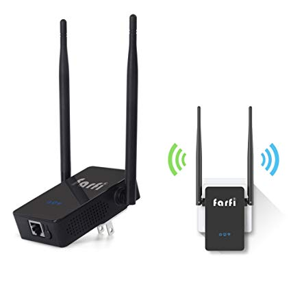
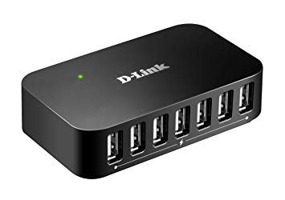
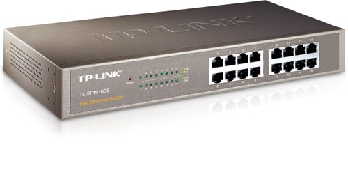
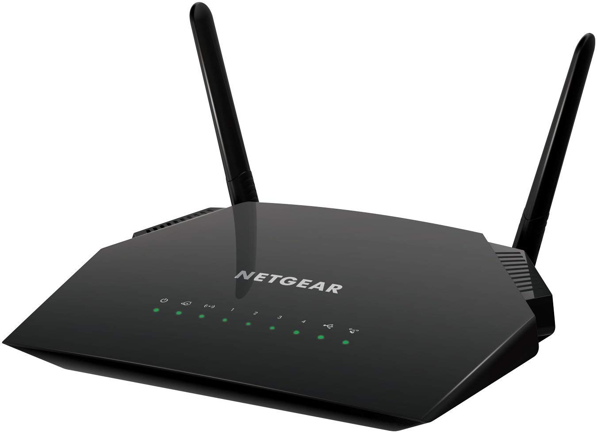

Tìm hiểu về một số thiết bị mạng
===
# Mục lục
- [1.Tổng quan](#1Tổng-quan)
- [2.Các thiết bị mạng](#2Các-thiết-bị-mạng)
    - [2.1.Repeater](#2.1Repeater)
    - [2.2.Hub](#2.2Hub)
    - [2.3.Bridge](#2.3Bridge)
    - [2.4.Switch](#2.4Switch)
        - [2.4.1.Switch layer 2](#2.4.1Switch-layer-2)
        - [2.4.2.Switch layer 3](#2.4.2Switch-layer-3)
    - [2.5.Router](#2.5Router)
- [3.Tài liệu tham khảo](#3Tài-liệu-tham-khảo)
## 1.Tổng quan
Trong môi trường mạng, có rất nhiều thiết bị tham gia kết nối và truyền tải thông tin. Chắc hản bạn sẽ có thể nghe đến một số cái tên như Hub, Switch, Router,... Dưới đây chúng ta sẽ cùng tìm hiểu về các thiết bị đó xem vai trò và chức năng của chúng trong môi trường mạng là gì.
## 2.Các thiết bị mạng
### 2.1.Repeater
Repeater là thiết bị của tầng 1 trong mô hình OSI, có vai trò khuyếch đại đường truyền tín hiệu.

Trong một không gian lớn, thông thường đường truyền tín hiệu sẽ bị giảm đi, các máy tính ở xa sẽ nhận được tín hiệu khá là yếu. Vì vậy, người ta dùng repeater giúp cho đường truyền có thể đi được xa hơn.

### 2.2.Hub
Hub là một thiết bị sở hữu từ 4 đến 24 cổng và cũng thể coi đây là một Repeater có nhiều cổng. Khi truyền tin vào một cổng, các cổng khác sẽ nhận được thông tin ngay lập tức.

Có 2 loại hub phổ biến:
- **Active hub**: loại này cần nguồn để chạy, có nhiều cổng giúp khuyếch đại tín hiệu.
- **Smart hub**: Giống Active hub nhưng có thêm chip giúp tự động dò lỗi mạng.

### 2.3.Bridge
Bridge nằm ở tầng thứ 2 trong mô hình mạng. Nó hoạt động như một cầu nối giữa 2 mạng đểtạo thành 1 mạng lớn hơn. 

Khi có một máy tính truyền tín hiệu tới 1 máy ở mạng khác, bridge sẽ sao chép lại gói tin và gửi nó tớ mạng đích. Tuy nhiên thì Bridge sẽ chỉ kết nối được những mạng cùng loại.

### 2.4.Switch
Switch cũng có thể được coi là hub với nhiều cổng với khả năng kết nối được nhiều mạng cùng lúc tuỳ vào số cổng. Switch sẽ kết nối các thiết bị mạng khác nhau lại với nhau.

#### 2.4.1.Switch layer 2
Switch layer 2 là thiết bị không cần kết nối trực tiếp với nhau để truyền tín hiệu mà thông qua nhiều cách khác nhau. Đặc điểm nổi bật là các máy host có thể hoạt động ở chế độ song công, thực hiện đường truyền mà không phải chia băng thông đồng thời có thể giới hạn lưu lượng truyền.
#### 2.4.2.Switch layer 3
Switch layer 3 được gắn thêm bảng định tuyến ip thông minh vào bên trong. Nhờ đó Switch layer 3 có cả chức năng định tuyến như 1 router, vừa có thể thực hiện chức năng như 1 switch thông thường.

- So sánh

 | | Layer 3 | Layer 2 
 --- | --- | ---
 Định tuyến tĩnh |Tính năng định tuyến tĩnh cho phép lưu lượng được định tuyến giữa các VLAN.
 |Định tuyến động | Sử dụng liên kết mạng lớn với nhau và chia sẻ các bảng định tuyến giữa chúng.
 |Bảo mật|Phòng người DoS, phát hiện lặp lại và kiểm tra ARP.
 |IP và QoS|Có khả năng hiểu thông tin địa chỉ ip của lưu lượng truy cập khi chuyển đổi.|Cấu hình một cổng thủ công.
 |Bảng CAM|Kế thừa từ Layer 2|Dùng bảng CAM để đối chiếu địa chỉ MAC đưa gói tin đến đúng nơi.
 |Bảng FIB|Dùng bảng FIB để chuyển tiếp gói tin|

### 2.5 Router
Router được xếp ở lớp thứ 3 trong mô hình OSI có nhiệm vụ kết nối nhiều dải IP khác nhau.

## 3.Tài liệu tham khảo

https://quantrimang.com/khai-niem-can-ban-ve-thiet-bi-mang-modem-router-19028

https://medium.com/@totolinkvn/switch-layer-3-l%C3%A0-g%C3%AC-switch-layer-3-kh%C3%A1c-g%C3%AC-so-v%E1%BB%9Bi-switch-layer-2-e74bc70e5744