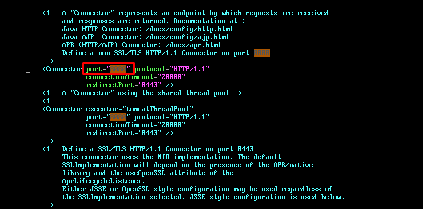
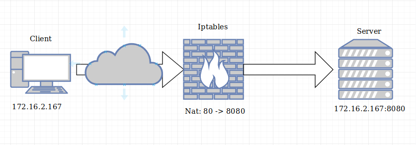

Cách chạy Apache Tomcat ở cổng 80
===
## Mục lục
1. [Mục địch](#1-Mục-đích)
2. [Cách 1: Thay đổi quyền sở hữu cho tomcat.service](#2-cách-1-Thay-đổi-quyền-sở-hữu-cho-tomcat.service)
3. [Cách 2: Tiến hành Nat port bằng firewalld](#3-Cách-2-Tiến-hành-Nat-port-bằng-firewalld)
4. [Tài liệu tham khảo](#4-tài-liệu-tham-khảo)

## 1. Mục đích
Thông thường, cổng mặc định khi chạy apache tomcat là cổng 8080. Tuy nhiên, điều này sẽ gây một số phiền toái khi nhập địa chỉ cổng 8080. 


Vì vậy, để khắc phục vấn đề này, ta sẽ cho apache tomcat chạy ở cổng mặc định của giao thức http là 80. Có rất nhiều cách để làm được điều này, trên đây mình xin hướng dẫn 2 cách sau.

## 2. Cách 1: Thay đổi quyền sở hữu cho tomcat.service

Cổng 80 là cổng chỉ được phép chạy dưới quyền root. Nếu apache tomcat quản lí bởi người dùng tomcat sẽ không chạy được cổng này. Vì vậy ta sẽ đổi quyền sở hữu cho apache tomcat sang root. Cách này có đặc điểm sau:
- Ưu điểm: Dễ làm!
- Nhược điểm: Sẽ rất nguy hiển khi đặt root làm người dùng sở hữu cho Tomcat.

### Bước 1: Đổi port sang 80
Đầu tiên, ta tìm tới file `server.xml`. Trên cửa sổ terminal, ta gõ:
```
$ cd /opt/tomcat/conf
$ vim server.xml
```



Tìm tới dòng như hình bên trên, đổi `8080` thành `80` sau đó lưu lại.

### Bước 2: Thay đổi quyền sở hữu

Ta cần tìm file service của tomcat để thay đổi quyền. Như bài hướng dẫn cài đặt lần trước (xem tại [đây](install_tomcat.md)), mình lưu file tomcat.service tại `/etc/systemd/system`, ta tiến hành sửa như sau:
```
$ sed -i 's/User=tomcat/User=root/g' /etc/systemd/system/tomcat.service
```

### Bước 3: reset lại service.

Sau khi thay đổi file service, ta tiến hành reload và restart lại nó như sau:
```
$ systemctl daemon-reload
$ systemctl restart tomcat
```

Như vậy là ta đã hoàn toàn đổi cổng tomcat sang 80.

## 3. Cách 2: Tiến hành Nat port bằng firewalld

Một cách hay hơn và an toàn hơn cách trên đó là sử dụng firewalld.



Với cách này, apache tomcat vẫn sẽ nghe tại cổng 8080, mọi lưu lượng sẽ được chuyển hướng bằng firewalld. Bạn sẽ không phải thay đổi bất cứ cấu hình nào của tomcat. Ta thực hiện lệnh như sau:
```
$ firewall-cmd --zone=public --add-forward-port=port=80:proto=tcp:toport=8080.
```
>Lưu ý: Bạn cũng có thể dùng iptables để nat port tuy nhiên phải tắt dịch vụ firewalld trước đó.
## 4. Tài liệu tham khảo
1. [Hướng dẫn dổi tomcat port sang 80]()