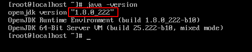
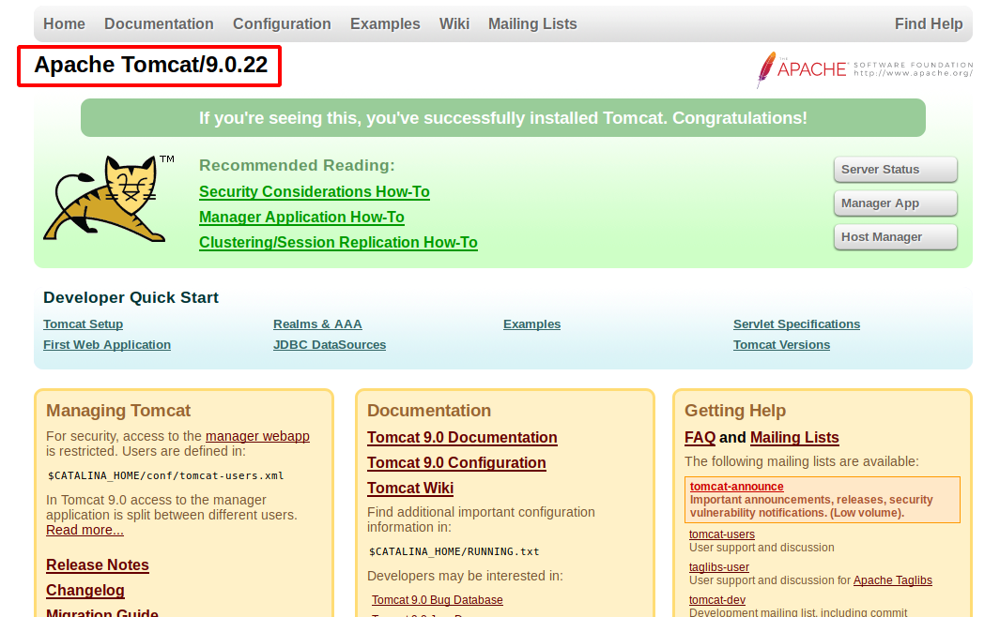

Hướng dẫn cài đặt Tomcat trên CentOS 7
===
## Mục lục
1. [Tổng quan](#1-Tổng-quan)
2. [Hướng dẫn cài đặt](#2-Hướng-dẫn-cài-đặt)
3. [Tài liệu tham khảo](#3-Tài-liệu-tham-khảo)
## 1. Tổng quan
Tomcat là một phần mềm máy chủ mã nguồn mở được phát triển bởi **Apache Software Foundation (ASF)**. Tomcat được sử dụng để deploy các ứng dụng Java Web. 


Trong bài này, mình sẽ hướng dẫn cài đặt bản Tomcat 9 trên máy ảo CentOS 7.
## 2. Hướng dẫn cài đặt
### Bước 1: Cài đặt Java

Bạn cần cài đặt java SE 7.0 hoặc cao hơn để có thể cài Tomcat. Ở đây, mình cài môi trường OpenJDK Runtime bản 8. Trên terminal, gõ lệnh:
```
$ sudo yum install java-1.8.0-openjdk.x86_64
```

Kiển tra version java đã cài:
```
$ java -version
```


Bạn có thể thấy bản java đã cài là bản 8.

### Bước 2: Tạo người dùng chuyên dụng Tomcat

Để bảo mật, bạn cần tạo người dùng mới không có quyền root cho Tomcat thuộc nhóm người dùng "tomcat".
```
$ sudo groupadd tomcat
$ sudo mkdir /opt/tomcat
$ sudo useradd -s /bin/nologin -g tomcat -d /opt/tomcat tomcat
```
Như vậy, người dùng "tomcat" được tạo thuộc nhóm "tomcat". Người dùng này không dùng để đăng nhập và có thư mục chính nằm tại `/opt/tomcat/`.
### Bước 3: Tải bản Tomcat mới nhất.

Để có thể tải Tomcat 9, bạn thực hiện như sau:
```
$ cd
$ wget http://www-us.apache.org/dist/tomcat/tomcat-9/v9.0.22/bin/apache-tomcat-9.0.22.tar.gz
```
Tiến hành giải nén:
```
$ sudo tar -zxvf apache-tomcat-9.0.22.tar.gz -C /opt/tomcat
```
> Lưu ý: thư mục chứa dữ liệu đã giải nén nằm tại `/opt/tomcat`.

### Bước 4: Thiết lập quyền cho Tomcat

Trước khi tiến hành cài đặt, bạn cần trao quyền sở hữu cho một số file và thư mục như sau:
```
$ cd /opt/tomcat
$ sudo chgrp -R tomcat conf
$ sudo chmod g+rwx conf
$ sudo chmod g+r conf/*
$ sudo chown -R tomcat logs/ temp/ webapps/ work/

$ sudo chgrp -R tomcat bin
$ sudo chgrp -R tomcat lib
$ sudo chmod g+rwx bin
$ sudo chmod g+r bin/*
```

### Bước 5: Thiết lập dịch vụ tomcat trong systemd

Để thuận tiện cho việc quản lí và kiểm tra, bạn cần thiết lập dịch vụ cho tomcat tại systemd.
```
$ sudo vi /etc/systemd/system/tomcat.service
```
Tiến hành viết vào file đó như sau:
```
[Unit]
Description=Apache Tomcat Web Application Container
After=syslog.target network.target

[Service]
Type=forking

Environment=JAVA_HOME=/usr/lib/jvm/jre
Environment=CATALINA_PID=/opt/tomcat/temp/tomcat.pid
Environment=CATALINA_HOME=/opt/tomcat
Environment=CATALINA_BASE=/opt/tomcat
Environment='CATALINA_OPTS=-Xms512M -Xmx1024M -server -XX:+UseParallelGC'
Environment='JAVA_OPTS=-Djava.awt.headless=true -Djava.security.egd=file:/dev/./urandom'

ExecStart=/opt/tomcat/bin/startup.sh
ExecStop=/bin/kill -15 $MAINPID

User=tomcat
Group=tomcat

[Install]
WantedBy=multi-user.target
```
Sau đó lưu và thoát khỏi chế độ edit **`:wq`**.

### Bước 6: Khởi chạy và test Tomcat
Đầu tiên, ta cần khởi chạy và thiết lập nó chạy cùng với hệ thống:
```
$ systemctl start tomcat
$ systemctl enable tomcat
```
Đển có thể test nó trên web browser, bạn cần thay đổi thiết lập firewall:
```
$ sudo firewall-cmd --zone=public --permanent --add-port=8080/tcp
$ sudo firewall-cmd --reload
```
Mở trình duyệt lên, trên thanh url, gõ:
<địa chỉ ip>:8080
Nếu mọi thứ không có lỗi, màn hình sẽ hiện ra như sau:



## 3. Tài liệu tham khảo
1. [Tomcat là gì?](https://vi.wikipedia.org/wiki/Apache_Tomcat)
2. [Hướng dẫn cài Tomcat trên CentOS 7](https://www.vultr.com/docs/how-to-install-apache-tomcat-8-on-centos-7)