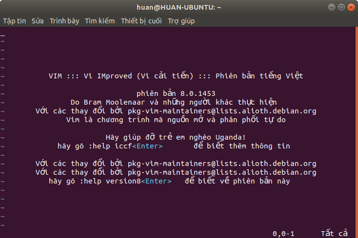

Tìm hiểu về Vim
================
# Mục lục
1. [Tổng quan](#1-Tổng-quan)
2. [Hướng dẫn cài đặt Vim](#2-hướng-dẫn-cài-đặt-vim)
3. [Một số câu lệnh cơ bản](#3-Một-số-câu-lệnh-cơ-bản)
4. [Tài liệu tham khảo](#4-Tài-liệu-tham-khảo)
## 1. Tổng quan
Vim (Vi improve) là một bản sao của trình soạn thảo vi được nâng cấp, bổ sung và phát hành năm 1991.
Nhìn chung, khá giống với vi, Vim không sử dụng menu hay icon mà thao tác bằng câu lệnh nhưng vẫn đảm bảo đầy đủ chức năng của một trình soạn thảo cơ bản.

## 2. Hướng dẫn cài đặt Vim
Nếu bạn sử dụng Windows, thực hiện tải nó trên trang chủ và cài đặt tại [đây](https://www.vim.org/download.php).

Nếu bạn sử dụng Linux, đối với Ubuntu, mở của sổ Terminal, gõ lệnh:

```
sudo apt-get install vim
```

Hoặc đối với CentOS:

```
sudo yum install vim
```

Sau đó tiến hành kiểm tra phiên bản vim bạn đang dùng bằng cách gõ lệnh:

```
vim -v
```



gõ **`:q!`** để thoát.
## 3. Một số câu lệnh cơ bản
Để khởi động Vim, bạn mở **Terminal** và gõ:

>vim "tên file"

Sau đó **Terminal** của bạn sẽ chuyển sang chế độ edit của Vim.
### 3.1. Nhóm lệnh di chuyển con trỏ

Điều đầu tiên bạn cần học đó là cách di chuyển con trỏ trên cửa sổ làm việc của vim. Song song với việc sử dụng phím mũi tên quen thuộc, người sử dụng có thể sử dụng các phím di chuyển như sau:
- `h`: di chuyển sang trái.
- `j`: di chuyển xuống dưới.
- `k`: di chuyển lên trên.
- `l`: di chuyển xuống dưới.
- `$`: di chuyển con trỏ tới cuối dòng.
- `w`: di chuyển tới kí tự đầu tiên của từ kế tiếp.
- `b`: di chuyển tới kí tự đầu tiên của từ phía trước.
- `G`: di chuyển tới vị trí cuối file.
- `gg`: di chuyển tớ vị trí đầu file. 
- [số] + `G`: di chuyển tớ dòng số...

Ngoài ra, để hiển thị số dòng và vị trí dòng mà con trỏ đang đứng, nhấn `Ctrl + g`.

### 3.2. Nhóm lệnh lưu và thoát

Khi chưa chắc chắn về bản ghi của mình, bạn có thể huỷ lưu thay đổi và thoát ra ngoài theo lệnh `:q!`

Nếu muốn lưu bản ghi của mình, gõ lệnh `:w`, 
hoặc có thể vừa lưu và thoát `:wq`
### 3.3. Nhóm lệnh soạn thảo

Nhóm câu lênh soạn thảo có cấu trúc như sau:

```
[số] + câu_lệnh + đối_tượng
```

Hoặc:
```
Câu_lệnh + [số] + đối_tượng
```
Trong đó:
- [số]: số lần thực hiện câu lệnh.
- câu_lệnh: câu lệnh cần thực hiện.
- đối_tượng: đối tượng mà câu lệnh thực hiện lên đó.
#### 3.3.1. Lệnh thay thế

Tiếp theo, ta cần học cách sử dụng các câu lệnh thay thế như sau:

- `r`: thay thế một kí tự tại vị trí con trỏ.
- `R`: thay thế nhiều kí tự cùng lúc.

Nếu muốn thực hiện thao tác tìm kiếm và thay thế, ta có thể làm như sau:

- `:s/cũ/mới`: tìm kiếm và thay thế cụm từ đầu tiên mà con trỏ tới.
- `:s/cũ/mới/g`: tìm kiếm và thay thế toàn bộ từ trong 1 dòng.
- `:<dòng1>,<dòng2>s/cũ/mới/g`: tìm kiếm và thay thế trong đoạn nào đó.
- `:%s/cũ/mới/g`: tìm kiếm và thay thế trên toàn bộ file.

#### 3.3.2. Lệnh chèn

Một trong những thao tác cần phải nắm đó là lệnh chèn. Để thực hiện chèn một đoạn văn bản, ta nhấn phím `i` hoặc `insert` trên bàn phím.

#### 3.3.3. Lệnh xoá

Tiếp theo là nhóm lệnh xoá. Với câu lệnh này, kí tự bị xoá bỏ sẽ lưu vào trong bộ nhớ tạm. Để thực hiện xoá, ta làm như sau:

- `x`: xoá một kí tự tại vị trí con trỏ.
- `dw`: xoá 1 từ (cả khoảng trắng).
- `de`: xoá một từ nhưng không xoá khoảng trắng.
- `d$`: xoá từ vị trí con trỏ đến hết dòng.
- `dd`: xoá hẳn một dòng.
- `[số] + dd`: xoá nhiều dòng.

#### 3.3.4. Nhóm lệnh Undo

Đôi khi bạn chỉnh sửa sai và cần khôi phục trạng thái trước đó, bạn cần biết lệnh Undo như sau:

- `u`: huỷ bỏ câu lệnh vừa thao tác.
- `U`: phục hồi trạng thái ban đầu của một dòng.

#### 3.3.5. Nhóm lệnh cut

Với việc lưu dữ liệu vào bộ nhớ đệm khi dùng câu lệnh xoá, ta có thể dùng chức năng cut. Để paste ra vị trí cần, bạn di chuyển con trỏ tới đó rồi nhấn phím `p`.

#### 3.3.6. Nhóm lệnh copy

Để thực hiện copy ta có thể nhấm phím y với các tuỳ chọn sau:
- `ye`: copy từ vị trí con trỏ đến cuối từ.
- `yw`: copy từ vị trí con trỏ đến cuối từ(cả khoảng trắng).
- `y$`: copy từ vị trí con trỏ đến cuối dòng.
- `yy`: copy cả dòng.

Ngoài ra, ta có thể bôi đen nhưng kí tự bằng cách chọn `v` rồi di chuyển con trỏ. Sau đó nhấn `y`.

Sau khi copy, chọn `p` để paste ra vị trí bạn cần.

#### 3.3.7. Nhóm lệnh tìm kiếm

Để thực hiện câu lệnh tìm kiếm, ta nhấn `/` sau đó nhấn từ tìm kiếm. Sau khi tìm thấy, con trỏ sẽ trỏ tới đầu cụm từ đầu tiên tìm thấy. 

Nếu muốn tiếp tục tìm kiếm từ đó, nhấn phím `n`.

Muốn tìm kiếm ngược lại, nhấn phím `?` thay vì `/`.

## 4. Tài liệu tham khảo

1. [Giới thiệu về Vim](https://vi.wikipedia.org/wiki/Vim_(tr%C3%ACnh_so%E1%BA%A1n_th%E1%BA%A3o))

2. [Câu lệnh về Vim](https://vim.rtorr.com/)

