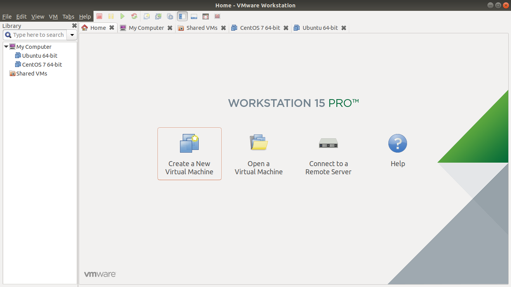
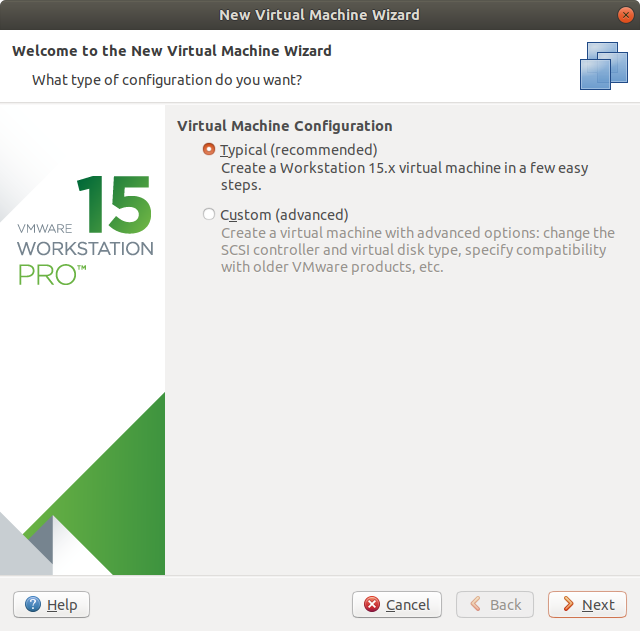
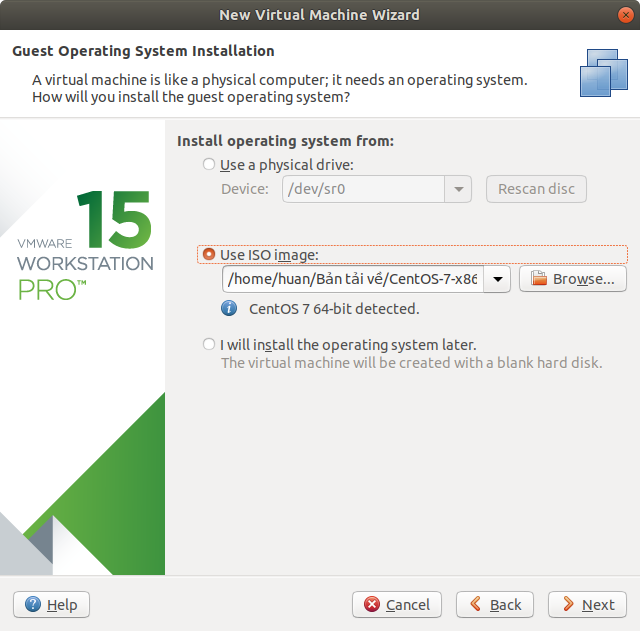
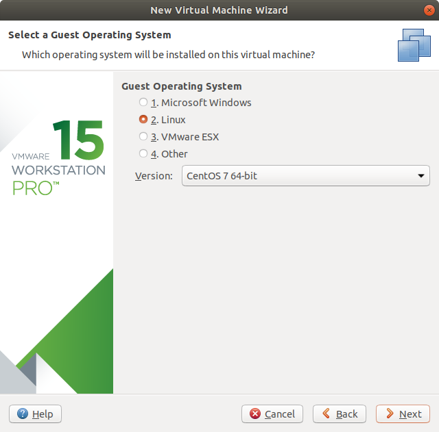
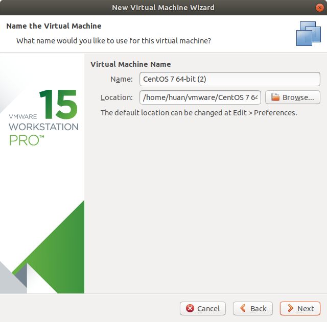
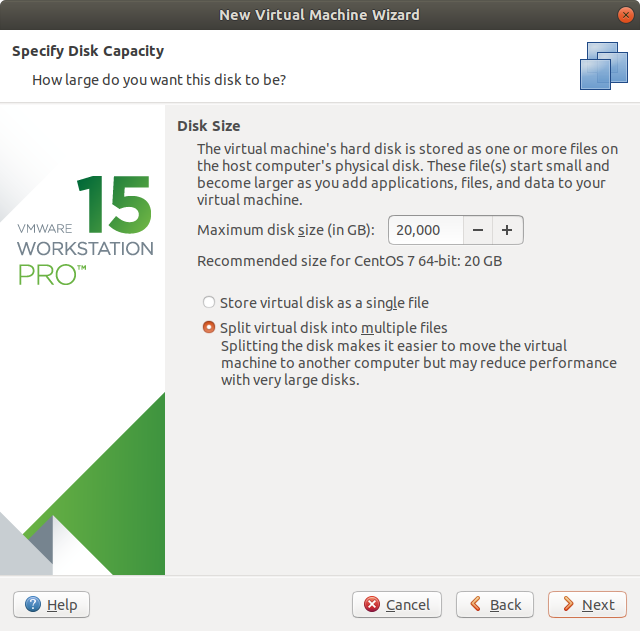
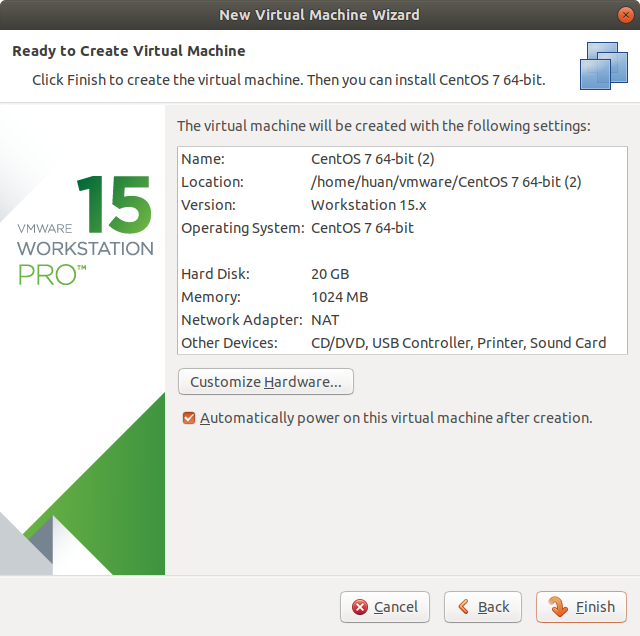
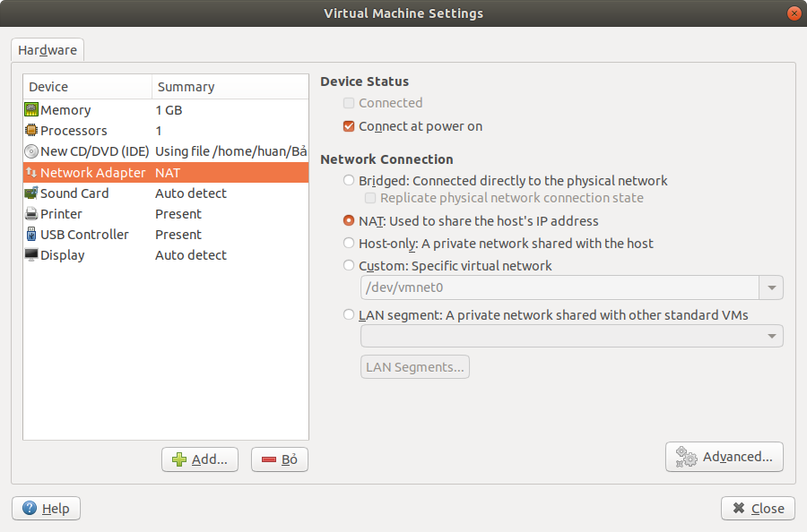
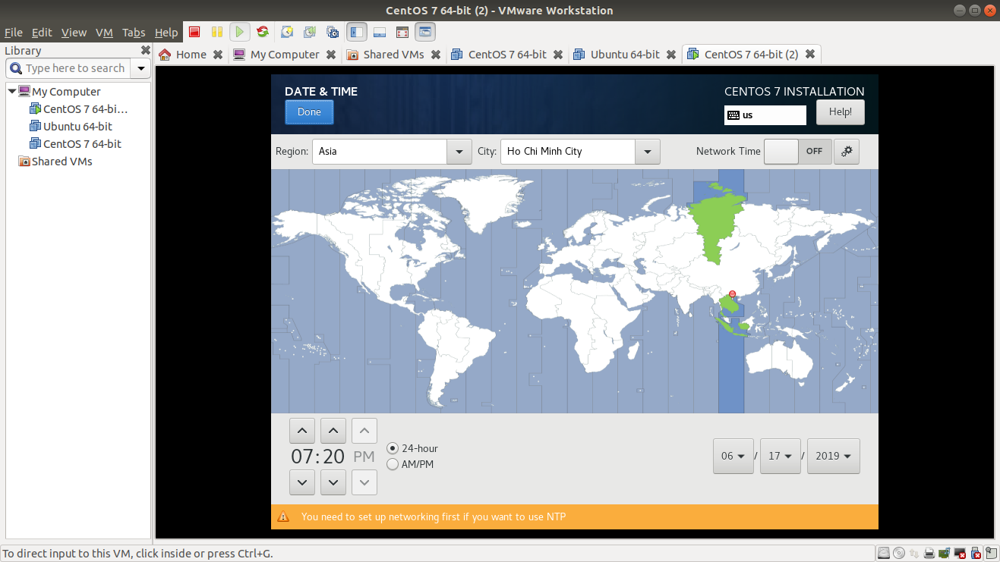

Tìm hiểu về VMWare WorkStation
====
# Mục lục
- [1.Tổng quan](#1tổng-quan)
- [2.Cài đặt phần mềm VMWare Workstation](#2cài-đặt-phần-mềm-vmware-workstation)
- [3.Cài đặt hệ điều hành trên máy ảo](#3cài-đặt-hệ-điều-hành-trên-máy-ảo)
- [4.Cài đặt hệ điều hành CentOS trên máy ảo](#4cài-đặt-hệ-điều-hành-centos-trên-máy-ảo)
- [5.Tài liệu tham khảo](#5tài-liệu-tham-khảo)
## 1.Tổng quan
VMWare WorkStation là một phần mềm giúp cài đặt máy ảo để có thể chạy đồng thời trên cùng 1 máy.
Máy ảo này sẽ hoạt động độc lập với máy tính vật lí nên nó có vai trò trong kết nối mạng, thử nghiệm virus, thử nghiệm hệ điều hành,...

## 2.Cài đặt phần mềm VMWare Workstation
**Bước 1**: Kiểm tra cấu hình máy tính.

 Bạn phải chắc chắn rằng máy tính của mình có đủ cấu hình để có thể cung cấp cho máy ảo của bạn.

**Bước 2**: Tải phần mềm và cài đặt phần mềm.
## 3.Cài đặt hệ điều hành trên máy ảo
**Bước 1**

Đầu tiên bạn phải xác định hệ điều hành mà bạn muốn cài. Bạn có thể tiến hành tải file .iso để có file cài.
Để cài đặt bạn chọn File -> New Virtual Machine hoặc Ctrl + N

**Bước 2**

Chọn cấu hình máy ảo. Ở đây có 2 lựa chọn:
* Typical: cài đặt máy ảo với vài bước đơn giản (khuyên dùng)
* Custom: cài máy ảo với một vài tuỳ chọn nâng cao (Nâng cao)

Bạn có thể chon Typical để tiếp tục.

**Bước 3**

Chọn file cài hệ điều hành. Ở đây có 3 sự lựa chọn:
* Use a physical drive: Sử dụng ổ quang để cài đặt
* Use ISO image: cài đặt bằng file iso.
* i will install the operating system later: 

Lựa chọn hệ điều hành cài đặt sau.
Với file ISO bạn tải ban đầu, bạn tiến hành cài đặt theo lựa chọn thứ 2.

**Bước 4**

Chọn hệ điều hành máy ảo. Ở bước này, bạn cần chọn hệ điều hành để cài đặt. Nếu bạn đã chọn hệ điều hành để cài đặt thì ở bước này nó sẽ chọn tự động.

Ở đây hệ điều hành đang được chọn là CentOS 7 64-bit

**Bước 5**

Chọn vị trí lưu máy ảo và tên máy ảo.

**Bước 6**

Chọn dung lượng lưu trữ ổ cứng. Ở bước này, bạn có thể để tự động theo recommended.

**Bước 7**

Ở bước này, bạn sẽ lựa chọn phần cứng cho máy ảo của bạn. Các phần cứng quan trọng cần có như: Memory, Processors, Network Adapter, Display.

Chọn Customize Hardware để tiến hành điều chỉnh.

Tại bước này bạn cần quan tâm tới card mạng. Có 3 lựa chọn cho card mạng của bạn như sau:
* Bridges: Máy ảo của bạn sẽ được kết nối thẳng tới máy tính vật lí của bạn.
* NAT: Thực hiện chia sẻ địa chỉ ip theo cơ chế NAT ip.
* Host Only: tạo vùng mạng riêng.

Sau khi cấu hình xong, chọn Finish để kết thúc quá trình tạo máy ảo.

## 4.Cài đặt hệ điều hành CentOS trên máy ảo.
Để cài đặt CentOS 7 trên máy ảo, ta tiến hành tạo máy ảo mới như đã hướng dẫn ở mục III.

Sau khi tạo xong, hệ điều hành sẽ khởi động và bạn sẽ tiến hành cài đặt như sau:

**Bước 1**: Lựa chọn ngôn ngữ

Phần này bạn cứ để là tiếng Anh

**Bước 2**: Lựa chọn thời gian

Bạn chọn múi giờ là khu vực mình sinh sống. Ở đây mình chọn Hồ Chí Minh, Asia.

**Bước 3** Chọn Begin Installation
 
Ở bước này bạn tiến hành đặt mật khẩu cho tàu khoản root cũng như là tạo các user cho máy ảo của bạn. 

Sau khi cấu hình xong, bạn đợi một chút để máy tính hoàn tất quá trình cài đặt.

## 5.Tài liệu tham khảo
https://tech.vccloud.vn/huong-dan-su-dung-vmware-workstation-15-20181127173115215.htm

https://www.howtoforge.com/tutorial/centos-7-minimal-server/

