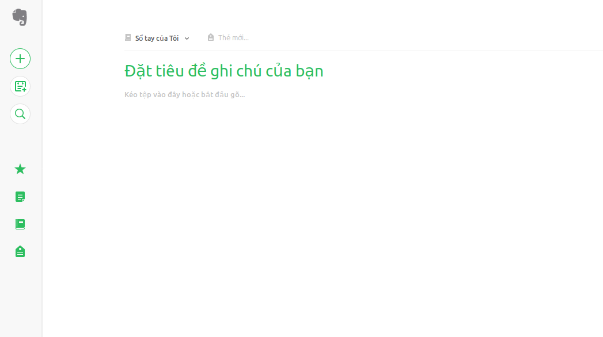
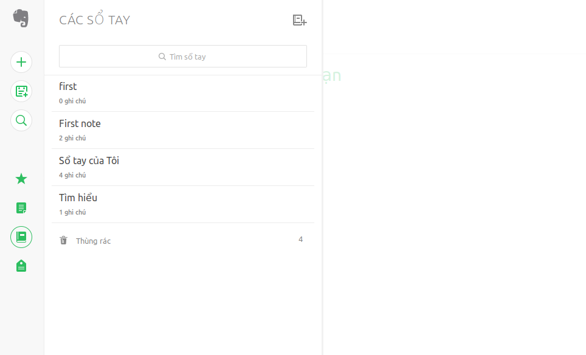
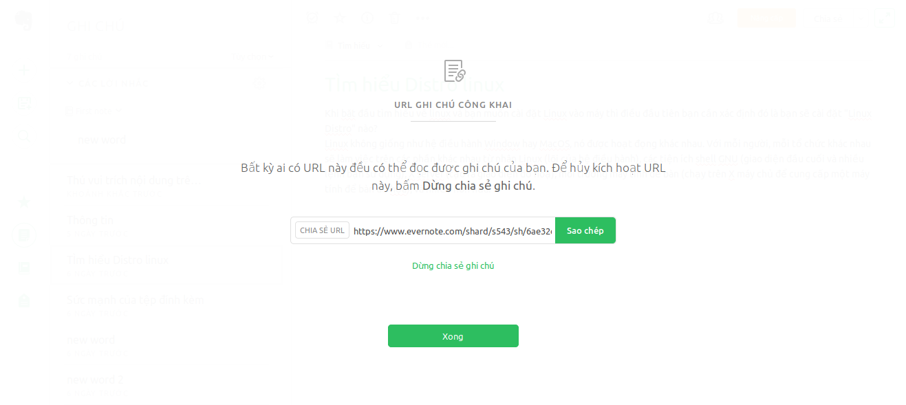

Tìm hiểu về Evernote
=====
# Mục lục
- [1.Tổng quan](#1tổng-quan)
- [2.Một số chức năng](#2một-số-chức-năng)
    - [2.1.Thêm một note mới](#2.1thêm-một-note-mới)
    - [2.2.Thêm một sổ tay mới](#2.2thêm-một-sổ-tay-mới)
    - [2.3.Thêm nhãn cho một note](#2.3thêm-nhãn-cho-một-note)
    - [2.4.Chức năng chia sẻ](#2.4Chức-năng-chia-sẻ)
- [3.Tài liệu tham khảo](#3Tài-liệu-tham-khảo)
## 1.Tổng quan

Evernote là một ứng dụng đa nên tảng có chức năng note lại thông tin trực tuyến. Evernote có khả năng chia sẻ cho nhiều người hoặc có thể cộng tác với người khác.

Người dùng có thể note trên mọi nền tảng như web, window, ios, android. và các note sẽ được đồng bộ liên tục khi thiết bị của bạn được kết nối mạng.

## 2.Một số chức năng

### 2.1.Thêm một note mới

Người dùng có thể tạo một note mới bằng cách chọn dấu "+" ở góc màn hình.

Sau đó, một note mới đã được tạo, bạn sẽ điền tiêu đề và note lại ở bên dưới.
### 2.2Thêm một sổ tay mới

Bạn có thể tổ chức các note mà bạn đang có thành sổ tay nhằm mục đích dễ tìm kiếm, chia sẻ và tìm kiếm. Để Thêm một sổ tay, bạn chọn vào mục sổ tay rồi chọn icon "+".

Sau đó chọn tiêu đề cho sổ tay rồi chọn "Tạo sổ tay". Sau khi tạo xong, muốn thêm note trong sổ tay bạn chọn biêu tượng "+" và thêm note như thường.
### 2.3.Thêm nhãn cho một note

Để phục vụ cho tìm kiếm cũng như là thêm các thẻ cho note của bạn thì bạn có thể sử dụng chức năng thêm tag.
Mục đích:
* Thêm thông tim về tiến độ: In-process, Done,...
* Thêm thông tin về mức độ ưu tiên.
* Thêm thành viên tham gia.
* Thêm chức vụ.

Để thêm tag vào note, bạn nhấn vào icon "tag" trên note.

Sau đó bạn thêm các tag liên quan. Với mỗi tag, được ngát với nhâu bởi "Enter"
Với những thẻ đó, bạn có thể xem thông tin thẻ tại mục tag. Ở đó bạn cũng có thể tìm kiếm note chứa các thẻ đó.

### 2.4.Chức năng chia sẻ

Với một note mà bạn có nhu cầu muốn chia sẻ cho người khác, bạn có thể chọn note đó, chọn "chia sẻ".

Bạn có thể chia sẻ trên nhiều nơi khác nhau. Nếu muốn lấy link chia sẻ, bạn chọn "liên kết". Sau đó copy link chia sẻ.

## 3.Tài liệu tham khảo
https://help.evernote.com/hc/en-us/categories/10681-Using-Evernote