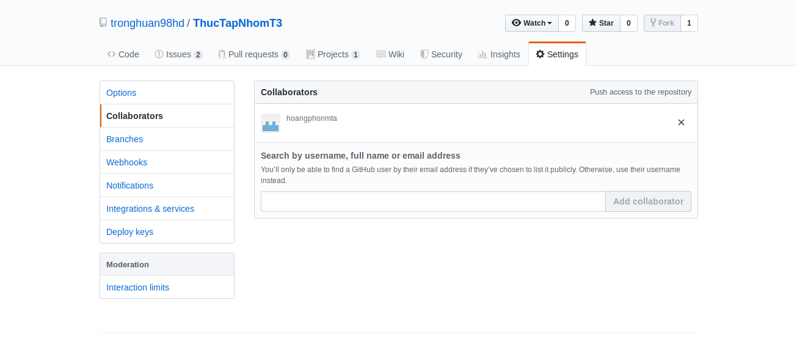

Thao tác làm việc với Git
===
# Mục lục

- [1.Tổng quan](#1tổng-quan)
- [2.Mô hình làm việc](#2mô-hình-làm-việc)
- [3.Thực hiện dự án](#3Thực-hiện-dự-án)
    - [3.1.Từ dự án có sẵn](#3.1từ-dự-án-có-sẵn)
    - [3.2.Tạo dự án mới](#3.2tạo-dự-án-mới)
- [4.Branch](#4Branch)
- [5.Tài liệu tham khảo](#5Tài-liệu-tham-khảo)
## 1.Tổng quan
Khi tham gia vào một dự án với nhiều người cùng thực hiện, để đảm bảo source code được đồng bộ và các công việc của mọi người được thực hiện trơn tru thì người tham gia dự án phải đảm bảo thực hiện đúng luồng quản lý nguồn code của dự án.

Trên đây chúng ta sẽ cùng tìm hiểu về git cũng như quy trình hoạt động của git khi thực hiện một dự án cụ thể.

## 2.Mô hình làm việc

Để bắt đầu làm việc với git, bạn phải biết một số thao tác cơ bản cũng như những yếu tối cần thiết trong luồng làm việc với git.

Các khái niệm:
- Repository (Repo): Kho lưu trữ source code.
- Remote Repo: Kho lưu trữ online bất kì.
- Origin Repo: Kho lưu trữ online đang làm việc hiện tại.
- Local Repo: Kho lưu trữ local trên máy của bạn.

Một số thao tác cơ bản:
- Fork: Copy một kho có sẵn về kho remote của mình.
- Pull: Tải xuống dự án trên Repo Online, rồi merge với Nơi làm việc hiện tại của bạn trên máy tính.
- Commit: Đồng bộ source code file làm việc với Local Repo của bạn.
- Push: Đẩy soure code lên Repo Online.
- Pull Request: Gửi yêu cầu hợp nhất source code với một Remote Repo.

## 3.Thực hiện dự án
### 3.1.Từ dự án có sẵn

Với một dự án đã có sẵn trên hệ thống git mà bạn muốn đưa nó về để làm việc, bước đầu tiên là bạn phải Thực hiện copy từ kho đó về kho của mình thông qua Fork.

_Tất nhiên kho của bạn thì không thể Fork được rồi_

Sau đó trên kho của bạn đang làm việc (gọi là origin) đã có source code y chang như vậy. Bạn tiến hành Pull nó về máy của bạn.

Mỗi khi bạn tiến hành phát triển hay thay đổi source code trên máy tính, nếu hoàn thành cơ bản một chức năng nào đó, bạn nên tiến hành đồng bộ với Local Repo trên máy thông qua lệnh commit.

Sau một thời gian làm việc với local repo, bạn muốn đẩy nó lên kho online của bạn. Khi đó bạn thực hiện thao tác Push. Lúc này, kho làm việc hiện hành của bạn (origin) sẽ được đồng bộ với Local Repo.

Trong quá trình làm việc, Source code từ kho remote bạn lấy về cũng sẽ được update bởi những người cùng tham gia dự án khác. Vì vậy bạn lại phải liên tục cập nhật source code cho Local Repo của bạn để tránh bị "lạc hậu". Để cập nhật bạn dùng thao tác Pull.

Một khoảng thời gian không lâu sau, bạn đã hoàn thành xong nhiệm vụ của mình. Bạn sẽ cần tiến hành hợp nhất với Source code của dự án. Trước tiên bạn cần đảm bảo kho của mình đã có đưọc phiên bản mới nhất từ remote. Sau khi Push lên origin Repo, bạn tiến hành tạo pull request với nhánh hiện tại bạn làm(thường là master). Khi đó, người sở hữu khi remote sẽ tiến hành kiểm tra xem có nên Merge hay không(Merge là hợp nhất source code).
### 3.2.Tạo dự án mới

Nếu bạn là người tạo mới cho một dự án thì điều đầu tiên bạn cần làm đó là tạo ngay một Repo Online chẳng hạn như GitHub.

Sau khi tạo xong bạn tiến hành cộng tác với một số người cùng làm dự án đó thông qua Collaborators

Rồi xong, khi đó bạn và mọi người có thể cùng làm việc theo luồng đã được nêu ở mục trên

Sau khi một ai đó hoàn thành công việc và tiến hành gửi Pull Request cho bạn, Bạn sẽ phải kiểm tra lại source code đó. Nếu có sự xung đột, bạn có thể huỷ Pull Request đó và yêu cầu người cộng tác sửa lại Code. Nếu mọi thứ đề ổn định, Bạn sẽ tiến hành Merge nó với dự án hiện tại.
## 4.Branch
Tuỳ vào vai trò được phân công và tính năng phát triển, người quản lí dự án và những người tham gia phải sẽ phát triển theo nhiều hướng khác nhau. Khi đó người ta sẽ chia ra các Branch (nhánh).

Với một dự án mới được tạo, sẽ luôn có một nhánh mặc định là nhánh master. Để đảm bảo hệ thống vẫn có thể đưuọc chạy trên server trong khi tiến hành phát triển thì chúng ta sẽ tạo ra một nhánh mới từ nhánh master, ta gọi đó là nhánh Dev. Mỗi khi có một sự chỉnh sửa code, ta sẽ merge nó vào trong nhánh Dev. Đến khi hoàn thánh tương đối ổn định một chức năng, ta sẽ tiến hành Merge chúng với nhánh master. Có một số cách merge như sau:
- Merge fast-forward: Với hình thức merge này, history của nhánh khác sẽ được hợp nhất với nhánh chính. Cách merge này sẽ giúp history của bạn là 1 đường thằng nhưng mặt khác cũng sẽ khiến history dày đặc nếu nhánh khác có nhiều commit
- Merge non fast-forward: Với hình thức này lịch sử của nhánh sẽ được giữ nguyên và bạn có thể hình dung được các các nhánh cụ thể mà bạn đang làm việc.

## 5.Tài kiệu tham khảo

https://rogerdudler.github.io/git-guide/index.vi.html

https://git-scm.com/book/vi/v1/C%C6%A1-B%E1%BA%A3n-V%E1%BB%81-Git