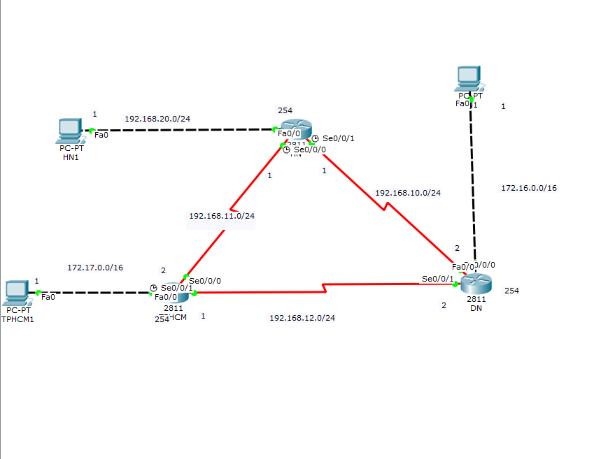
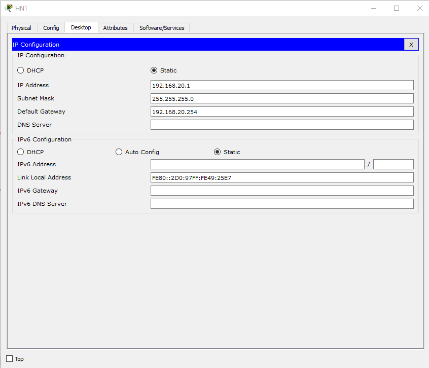
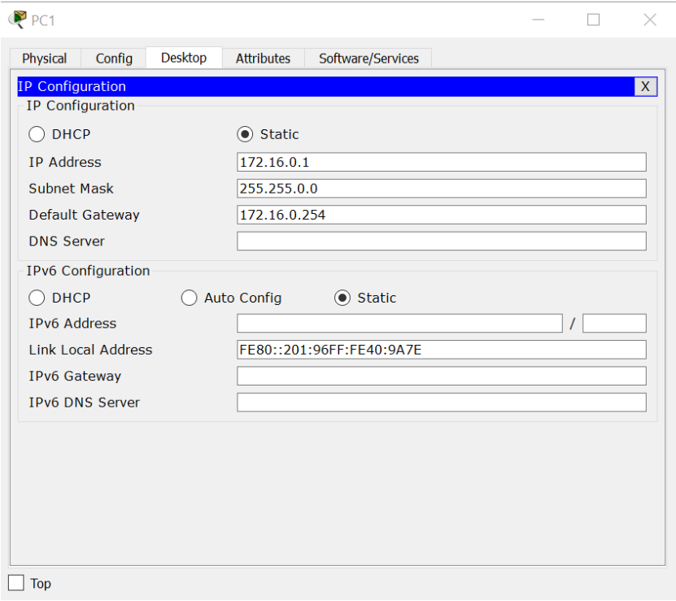
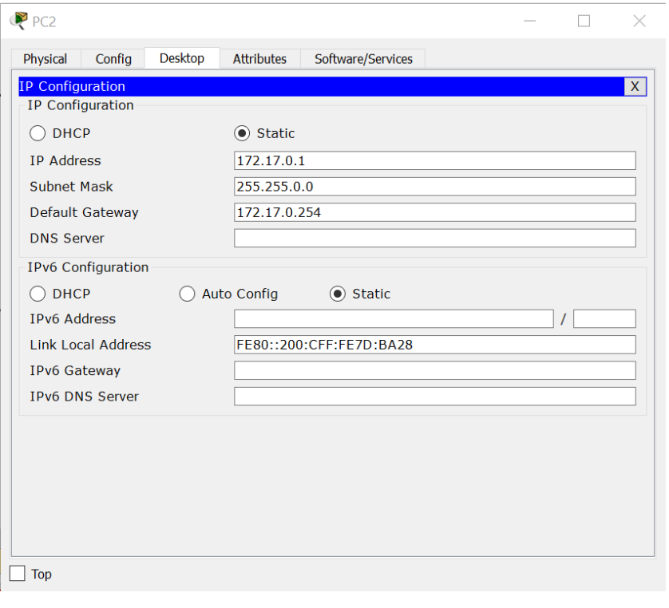
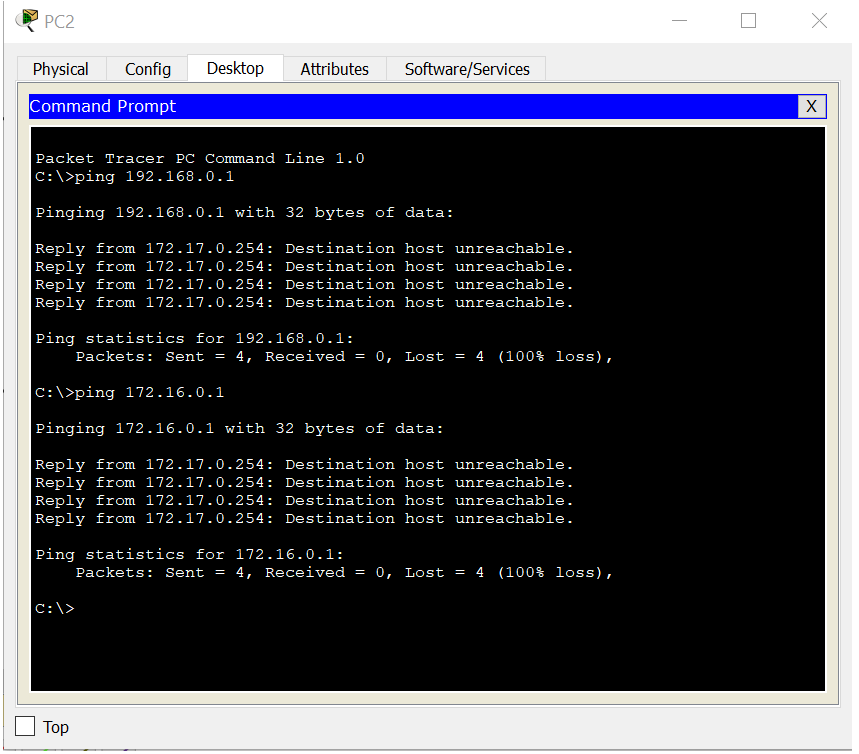

<a name ="RIPv2-Định tuyến Động">

# Cấu hình RIPv2
- Ta có một Topology như hình 


 - Trước tiên chúng ta đặt địa chỉ ip cho từng PC trong topo 
    - IP PC0

    

    - IP PC1

    

    - IP PC2 

    

- Đặt Ip cho router
- Router 0 

``` Router(config)#hostname R1
    R1(config)#interface fa0/0
    R1(config-if)#ip add 192.168.20.254 255.255.255.0
    R1(config-if)no shutdown
    R1(config-if)#exit
    R1(config)#interface se0/0/1
    R1(config-if)#ip add 192.168.11.1 255.255.255.0
    R1(config-if)no shutdown
    R1(config-if)#exit
    R1(config)#interface se0/0/0
    R1(config-if)#ip add 192.168.10.1 255.255.255.0
    R1(config-if)no shutdown
    R1(config-if)#exit 
``` 

- Router 1
```
    Router(config)#hostname R2
    R2(config)#interface fa0/0
    R2(config-if)#ip add 172.17.0.254 255.255.0.0
    R2(config-if)no shutdown
    R2(config-if)#exit 
    R2(config)#interface se0/0/0
    R2(config-if)#ip add 192.168.12.1 255.255.255.0
    R2(config-if)no shutdown
    R2(config-if)#exit 
    R2(config)#interface se0/0/1
    R2(config-if)#ip add 192.168.11.1 255.255.255.0
    R2(config-if)no shutdown
    R2(config-if)#exit 
```
- Router 2
```
    Router(config)#hostname R3
    R3(config)#interface fa0/0
    R3(config-if)#ip add 168.16.10.0 255.255.0.0
    R3(config-if)no shutdown
    R3(config-if)#exit 
    R3(config)#interface se0/0/0
    R3(config-if)#ip add 168.16.20.0 255.255.0.0
    R3(config-if)no shutdown
    R3(config)#interface se0/0/0
    R3(config-if)#ip add 168.16.30.0 255.255.0.0
    R3(config-if)no shutdown
    R3(config-if)#exit     

``` 
- Cấu hình RIPv2
- R1
```
    R1(config)#router rip 
    R1(config-router)#version 2
    R1(config-router)#network 192.168.20.0
    R1(config-router)#network 192.168.11.0
    R1(config-router)#network 192.168.10.0
    R1(config-router)#no auto-summary
    R1(config-router)#exit 

```
- R2
```
    R2(config)#router rip
    R2(config-router)#version 2 
    R2(config-router)#network 172.17.0.0
    R2(config-router)#network 192.168.12.0
    R2(config-router)#network 192.168.11.0
    R2(config-router)#no auto-summary 
    R2(config-router)#exit
```
- R3
```
    R3(config)#router rip
    R3(config-router)#version 2 
    R3(config-router)#network 172.16.0.0
    R3(config-router)#network 192.168.10.0
    R3(config-router)#network 192.168.12.0
    R3(config-router)#no auto-summary
    R3(config-router)#exit
```
- Ping 




