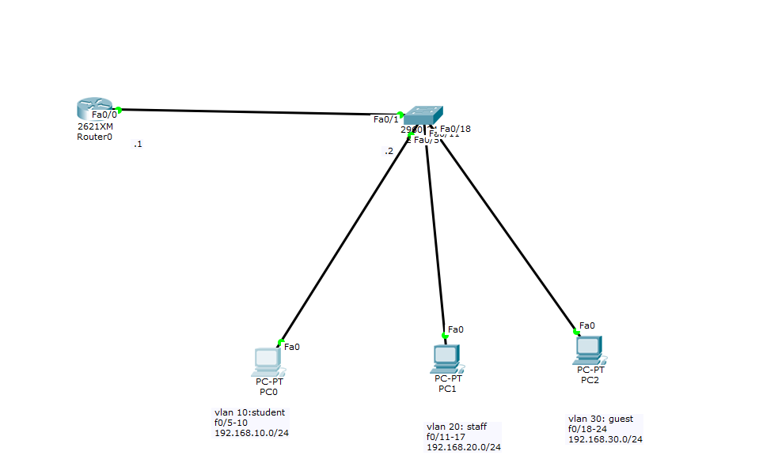
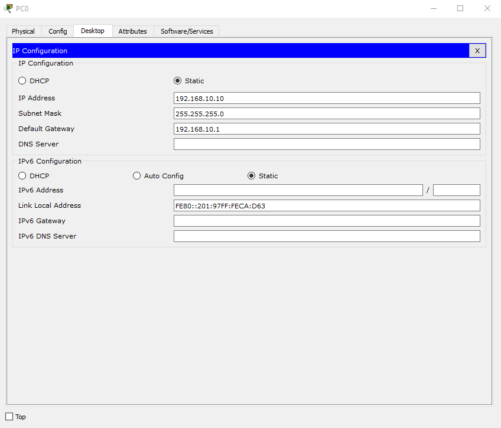
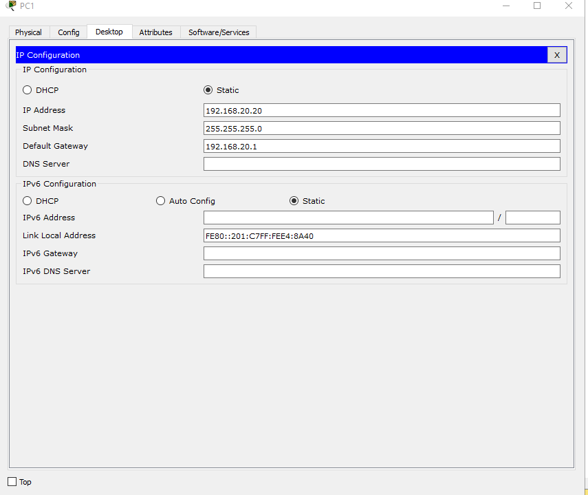
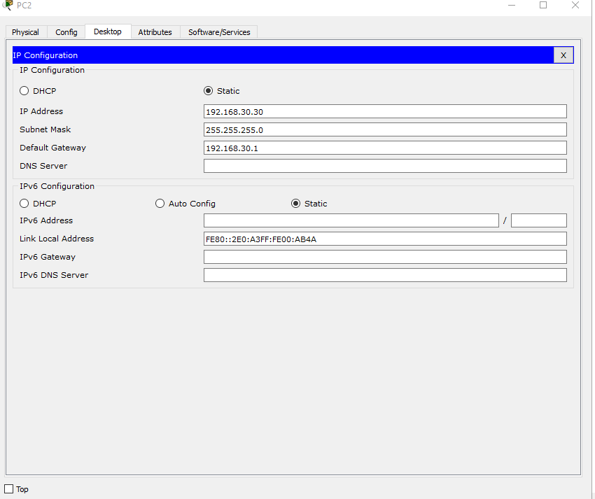
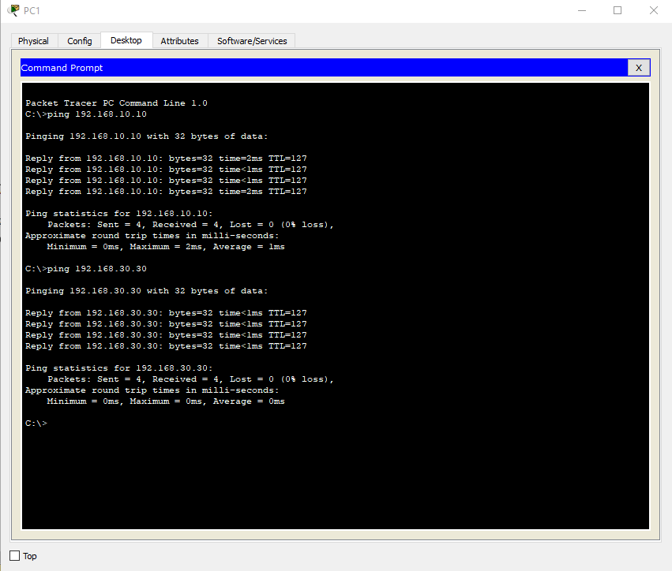

<a name ="Inter-vlan">

# Cấu hình Inter Vlan
- Ta có một Topology như hình:

- ĐẶt IP và defaulgetWay cho từng PC
    - PC1
    
    - PC2
    
    - PC3
    


- Đặt hostname và ip cho router 
```
SW0(config)#vlan 10

SW0(config-vlan)#name IT

SW0(config-vlan)#vlan 20

SW0(config-vlan)#name sale

SW0(config-vlan)#exit

SW0(config)#interface range f0/1-10

SW0(config-if-range)#switchport access vlan 10

SW0(config-if-range)#exit

SW0(config)#interface range f0/11-20

SW0(config-if-range)#switchport access vlan 20

SW0(config-if-range)#exit

SW0(config)#interface range g1/1-2

SW0(config-if-range)#switchport mode trunk

SW0(config)#interface vlan 1

SW0(config)#no shutdown

SW0(config-if)#ip add 10.0.0.101 255.255.255.0

SW0(config-if)#end

SW0#write
```
- Cấu hình định tuyến VLAN trên Router
```
R1(config)#int f0/0

R1(config-if)#no shut

R1(config)#int f0/0.10

R1(config-subif)#encapsulation dot1Q 10

R1(config-subif)#ip add 192.168.1.1 255.255.255.0

R1(config-subif)#exit

R1(config)#int f0/0.20

R1(config-subif)#encapsulation dot1Q 20

R1(config-subif)#ip add 192.168.2.1 255.255.255.0

R1(config-subif)#exit
```
- Ping



- https://www.youtube.com/watch?time_continue=24&v=yUCocOZmwy0