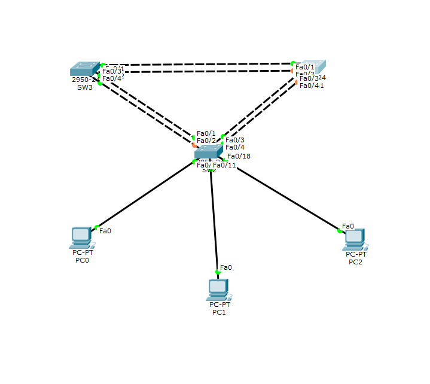

<a name ="Giao thức STP">


# Cấu hình STP

- Ta có một Topology như hình:


- Đặt hostname và đặt password
```
Switch(config)#hostname SW1
SW1(config)#enable secret dainam
SW1(config)#line console 0
SW1(config-line)#pss
SW1(config-line)#pass
SW1(config-line)#password dainam
SW1(config-line)#loggin sys
SW1(config-line)#loggin syn
SW1(config-line)#loggin synchronous 
SW1(config-line)#exit
SW1(config)#line vty 0 4
SW1(config-line)#pas
SW1(config-line)#password dainam
SW1(config-line)#login
SW1(config-line)#exit
SW1(config)#ban
SW1(config)#banner motd "WELCOME TO dainam"
```
- Cấu hình trink (Cho từng sw)
```
SW1(config)#int range fa 0/1-5
SW1(config-if-range)#sw
SW1(config-if-range)#switchport mode trunk
SW1(config-if-range)#switchport native vlan 99
SW1(config-if-range)#exit
```
- Cấu hình VTP Sw1
```
SW1(config)#vtp mode server
Device mode already VTP SERVER.
SW1(config)#vtp domain dainam
Changing VTP domain name from NULL to dainam
SW1(config)#vtp password dainam123
Setting device VLAN database password to dainam123
SW1(config)#
```
- Cấu hình VTP Sw2,SW3
```
SW2(config)#vtp mode client 
Setting device to VTP CLIENT mode.
SW2(config)# vtp domain dainam
Domain name already set to dainam.
SW2(config)#vtp password dainam123
Setting device VLAN database password to dainam123
SW2(config)#
```
- Cấu hình VLAN
```
SW1(config)#vlan 10
SW1(config-vlan)#name Staff
SW1(config-vlan)#exit
SW1(config)#vlan 20
SW1(config-vlan)#name Student
SW1(config-vlan)#vlan 30
SW1(config-vlan)#name Guest
SW1(config-vlan)#exit
SW1(config)#vlan 99
SW1(config-vlan)#name Manage
SW1(config-vlan)#exit
```
- Gán Vlan vào Cổng(SW2)
```
SW2(config)#int range fa 0/6-10
SW2(config-if-range)#switchport mode access 
SW2(config-if-range)#switchport access  vlan 10
SW2(config-if-range)#exit
SW2(config)#int range fa 0/11-17
SW2(config-if-range)#switchport mode access 
SW2(config-if-range)#switchport access vlan 20
SW2(config-if-range)#exit
SW2(config)#int range fa 0/18-24
SW2(config-if-range)#switchport access vlan 30
SW2(config-if-range)#exit
SW2(config)#do show vlan
```
- Đặt địa chỉ cho vlan 99 để quản lý
```
SW1(config)#int vlan 99
SW1(config-if)#ip add 192.168.99.1 255.255.255.0
SW1(config-if)#exit
```
```
SW2(config)#int vlan 99
SW2(config-if)#ip add 192.168.99.2 255.255.255.0
SW2(config-if)#exit
```
```
SW3(config)#int vlan 99
SW3(config-if)#ip add 192.168.99.3 255.255.255.0
SW3(config-if)#exit
```
- Cấu hình Spanning-Tree
```
SW1(config)#spanning-tree vlan 10 root primary
SW1(config)#spanning-tree vlan 20 root primary
```
```
SW2(config)#spanning-tree vlan 20 root primary
SW2(config)#spanning-tree vlan 30 root secondary
```
```
SW3(config)#spanning-tree  vlan 30 root primary
SW3(config)#spanning-tree vlan 20 root secondary 
SW3(config)#exit
SW3#show spanning-tree 
```