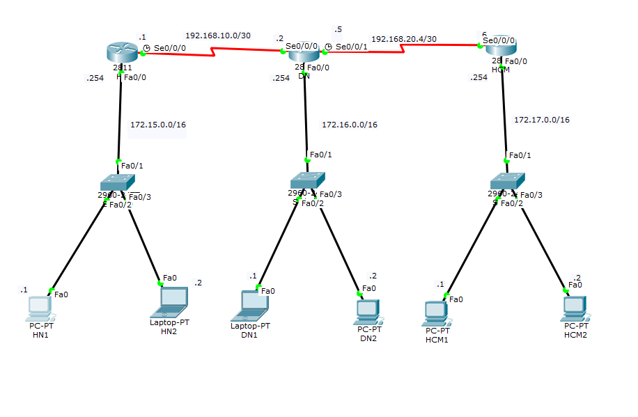
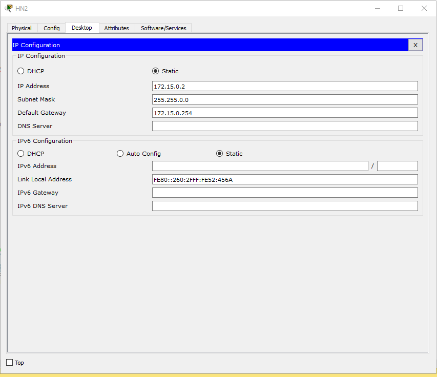
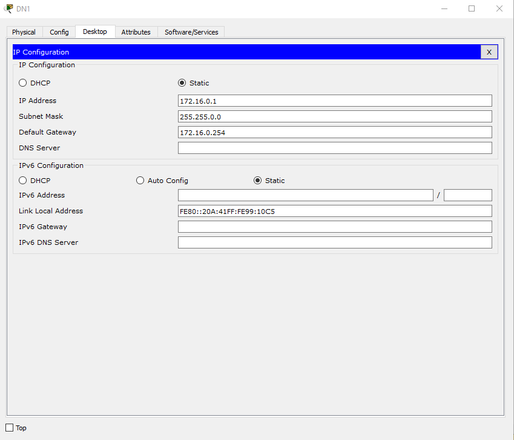
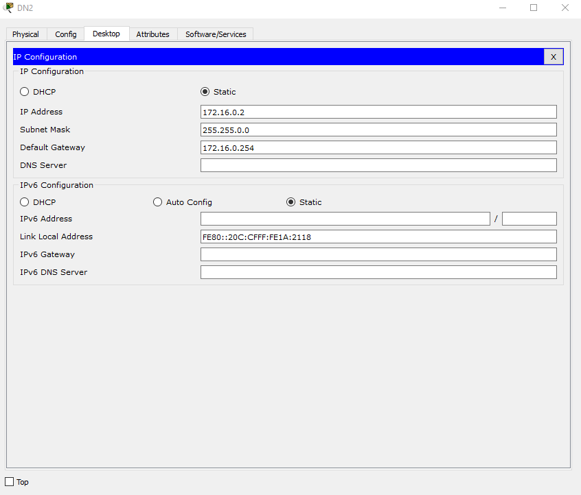
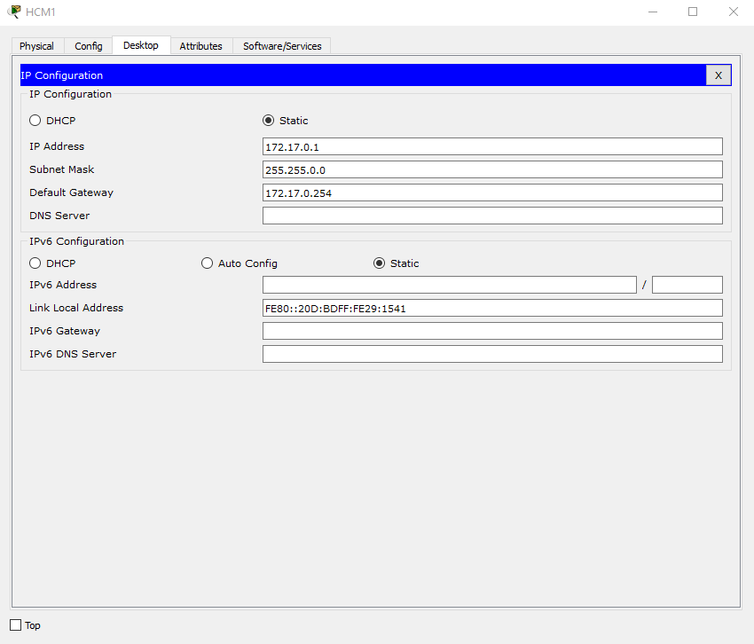
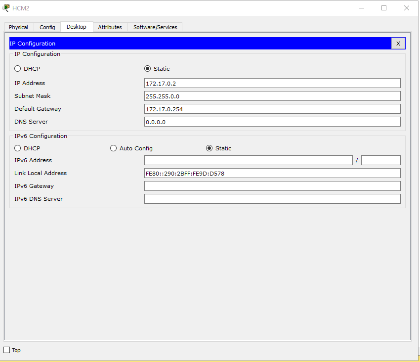
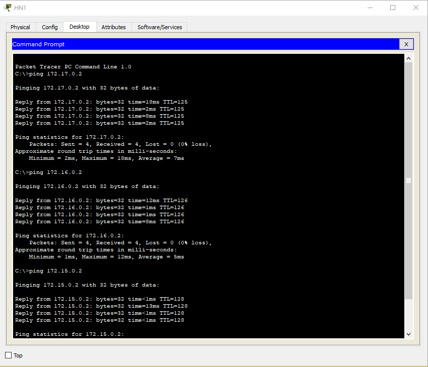

<a name ="Static Routing-Định tuyến Tĩnh">

# Cấu hình Static Routing
- Ta có một Topology như hình:


- ĐẶt IP và defaulgetWay cho từng PC
    - PC1
    
    - PC2
    
    - pc3
    
    - PC4
    
    - PC5
    
    - PC6
    

- Đặt hostname và ip cho router HN
```
Router(config)#hostname HN
HN(config)#interface fa0/0
HN(config-if)#description ket noi voi HN mang LAN HN
HN(config-if)#ip add 172.15.0.254 255.255.0.0
HN(config-if)#no shut
HN(config-if)#exit
HN(config)#interface se0/0/0
HN(config-if)#description ket noi voi DN
HN(config-if)#ip add 192.168.10.1 255.255.255.252
HN(config-if)#clock rate 64000
HN(config-if)#no shut
HN(config-if)#exit
```
- Đặt hostname và ip cho router DN
```
Router(config)#hostname DN
DN(config)#interface fa0/0
DN(config-if)#description ket noi voi LAN DN
DN(config-if)#ip add 172.16.0.254 255.255.0.0
DN(config-if)#no shut
DN(config-if)#exit

DN(config)#interface se0/0/0
DN(config-if)#description ket noi voi HN
DN(config-if)#ip add 192.168.10.2 255.255.255.252
DN(config-if)#no shut
DN(config-if)#exit

DN(config)#interface se0/0/1
DN(config-if)#des
DN(config-if)#description ket noi voi HCM
DN(config-if)#ip add 192.168.20.5 255.255.255.252
DN(config-if)#clock rate 64000	
DN(config-if)#no shut
DN(config-if)#exit
DN(config)#do wr
Building configuration...
[OK]

```
- Đặt hostname và ip cho router HCM
```
Router(config)#hostname HCM
HCM(config)#interface fa0/0
HCM(config-if)#description ket noi voi Lan HCM
HCM(config-if)#ip add 172.17.0.254 255.255.0.0
HCM(config-if)#no shut
HCM(config-if)#exit

HCM(config)#interface se0/0/0
HCM(config-if)#description ket noi voi DN
HCM(config-if)#ip add 192.168.20.6 255.255.255.252
HCM(config-if)#no shut
HCM(config-if)#exit
HCM(config)#do wr
Building configuration...
[OK]
```
- Định tuyến Router (config) #ip route <Network_dich> <Subnet Mask of Network_dich> <IP nexthop>
- HN:
```
HN(config)#ip route 172.16.0.0 255.255.0.0 se0/0/0
HN(config)#ip route 172.17.0.0 255.255.0.0 se0/0/0
HN(config)#ip route 192.168.20.4 255.255.255.252 se0/0/0
HN(config)#do wr
Building configuration...
[OK]
```
  
- DN
```
DN(config)#ip route 172.15.0.0 255.255.0.0 se0/0/0
DN(config)#ip route 172.17.0.0 255.255.0.0 se0/0/1
DN(config)#do wr
```
- HCM
```
HCM(config)#ip route 172.15.0.0 255.255.0.0 se0/0/0
HCM(config)#ip route 172.16.0.0 255.255.0.0 se0/0/0
HCM(config)#ip route 192.168.10.0 255.255.255.252 se0/0/0
HCM(config)#do wr
Building configuration...
[OK]
```
Ping Ping từ PC0->PC1,PC2

