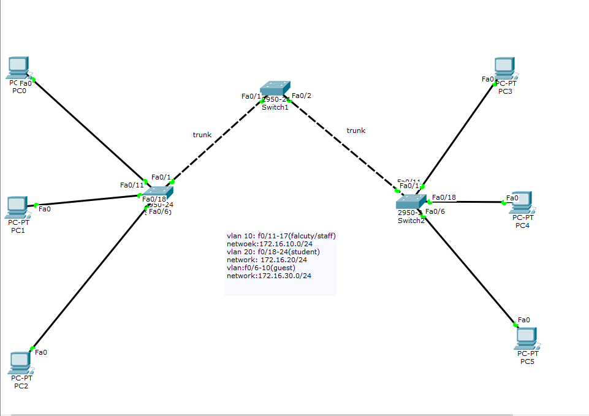
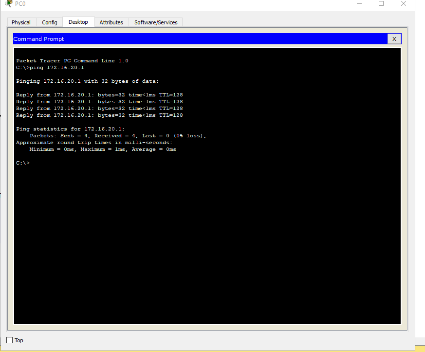

<a name ="Giao thức VTP">

# Cấu hình VTP
- Xét trong hệ thống có 30 Switch: tất cả các Switch đều có VLAN 10, 20, 30, 40, 50 và tên của các VLAN như IT, Sale.... Bình thường ta phải đi cấu hình lần lượt 30 Switch nhưng khi dùng VTP thì chỉ cần cấu hình các VLAN trên một Switch Server sau đó đồng nhất với các Switch còn lại là xong.

- Ta có một Topology như hình:

- Trên Switch Server:  Khởi tạo VTP Server:
```
         SW(config)#vtp  mode Server

          SW(config)#vtp  domain  dnu

          SW(config)#vtp pasword  abc

          SW(config)#vtp version 2

          SW(config)#vtp pruning (Packet tracer không hỗ trợ).

          SW(config)#end
```
- Bật đường Trunking của cổng kết nối tới các SW Client:
```
          SW(config)#interface f0/24

          SW(config-if)#switchport mode trunk
```
-   Khởi tạo tên VLAN:
```
          SW(config)#vlan 2

          SW(config)#name IT

          SW(config)#exit

          SW(config)#vlan 3

          SW(config)#name Sale

          SW(config)#exit
```
- Trên Switch Transparent:
``` 
     SW(config)#vtp  mode transparent

     SW(config)#vtp  domain  dnu

     SW(config)#vtp pasword  abc

     SW(config)#vtp pruning  (Packet tracer không hỗ trợ).

     SW(config)#end
```
- Trên Switch VTP Client: Khởi tạo VTP Client:
```
          SW(config)#vtp  mode client

          SW(config)#vtp  domain  dnu

          SW(config)#vtp pasword  abc

          SW(config)#vtp pruning  (Packet tracer không hỗ trợ).

          SW(config)#end

         Gán cổng cho SW: Phải gán cổng cho SW vì VTP Server không gửi thông tin gán cổng cho Client.

          SW(config)#interface range f0/1-10

          SW(config-if-range)#switchport access vlan 2

          SW(config-if-range)#exit

          SW(config)#interface range f0/11-20

          SW(config-if-range)#switchport access vlan 3

          SW(config-if-range)#exit
```

- Các lệnh kiểm tra sau khi cấu hình:
```
SW(config)# show vtp status

SW(config)# show vtp pasword

SW(config)# show vlan

SW(config)# Show interfaces trunk
```

- ping


- https://www.youtube.com/watch?v=aO4E1Ea0xyw
