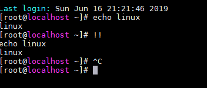

<a name ="101 Commands">


# 101 Commands

I.Di chuyển ,liệt kê các tập tin

1.Sử dụng lệnh trước đó vừa sử dụng
```
!!
```
- Ta thử nó với lệnh echo
```
[root@localhost ~]# echo linux
linux
[root@localhost ~]# !!
echo linux
linux
```


2 .Hiển thị tên thư mục đang làm việc

`pwd`
```
[root@localhost home]# pwd
/home

```
3. Di chuyển qua lại các thư mục
- Di chuyển tới thư mục người dùng ( /home/người_dùng )

`cd`
- Di chuyển tới thư mục home

`cd /`
- Di chuển ra khỏi 1 lớp thư mục (Di chuyển ra thư mục mẹ của thư mục hiện tại.)

`cd ..`
```

[root@localhost /]# cd /home
[root@localhost home]# cd file2
[root@localhost file2]# cd ..
[root@localhost home]#

```
- Di chuyển tới thư mục ( /home/người_dùng/Desktop )

`cd ~`
- Hoán đổi vị trí đứng với thư mục này và thư mục mẹ của nó.

`cd -`
```
[root@localhost home]# cd -
/home/file2
[root@localhost file2]# 
```

3. Liệt kê các danh mục trong thư mục hiện hành

`ls`
```

[root@localhost /]# cd /
[root@localhost /]# ls
bin   dev  home  lib64  mnt  proc  run   srv  tmp  var
boot  etc  lib   media  opt  root  sbin  sys  usr
[root@localhost /]#

```

- Liệt kê danh mục tập tin trong thư mục 1 cách chi tiết.

`ls -l`

Liệt kê tất cả các tập tin, kể cả các tập tin ẩn (thường có tên bắt đầu bằng một dấu chấm)

```
[root@localhost /]# ls -l
total 20
lrwxrwxrwx.   1 root root    7 Jun 11 13:02 bin -> usr/bin
dr-xr-xr-x.   5 root root 4096 Jun 11 13:07 boot
drwxr-xr-x.  20 root root 3220 Jun 16 21:21 dev
drwxr-xr-x.  74 root root 8192 Jun 16 21:21 etc
drwxr-xr-x.   8 root root   82 Jun 16 22:37 home
lrwxrwxrwx.   1 root root    7 Jun 11 13:02 lib -> usr/lib
lrwxrwxrwx.   1 root root    9 Jun 11 13:02 lib64 -> usr/lib64
drwxr-xr-x.   2 root root    6 Apr 11  2018 media
drwxr-xr-x.   2 root root    6 Apr 11  2018 mnt
drwxr-xr-x.   2 root root    6 Apr 11  2018 opt
dr-xr-xr-x. 124 root root    0 Jun 16 21:21 proc
dr-xr-x---.   2 root root  135 Jun 11 13:11 root
drwxr-xr-x.  24 root root  740 Jun 16 21:21 run
lrwxrwxrwx.   1 root root    8 Jun 11 13:02 sbin -> usr/sbin
drwxr-xr-x.   2 root root    6 Apr 11  2018 srv
dr-xr-xr-x.  13 root root    0 Jun 16 21:21 sys
drwxrwxrwt.  17 root root 4096 Jun 16 21:21 tmp
drwxr-xr-x.  13 root root  155 Jun 11 13:02 usr
drwxr-xr-x.  19 root root  267 Jun 11 13:08 var
[root@localhost /]#

```
`ls-a`

- Liệt kê tên các thư mục nằm trong thư mục hiện hành.
```

[root@localhost /]# ls -a
.   bin   dev  home  lib64  mnt  proc  run   srv  tmp  var
..  boot  etc  lib   media  opt  root  sbin  sys  usr
[root@localhost /]#

```
`ls -d`
 - Xếp lại các tập tin theo ngày đã tạo ra, bắt đầu bằng những tập tin mới nhất.

`ls -t`
- Xếp lại các tập tin theo kích thước, từ to nhất đến nhỏ nhất.

`ls -s`
- Liệt kê theo từng trang một, nhờ tiện ích ( more )

### II. Tập tin và thư mục
**4. Lệnh dùng để copy (cp)**

 
`` cp file1 file2``

```
[root@localhost home]# cp file1/a1 file1/a2
cp: overwrite ‘file1/a2’? y
[root@localhost home]# cd file1
[root@localhost file1]# cat a2
day la noi dung
day la noi dung
day la noi dung

[root@localhost file1]#

```
 - Sao chép từ file1 sang file2.


`` cp file thưmục ``

```
[root@localhost file1]# cd ..
[root@localhost home]# cp file1/a1 file2
[root@localhost home]# cd file2
[root@localhost file2]# ls
a1  b1
[root@localhost file2]#

```
- Chép file vào thự mục.


`` cp -i file1 file2``

- kiểm tra xem có ghi đè không.
    


`` cp -f file1 file2 ``
   
   - Sao chép mà không cần xác nhận là có ghi đè hay không.


`` cp -b file1 file2``

- Nếu đích sao chép có cùng tên tệp, tạo bản sao lưu và sao chép.
    


`` cp -r thưmục1 thưmục2 ``
    
- Sao chép tất cả nội dung của ``thưmục1`` sang ``thưmục2``.
```
[root@localhost home]# cd file2
[root@localhost file2]# cp -r a1 b1
cp: overwrite ‘b1’? t
[root@localhost file2]# cp -r a1 b1
cp: overwrite ‘b1’? y
[root@localhost file2]# cat b1
day la noi dun cua a1

[root@localhost file2]#

```

**5. Chuyển tên tập tin/ thư mục.**
`` mv ``
- chuyển toàn bộ nội dung của file1 thành file2.

`` mv file1 file2 ``

- Chuyển toàn bộ nội dung của thưmục1 thành thưmục2.

`` mv thưmục1 thưmục2 ``

- Chuyển file1 vào thư mục1.

`` mv file1 thưmục1 ``

- Chuyển ``file111`` vào ``thưmục1`` rồi đồng thời đổi tên tên tin thành ``file2``.

`` mv file1 thưmục1/file2 ``

**6. Tạo, xóa bỏ tập tin/ thư mục**

- Tạo thư mục.

`` mkdir tên_thưmục ``

- Tạo thư mục ngang hàng.

`` mkdir  {1,2,3,4,5,6,7,8,9,0} ``

- Tạo thư mục cha và con cùng lúc.

`` mkdir -p thưmục1/thưmục2 ``

- Xóa bỏ file trong thư mục hiện hành.

`` rm tên_file ``

- Xóa bỏ thư mục trống mang tên ``thưmục1``.

`` rmdir thưmục1 ``

- Xóa bỏ thư mục mang tên ``thưmục1`` và tất cả các tập tin trong đó. 

`` rm -rf thưmục1 ``

**7. Tạo ta một liên kết mang tên ``abc`` đến file1 (nối tắt).**

`` ln -s file1 abc ``

**8. Tìm tập tin mang tên ``file1`` trong `` thưmục1`` kể cả trong các thư mục con.**

`` find thưmục1 -name file1 ``

**9. So sánh nội dung của 2 tập tin hoặc thư mục.**

`` diff file1 file2``

### III. Nội dung tập tin
**10. Đọc nội dung file**
- Đọc nội dung của file1.

`` cat file1 ``

- Xuất hiện nội dung của tập tin ``file1`` trên màn hình theo chế độ từng trang một: ấn phím << enter >> để xuống dòng; ấn phím << space >> để sang thêm 1 trang; ấn phím << q >> để thoát.

`` more file1 ``

- << less >> giống như << more >>, nhưng cho phép dùng phím << page Down >> ( có thể xem được tên file nén)

`` less file1 ``

**11. Đếm số dòng**
- Xuất hiện n số dòng đầu tiên của tập tin ``file1``.

`` head -n file1 ``

- Xuất hiện số n dòng cuối cùng của tập tin ``file1``.

`` tail -n file1 ``

**12. Soạn thảo tập tin.**
- Soạn thảo tập tin ``file1``, dùng trình soạn thảo vi.

`` vi file1 ``

- Soạn thảo tập tin ``file1``, dùng trình soạn thảo nano.

`` nano file1 ``

- Soạn thảo tập tin ``file1``, dùng trình soạn thảo gedit

`` gedit file1 ``

13. Cấp quyền thực thi cho tất cả user

`chmod a+x (tên file)`

```

[root@localhost ~]# su user1
[user1@localhost root]$ su root
Password:
[root@localhost ~]#


```

14. Thay đổi quyền sở hữu một file hoặc thư mục

`chown option user:group file/folder`

```

[root@localhost file1]# chown user1 a1
[root@localhost file1]# ll
total 8
-rw-r--r--. 1 user1 root 49 Jun 16 23:53 a1
-rw-r--r--. 1 root  root 49 Jun 17 00:22 a2
[root@localhost file1]# chmod g+w a1
[root@localhost file1]# ll
total 8
-rw-rw-r--. 1 user1 root 49 Jun 16 23:53 a1
-rw-r--r--. 1 root  root 49 Jun 17 00:22 a2
[root@localhost file1]#

```

15. Hiển thị giờ thứ ngày tháng năm của máy tính

` date`

16. Sao lưu dữ liệu

`dd if=/dev/vda1 of=/root/vda1.anh`

 - Ta sao lưu ổ đĩa sang một file ảnh của nó
 ```
 
[root@localhost hung1]# cd ~
[root@localhost ~]# dd=/abc/a2 of=/hung1/b1
[root@localhost ~]#

 ```
 17. Hiển thị không gian đĩa
 
 `df -h`

 ```
 
[root@localhost ~]# df -h
Filesystem               Size  Used Avail Use% Mounted on
/dev/mapper/centos-root   18G 1007M   17G   6% /
devtmpfs                 475M     0  475M   0% /dev
tmpfs                    487M     0  487M   0% /dev/shm
tmpfs                    487M  7.7M  479M   2% /run
tmpfs                    487M     0  487M   0% /sys/fs/cgroup
/dev/sda1                509M  126M  383M  25% /boot
tmpfs     
 ```
 - Trong đó: - Filesystem: tên ổ đĩa 
 - Size: không gian tổng 
 - Used: Không gian đã sử dụng
- Avail: Không gian trống 
- Use: Phần trăm đã sử dụng 
- Mounted on: Được gắn trên đâu trong cây thư mục root 

18. Lấy thông tin của HDH và ghi vào tệp văn bản

```
dmesg>dmesg.txt
```
19. Hiển thị thông tin hệ thống

```
dmidecode
```
20. Hiển thị thông tin BIOS
```
dmidecode -t 0
```
21. Hiển thị thông tin CPU

```
dmidecode -t 4
```

22. Tìm kiếm các gói đã cài đặt liên quan đến` zip`
```
anhduc@anhduc:~$ sudo dpkg --get-selections | grep zip  
bzip2						install
gzip						install
libarchive-zip-perl				install
libperlio-gzip-perl				install
p7zip						install
p7zip-full					install
unzip						install
zip						install
```
23. Hiển thị tất cả các gói đã cài đặt
```
dpkg -L
```

24. Ước tính không gian đĩa, tệp

```
du -bh (đường dẫn)
```

```
[root@localhost ~]# du -bh /root/test/
45	/root/test/
```
25. In ra biến môi trường

```

[root@localhost ~]# x=10
[root@localhost ~]# echo $x
10
[root@localhost ~]#

```
26. Hiển thị biến môi trường

```
env
```
27. Hiển thị hình ảnh

```

[root@localhost ~]# picturess$ eog hinh-nen-may-tinh-anime-buoi-2.jpg

```
28. Thoát khỏi terminal

``` 
exit
```
29. Hiển thị memory đã sử dụng

```
free
```
30. Hiển thị bản ghi hệ thống

```
gnome-system-log
```

31. Tìm kiếm một chuỗi trong một file

```
grep <string> <filename>
```

32. Số giây mà hệ điều hành chạy

```

[root@localhost ~]# grep btime /root/abc
grep: /root/abc: Is a directory
[root@localhost ~]#


```
33. Hiển thị một 1000 lệnh cuối cùng

```
history | less
```

34. Hiển thị tên của máy tính

```
hostname
```

35. Hiển thị ngày tháng năm giờ
```
 [root@localhost ~]# sudo hwclock --show
Mon 17 Jun 2019 11:54:08 AM EDT  -0.791117 seconds

```
36. Hiển thị user id (uid) và group id (gid) của user hiện đang sử dụng

```
id
```
37. Hiển thị địa chỉ IP và netmask trên máy

```
ifconfig
```

38. Hiển thị thông tin của wireless interface

```
iwconfig
```

39. Hiển thị thông tin của wireless network

```
iwconfig
```

40. Kill process theo tên.

```
killall process-name
```

41. Hiển thị khoảng thời gian shutdown gần đây nhất

```
last -x | grep shutdown | head -1 
```

42. Logout khỏi user hiện tại

```
logout

```
43. Hiển thị các file, thư mục không bị ẩn trong thư mục hiện tại. Có thể sử dụng option `  -a` để hiển thị cả những file bị ẩn.

```
ls
```
44. Hiển thị quyền truy cập đối với tất cả files bên trong thư mục

```
ls -l filename
```

45. Hiển thị tất cả các lệnh sẵn có trong trường hợp bạn quên

```
ls /usr/bin
```
46. Hiển thị thêm thông tin về network

```
lshw -C network
```
47. Hiển thị thông tin về USB bus trong hệ thống và các thiết bị kết nối đến nó.

```
lsusb
```
48. Show thông tin phần cứng âm thanh, video, network

```
lspci -nv | less
```
49. Hiển thị thông tin về USB bus trong hệ thống và các thiết bị kết nối đến nó.

```
lsusb
```
50. Đọc hướng dẫn sử dụng của câu lệnh

```
man <commnda>
```
51. Tạo một thư mục tại vị trí chỉ định

```
mkdir
```
52. Chuyển toàn bộ nội dung của thưmục1 thành thưmục2.

```
mv file1 file2 

```

53. Chuyển file1 vào thư mục1.

```
 mv file1 thưmục1
 ```

54. Show bảng định tuyến

```
netstat -rn
```

55. In ra các biến môi trường

```
printenv
```

56. Hiển thị những process đang chạy được thực thi bởi chính user đang sử dụng

```
ps -Af
```

57. Hiển thị thư mục đang đứng

```
pwd
```
58. Xóa file

```
rm <filename>

```

59. Xóa thư mục và nội dung bên trong thư mục này

```
rm -rf <dir>
```

60. Xóa tất cả các file có đuôi .txt trong thư mục đang đứng

```
rm *.txt
```
61. Xóa thư mục (chỉ xóa khi thư mục đó là trống)

```
rmdir <dir>
```
62. Hiển thị địa chỉ gateway mặc định

```
route
```
63. Xóa hoàn toàn mọi thông tin và dấu vết của 1 file không cho khôi phục lại. -n 7 ghi đè lên file 7 lần. -z ghi đè lần cuối bằng không để ẩn shred. -u thực hiện xóa file khi thự hiện xong, -v hiển thị quá trình thực hiện

```
shred -zuv -n 7 <file>
```

64. Shutdown now

```
shutdown -h now
```

65. Restart now

```
shutdown -r now
```

66. SSH đến máy tính khác

```
ssh <username>@<IP>
```
67. Sử dụng shell với quyền root. User của bạn cần có quyền su sang user root.

```
sudo -i
```

68. Sử dụng shell với quyền root. Câu lệnh này khác với `sudo -i` là nó giữ nguyên biến mối trường của user.

```
sudo su
```

69. Nén tất cả các file và thư mục bên trong một thư mục xác định thành một file

```
tar czf <dirname>.tgz <dirname>
```

```
[root@localhost hung1]# touch {1,2,3}.txt
[root@localhost hung1]# tar -cvf test.tar 1.txt 2.txt 3.txt
1.txt
2.txt
3.txt
[root@localhost hung1]# ls
1.txt  2.txt  3.txt  b1.gz  b2  name.txt  oanh  test.tar

```
70. Giải nén một file

```
tar xzvf <filename>
```

71. Liệt kê các tiến trình đang được thực thi bằng CPU. Bấm `q` để `quit` và bấm `h` để xem hướng dẫn

```
top
```
- Ngoài ra, với lệnh `top` bạn có thể xem các thông số khác như `ram`, `swap`, `buff/cache`, `sleeping` và `zombie` Bạn có thể tải htop về để xem với giao diện đẹp hơn top và nhiều option hơn.

72. Tạo một file mới-trống nếu nó chưa tồn tại ở thư mục bạn đang đứng

```
touch <filename>
```

73. In ra tên của `terminal `bạn đang sử dụng

```
tty
```
74. In ra nhân linux của máy bạn đang dùng

```
uname -a
```

75. In ra kiến trúc vi sử lý mà máy bạn đang dùng

```
uname -m
```

76. Trả về tóm tắt câu lệnh là gì từ` man `. Trang `man` là hướng dẫn sử dụng tất cả câu lệnh của Linux

```
whatis <commmand>
```
77. Trả về vị trí của một chương trình trong hệ thống

```
whereis <command>
```

78. Tra về đường dẫn của một ứng dụng

```
which <command>
```
79. In ra những người đang truy cập vào máy

```
who
```
80. In ra tên mà bạn đang đăng nhập vào máy

```
whoami
```
81. In ra những dòng cuối của file test.log trong khi vẫn đang bị viết bởi một chương trình khác

```
tail –follow test.log
```
82. Bỏ

83. Dùng toán tử `\ `trước một khoảng trắng để mở một file mà tên file có dấu cách. Ví dụ ta sẽ mở file là `stupid file name.txt`

```
cat stupid\ file\ name.txt
```

84. Kí hiệu kiểu diễn thư mục home của bạn

```
~
```
85. Bỏ

86. In ra thông tin của CPU

```
cat /proc/cpuinfo
```

87. In ra thông tin bộ nhớ

```
cat /proc/meminfo
```
88. In ra các thiết bị kết nối

```
cat /proc/net/dev
```
89. In ra thông tin hiệu suất

```
cat /proc/uptime
```

90. In ra phiên bản nhân hệ thống

```
cat /proc/version
```

91. In ra nội dung của một file

```
cat <ten file>
```

92. In ra các phân vùng

```
fdisk -l
```

93. In ra các thuộc tính/nén của file hoặc package
```
file <package_name>
```
94. Tìm file 
```
find -name <filename>
```
95. Tạo 1 file nén đuôi .gz
```
gzip <Tên file cần nén>
```
96. Giải nén 1 file đuôi .gz
```
gzip -d <Tên file nén.gz>
```
97. Hiển thị thông tin chi tiết khi nén bằng opion -l
```
gzip -l *.gz
```
98. Hiện thị trạng thái của file 
```
stat filename.txt
```
99. Download a` file từ internet
```
wget <link>
```
Wget là một công cụ máy tính tạo ra từ GNU Project. 
Bạn có thể dùng nó để trích xuất dữ liệu và nội dung từ nhiều web servers khác nhau. 
Tên của nó là kết hợp của World Wide Web và từ get.
Nó hỗ trợ download qua FTP, SFTP, HTTP, và HTTPS.

100. In ra danh sách 10 người đăng nhập cuối cùng vào máy
```
last -n 10
```
101. Hiển thị tiến trình của hệ thống dưới dạng `tree`
```
pstree
```