<a name ="Cài đặt CentOS7"></a>

# Cài đặt CentOS7

- Trước tiên chúng ta download file centOS7 về máy 
- Có thể [Click vào đây](http://isoredirect.centos.org/centos/7/isos/x86_64) để chọn file cài đặt phù hợp.
- Mở VMware và chọn `Create new Virtual machine` để tiến hành cài đặt 
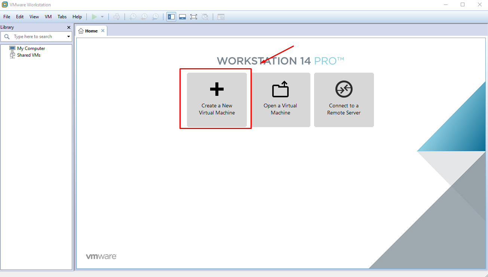

- Chọn `typical` để tạo máy ảo dễ dàng hơn sau đó nhấn `next` để tiếp tục.
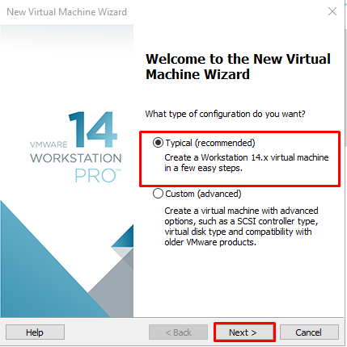
- Nhấn vào `Browser` để chọn file CentOS vừa tải về sau đó nhấn `next` để tiếp tục.
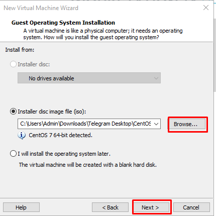
- Đặt tên cho máy ảo vừa tạo và chọn vị trí lưu của nó trong PC. Sau đó nhấn `next` để tiếp tục.
- Đặt tên cho máy ảo vừa tạo và chọn vị trí lưu của nó trong PC. Sau đó nhấn next để tiếp tục.
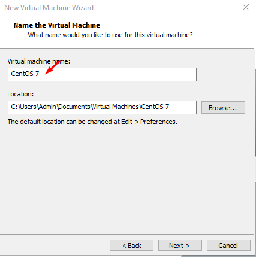
- Chọn kích thước max mà ổ đĩa ảo có thể dùng.NHấn chọn `Split virtual disk into multiples file` Việc tách đĩa giúp cho việc di chuyển máy ảo sang một máy tính khác dễ dàng hơn nhưng có thể làm giảm độ hoàn hảo với các đĩa rất lớn
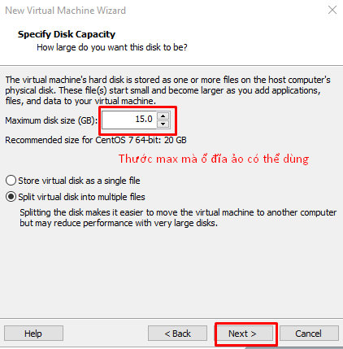
- Chọn `Customize Hardware `để điều chỉnh phần cứng
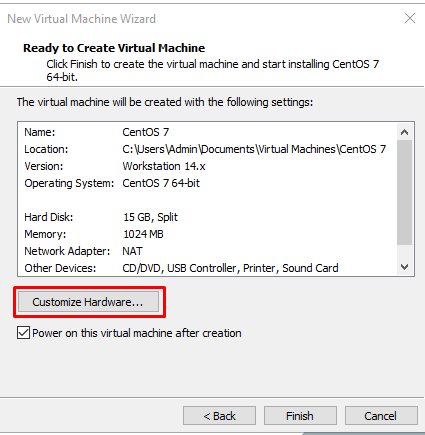
- Thay đổi 3 thông số chính cho phần cứng `memory`, `Processors` và `Network Adapter`
    - Memory :chỉ định dung lượng bộ nhớ được phân bổ cho máy ảo này. Kích thước bộ nhớ phải là bội số của 4MB
    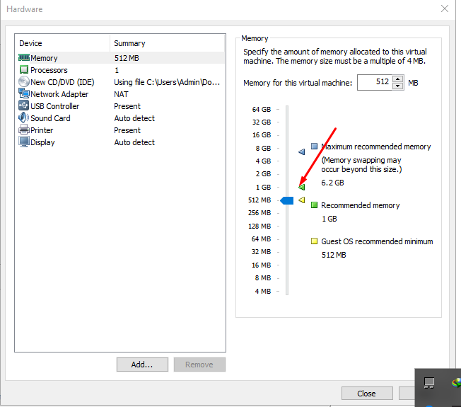
    - Processor:
    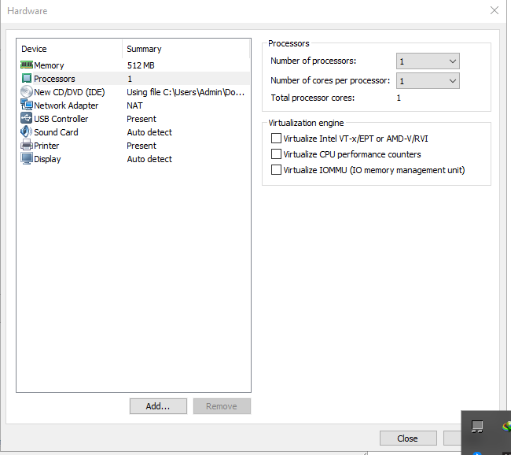
    - Network Adapter:
        - NAT : Được sử dụng để chia sẻ địa chỉ IP máy chủ.Thực hiện cơ chế NAT để chia sẻ IP ra bên ngoài.
        - Host-Only: chỉ dùng để chia sẻ mạng với máy chủ
        - Custom : Mạng ảo cụ thể
    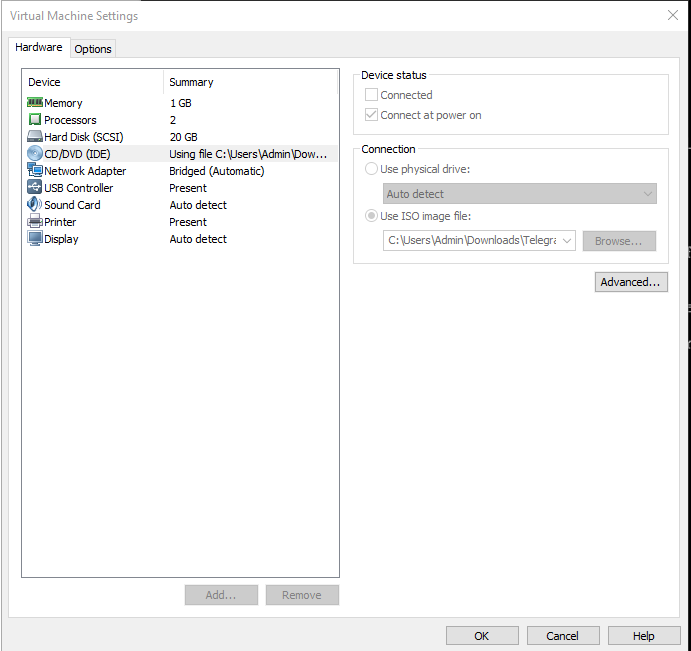
 - Sau khi đã cài đặt xong phần cứng nhấn Finish để tiến hành Installing
    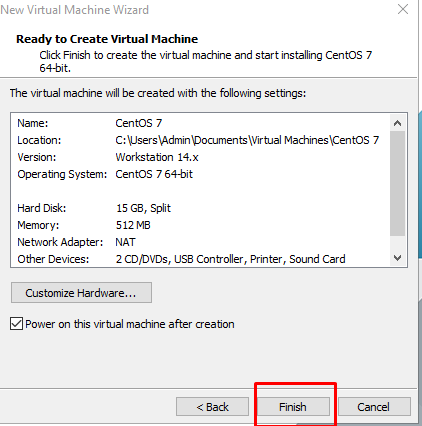

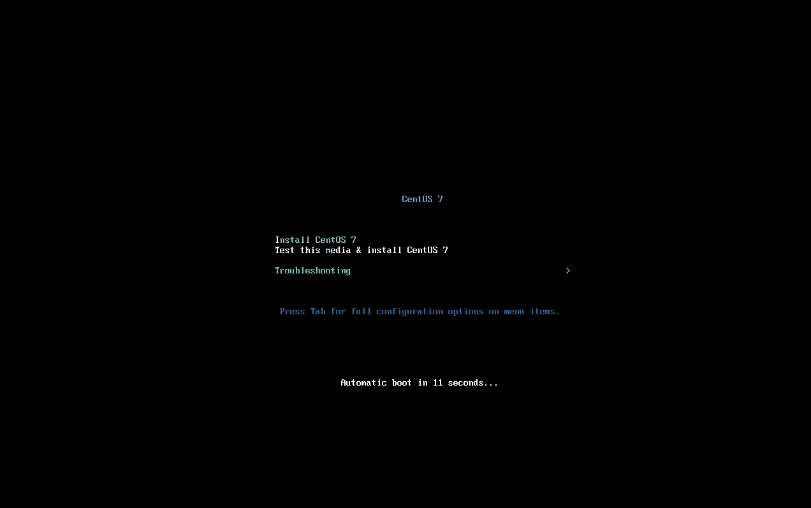

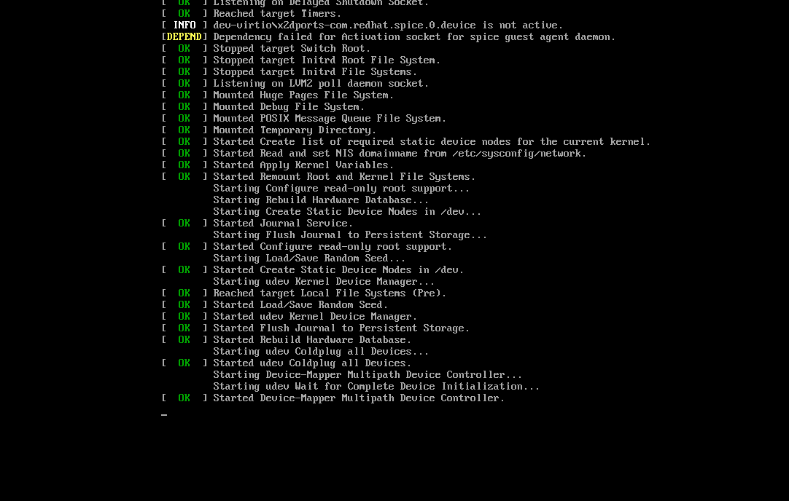
- Chọn ngôn ngữ cho máy nhấn ``continue` tiếp tục
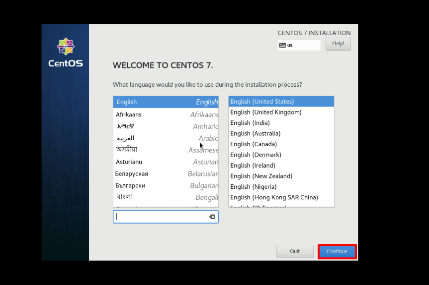
- Chọn thành phố và ngày giờ rồi nhấn `done` để tiếp tục.
- Chọn `Network-Hostname`để bật kết nối mạng cho máy rồi nhấn `Done `để tiếp tục.
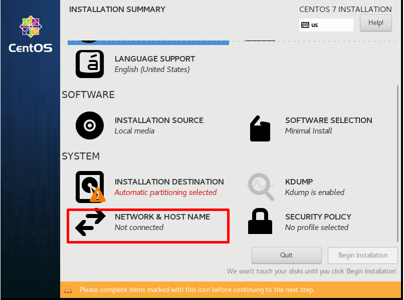

- Chọn Root password để cài đặt mật khẩu cho máy chọn `Done` để tiếp tục.
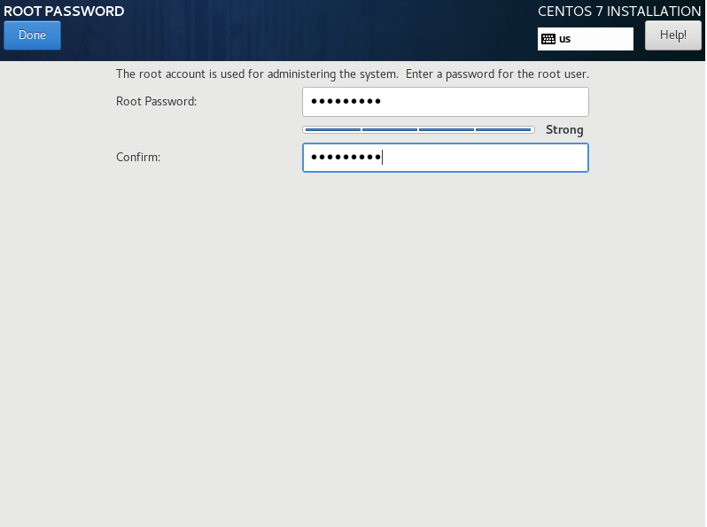
- Nhấn Reboot để khởi động máy ảo vừa tạo

- Máy đã được tạo thành công
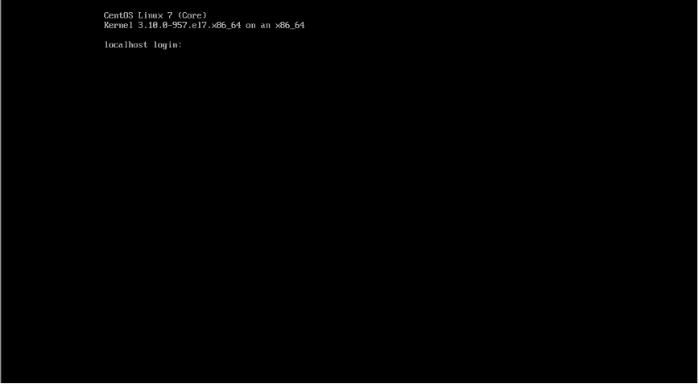
- Kiểm tra thông tin hệ điều hành
```
hostnamectl
cat /etc/centos-release
```
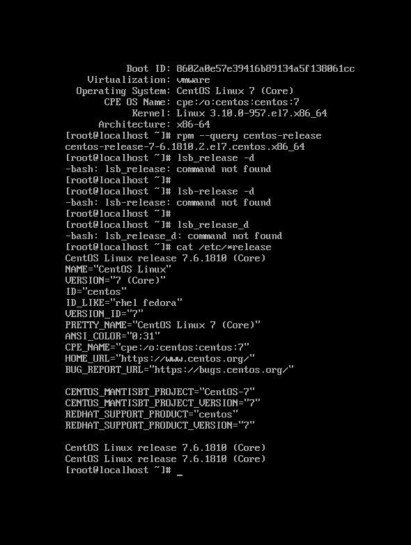
- Kiểm tra ip dùng lệnh `ip a`

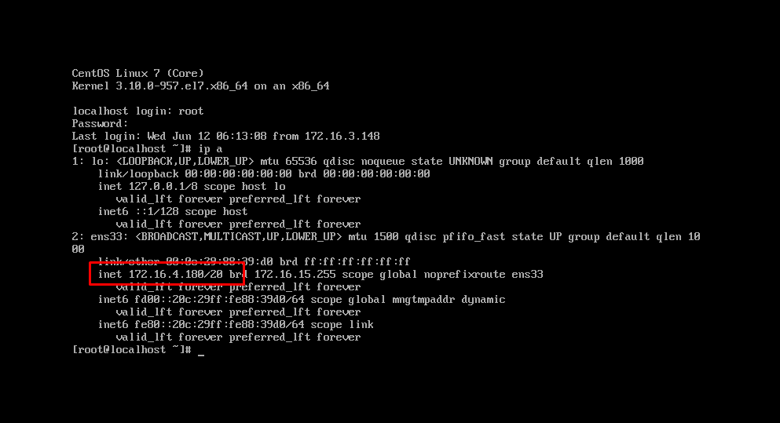