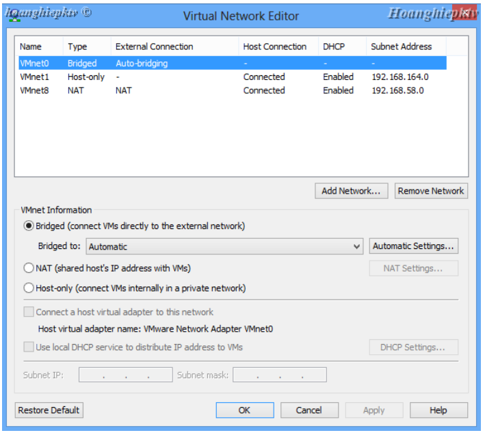
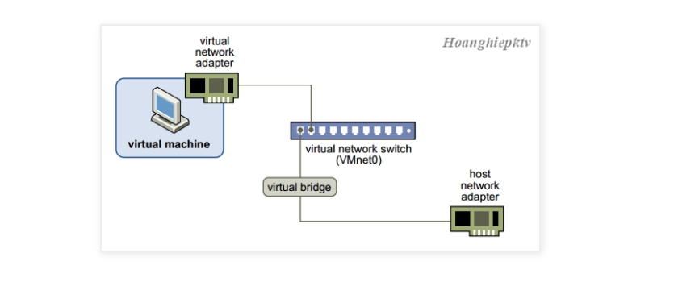
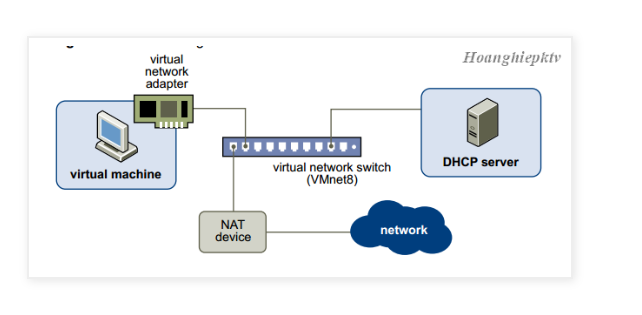
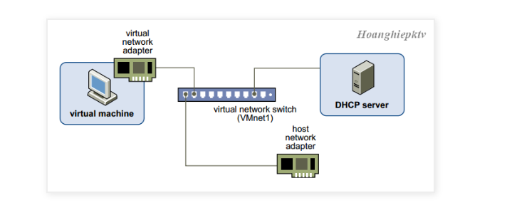

# Cơ chế card mạng trong VMware

- Switch ảo (Virtual Switch) cũng giống như switch vật lý, một Virtual Switch kết nối các thành phần mạng ảo lại với nhau. Những  switch ảo hay còn gọi là mạng ảo, chúng có tên là VMnet0, VMnet1, VMnet2… một số switch ảo được gắn vào mạng một cách mặc định. 
- Mặc định khi ta cài Wmware thì có sẵn 3 Switch ảo như sau:
    -  VMnet0 chế độ Bridged (cầu nối), 
    - VMnet8 chế độ NAT 
    - VMnet1 chế độ Host-only
    - (Ta có thể thêm, bớt, chỉnh các option của VMnet bằng cách vào menuEdit -> Virtual Network Editor...)

- DHCP server ảo DHCP (Dynamic Host Configuration) server ảo cung cấp địa chỉ IP cho các máy ảo trong việc kết nối máy ảo vào các Switch ảo không có tính năng Bridged (VMnet0). 
- Ví dụ như DHCP ảo cấp đến các máy ảo có kết nối đến Host-only và NAT.
 ## Chế độ Bridge:
 Ở chế độ này thì card mạng trên máy ảo sẹ được gắn vào VMnet0 và VMnet0 này liên kết trực tiếp với card mạng vật lý. Ở chế độ này máy ảo sẽ kết nối internet thông qua lớp card mạng vật lý và có chung lớp mạng với card mạng vật lý.

## Chế độ NAT
Ở chế độ này thì card mạng của máy ảo kết nối với VMnet8, VNnet8 cho phép máy ảo đi internet thông qua cơ chế NAT (NAT device). Lúc này lớp mạng bên trong máy ảo khác hoàn toàn với lớp mạng của card vật lý bên ngoài. IP của card mạng sẽ được cấp bởi DHCP VMnet8 cấp, trong trường hợp bạn muốn thiết lập IP tĩnh cho card mạng máy ảo bạn phải đảm bảo chung lớp mạng với VNnet8 thì máy ảo mới có thể đi internet.

## Cơ chế Host-only
Ở cơ chế này máy ảo được kết nối với VMnet có tính có tính năng Host-only, trong trường hợp hình này là VMnet1 (bạn có thể add nhiều VMnet Host-only). VNnet Host-only kết nối ra một card mạng ảo tương ứng ngoài máy thật (như đã nói ở phần trên, khi ta add một VMnet thì có một card tương ứng với VMnet sẽ được tạo ra ở phần trên. Trường hợp này là VMware Network Adapter VMnet1).

