 <a name ="Cài đặt ubuntu server">

# Cài đặt ubuntu server 16.04 
- Tải file ubuntu 16.04 [Tại đây](http://releases.ubuntu.com/16.04/)
- Mở VMware lên và chọn `Create new virtual machine` để tiến hành cài đặt 
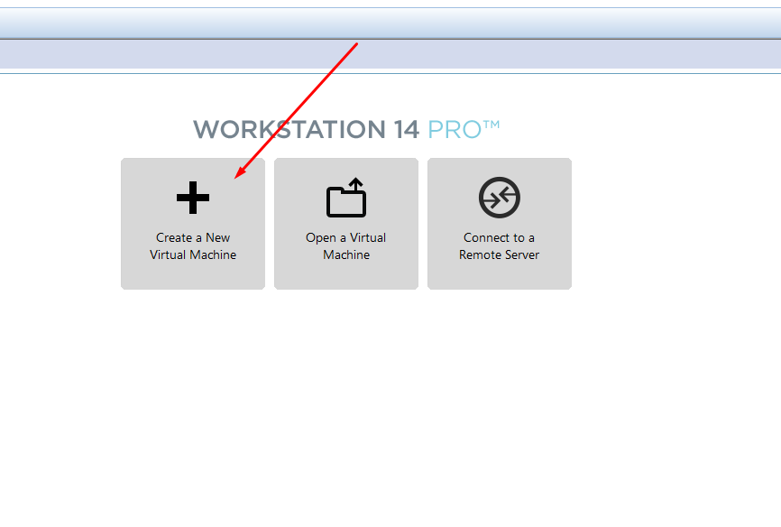
- Chọn file ubuntu vừa tải về nhấn `next` để tiếp tục.
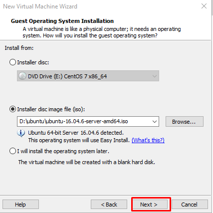

 - Điền thông tin uername và password
 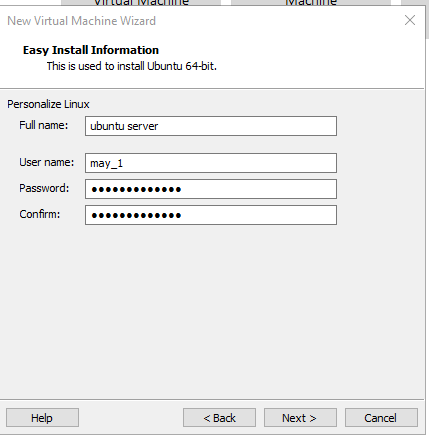
 - Đổi tên cho máy ảo vừa cài đặt và chọn next để tiếp tục.
 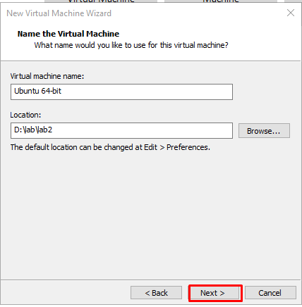
- Cấp bộ nhớ lớn nhất mà máy ảo có thể sử dụng
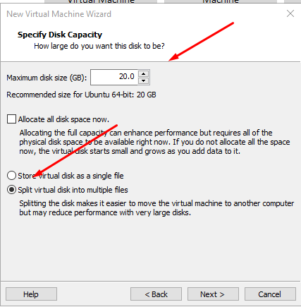
- Chỉnh sửa các thông số cho phần cứng

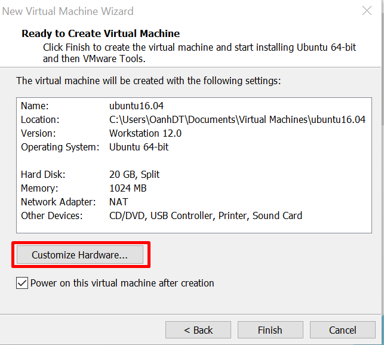
- Memory
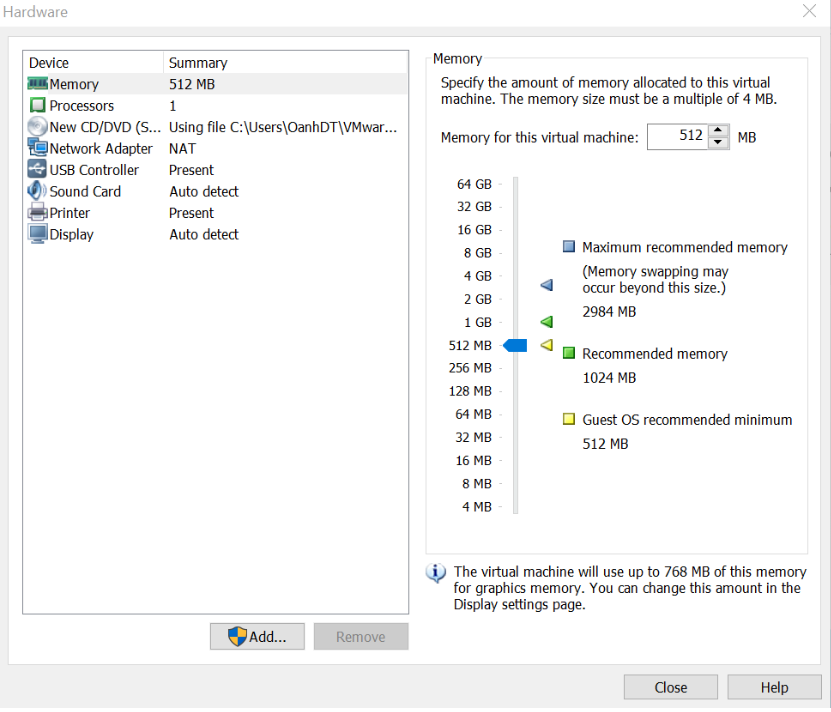
- Processor
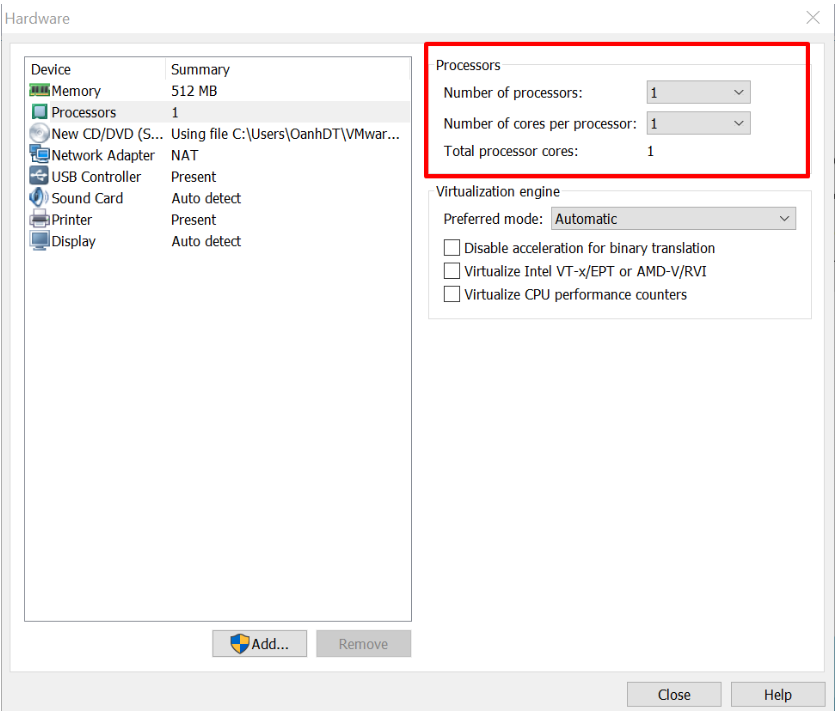
- network
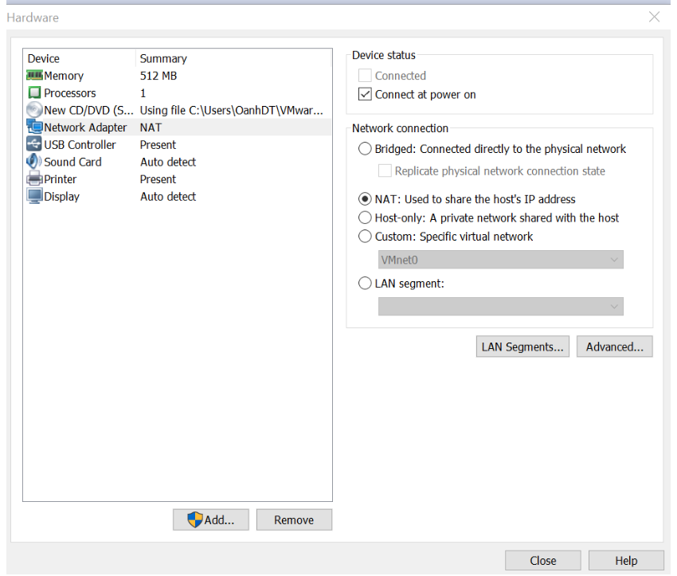
- Sau khi cài đặt xong nhấn finish để qua bước tiếp theo

- Hệ thống đang cài đặt
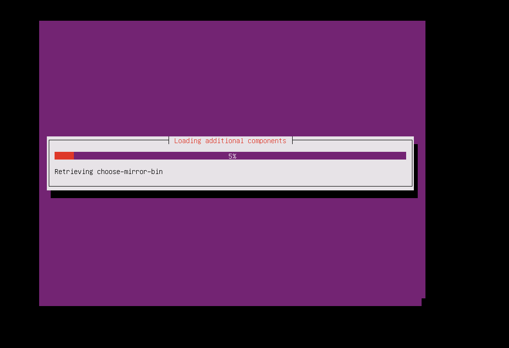
- Nhập user và password để đăng nhập và máy
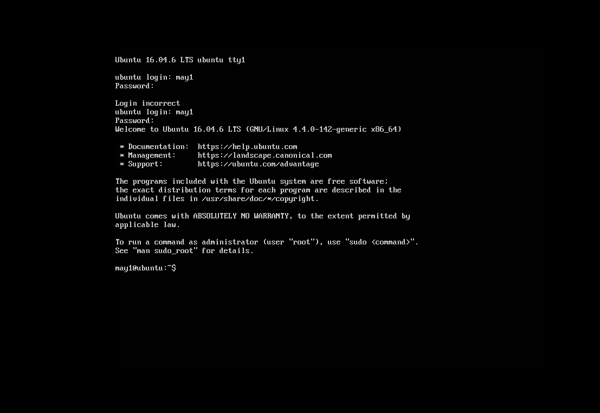