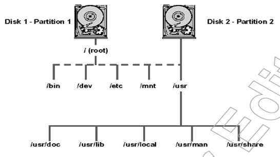

# Cấu trúc của một file hệ thống

Hệ thống tập tin của Linux và Unix được tổ chức theo một hệ thống phân bậc tương tự cấu trúc của một cây phân cấp.
Bậc cao nhất của hệ thống tập tin là thư mục gốc, được ký hiệu bằng gạch chéo “/” (root directory).

Hệ thống tập tin của Linux và Unix được tổ chức theo một hệ thống phân bậc tương tự cấu trúc của một cây phân cấp. 
Bậc cao nhất của hệ thống tập tin là thư mục gốc, được ký hiệu bằng gạch chéo “/” (root directory).

Đối với các hệ điều hành Unix và Linux tất các thiết bị kết nối vào máy tính đều được nhận dạng như các tập tin, kể cả những linh kiện như ổ đĩa cứng, các phân vùng đĩa cứng và các ổ USB. 
Điều này có nghĩa là tất cả các tập tin và thư mục đều nằm dưới thư mục gốc, ngay cả những tập tin biểu tượng cho các ổ đĩa cứng.

## Filesystem là gì?
Filesystem là các phương pháp và các cấu trúc dữ liệu mà một hệ điều hành sử dụng để theo dõi các tập tin trên ổ đĩa hoặc phân vùng. 
Có thể tạm dịch filesystem là hệ thống tập tin. Đó là cách các tập tin được tổ chức trên ổ đĩa. 
Thuật ngữ này cũng được sử dụng để chỉ một phân vùng hoặc ổ đĩa được sử dụng để lưu trữ các tập tin hoặc loại hệ thống tập tin. 
Vì vậy, nếu ai đó nói "Tôi có hai filesystem" nghĩa là người dùng đó có hai phân vùng, trong đó một phân vùng lưu trữ các file, 
hoặc một phân vùng sử dụng "extended filesystem", nghĩa là loại filesystem. 

## Các thư mục và cấu trúc tập tin

1. / – Root

- Mở từng tập tin và thư mục từ thư mục Root.

- Chỉ có Root user mới có quyền viết dưới thư mục này.

- Lưu ý rằng /root là thư mục gốc của Root user.

2. /bin – User Binaries

- Chứa các tập tin thực thi nhị phân (binary executables).

- Lệnh Linux phổ biến sử dụng ở chế độ Singer-user mode nằm trong thư mục này.

- Tất cả user trên hệ thống nằm tại thư mục này đều có thể sử dụng lệnh.

- Ví dụ: ps, ls, ping, grep, cp.

3. /sbin – System Binaries

- Cũng giống như /bin, /sbin cũng chứa tập tin thực thi nhị phân (binary executables).

- Lệnh Linux nằm trong thư mục này được sử dụng bởi Admin hệ thống, nhằm mục đích duy trì hệ thống.

- Ví dụ: iptables, reboot, fdisk, ifconfig, swapon.

4. /etc – Configuration Files

- Chứa cấu hình các tập tin cấu hình của hệ thống, các tập tin lệnh để khởi động các dịch vụ của hệ thống……

- Ngoài ra /etc còn chứa shell scripts startup và shutdown, sử dụng để chạy/ngừng các chương trình cá nhân.

- Ví dụ: /etc/resolv.conf, /etc/logrotate.conf.

5. /dev – Files device

- Chứa các tập tin để nhận biết cho các thiết bị của hệ thống (device files).

- Bao gồm thiết bị đầu cuối, USB hoặc các thiết bị được gắn trên hệ thống.

- Ví dụ: /dev/tty1, /dev/usbmon0

6. /proc – Process Information

- Chưa các thông tin về System Process.

- Đây là hệ thống tập tin giả có chứa thông tin về các quá trình đang chạy. chẳng hạn như thư mục /proc/{pid} có chứa thông tin về quá trình đặc biệt của pid.

- Đây là một hệ thống tập tin ảo có thông tin về tài nguyên hệ thống. Chẳng hạn như /proc/uptime.

7. /var – Variable Files

- Var là viết tắt của variable file, lưu lại tập tin ghi các số liệu biến đổi (variable files).

- Nội dung các tập tin được dự kiến sẽ tăng lên tại thư mục này.

- Bao gồm: hệ thống tập tin log (/var/log), các gói và các file dữ liệu (/var/lib), email (/var/mail), print queues (/var/spool); lock files (/var/lock); các file tạm thời cần khi reboot (/var/tmp).

8. /tmp – Temporary Files (các tập tin tạm thời)

- Thư mục chứa các tập tin tạm thời được tạo bởi hệ thống và user.

- Các tập tin tạo thư mục này được xóa khi hệ thống được khởi động lại (reboot).

9. /usr – User Programs

- Chứa các ứng dụng, thư viện, tài liệu và mã nguồn các chương trình thứ cấp.

- /usr/bin chứa các tập tin của các ứng dụng chính đã được cài đặt cho user. Nếu bạn không tìm thấy user binary tại thư mục /bin, bạn có thể tìm tại thư mục /usr/bin. Ví dụ như at, awk, cc, less, scp.

- /usr/sbin có chứa các tập tin ứng dụng cho Admin hệ thống. Nếu không tìm thấy hệ nhị phân tại /sbin, bạn có thể tìm tại /usr/sbin. Chẳng hạn như atd, cron, sshd, useradd, userdel.

- /usr/lib chứa thư viện /usr/bin và /usr/sbin.

- /usr/local chứa các chương trình user mà bạn cài đặt từ nguồn.

Chẳng hạn khi bạn cài đặt apache từ nguồn, apache nằm dưới /usr/local/apache2.

10. /home – thư mục Home

- Thư mục chính lưu trữ các tập tin cá nhân của tất cả user.

- Ví dụ: /home/john, /home/nikita.

11. /boot – Boot Loader Files

- Chứa các tập tin cấu hình cho quá trình khởi động hệ thống.

- Các file Kernel initrd, vmlinux, grub nằm trong /boot.

- Ví dụ: nitrd.img-2.6.32-24-generic, vmlinuz-2.6.32-24-generic.

12. /lib – System Libraries

- Chứa các file thư viện hỗ trợ các thư mục nằm dưới /bin và /sbin.

- Tên file thư viện có thể là ld* hoặc lib*.so.*.

- Ví dụ:ld-2.11.1.so, libncurses.so.5.7.

13. /opt – Optional add-on Applications

- Opt là viết tắt của Optional (tùy chọn).

- Chứa các ứng dụng add-on từ các nhà cung cấp.

- Ứng dụng add-on được cài đặt dưới thư mục /opt/ hoặc thư mục /opt/ sub.

14. /mnt – Mount Directory

- Gắn kết các thư mục hệ thống tạm thời (thư mục Temporary) nơi Sysadmins có thể gắn kết các file hệ thống.

15. /media – Removable Media Devices

- Gắn kết các thư mục Temporary (thư mục tạm thời) được hệ thống tạo ra khi một thiết bị lưu động (removable media) được cắm vào như đĩa CDs, máy ảnh kỹ thuật số...

- Ví dụ: /media/cdrom for CD-ROM; /media/floppy for floppy drives; /media/cdrecorder for CD writer.

16. /srv – Service Data

- Svr viết tắt của service.

- Chứa các service của máy chủ cụ thể liên quan đến dữ liệu.

- Ví dụ: /srv/cvs chứa dữ liệu liên quan đến CVS.

## Ổ đĩa và các Partition (phân vùng)

- /dev/hda Ổ đĩa cứng IDE đầu tiên (chính) 
- /dev/hdb Ổ đĩa cứng IDE thứ hai (thứ cấp)
- /dev/sda Ổ đĩa cứng SCSI đầu tiên
- /dev/sdb Ổ đĩa cứng SCSI thứ hai
- /dev/fd0 Ổ đĩa mềm đầu tiên 
- /dev/fd1 Ổ đĩa mềm thứ hai 

Tiêu chuẩn phân cấp hệ thống tập tin (FHS) phát triển từ các tiêu chuẩn lịch sử từ các phiên bản 
đầu tiên của UNIX. 
FHS cung cấp cho các nhà phát triển và quản trị viên hệ thống Linux một cấu trúc 
thư mục tiêu chuẩn cho file hệ thống. Linux hỗ trợ các file hệ thống khác nhau được tạo cho Linux, cùng với nó là một sự tương thích với các file hệ thống đến từ hệ điều hành khác.
Cũ hơn, file hệ thống kiểu legacy ( dành cho Win cũ ) vẫn được hỗ trợ.
Một số ví dụ mà các file hệ thống vẫn được Linux hỗ trợ là:

- Minix

    Minix là hệ thống lâu đời nhất và được cho là đáng tin cậy nhất, 
nhưng nó khá hạn chế về các tính năng (một số nhãn thời gian (time stamp) bị thiếu, 
tối đa 30 kí tự tên tập tin) và hạn chế về khả năng (tối đa 64 MB cho mỗi filesystem)

- Xia
    Xia là phiên bản sửa đổi của hệ thống tập tin minix - nâng cao giới hạn về tên tập tin và kích thước hệ thống tập tin, nhưng không giới thiệu tính năng mới nào cả. Xia cũng không phổ biến lắm nhưng các báo cáo cho thấy hệ thống này hoạt động rất tốt.

- Ext2
    Ext2 là hệ thống nhiều tính năng nhất của các tập tin hệ thống Linux đời đầu. Nó được thiết kế để dễ dàng tương thích với phiên bản mới, do đó các phiên bản code mới của hệ thống tập tin không yêu cầu viết lại hệ thống tập tin hiện có.

- Ext
    Là phiên bản cũ hơn của ext2, phiên bản này không tương thích với các phiên bản mới. Nó hầu như không bao giờ được sử dụng trong các cài đặt mới nữa và hầu hết người dùng đều chuyển đổi sang ext2.
- Ext3
    Hệ thống tập tin ext3 có tất các tính năng của ext2.
     Tuy nhiên, sự khác biệt là sự có mặt của journaling. 
     Điều này cải thiện hiệu suất và thời gian phục hồi phòng khi hệ thống bị treo. 
     Chính điều đó khiến ext3 phổ biến hơn ext2.

- ext3 ( có hỗ trợ journaling ), ext4 ( đang được sử dụng làm để chạy hệ thống linux ), btrfs, xfs
- vfat, fat, ntfs ( cho win )

ngoài ra còn một số hệ thống tập tin cũ hơn :

-Min`