# Logical Volume Manager (LVM)

## Khái niệm về phân vùng đĩa cứng trong Linux

Sau khi bấm nút khởi động, BIOS sẽ kiểm tra những phần cứng cơ bản (ổ đĩa cứng, ổ đĩa mềm, bàn phím, ...)

BIOS là chương trình chạy đầu tiên khi nhấn nút nguồn hoặc nút reset trên máy tính của bạn.

BIOS thực hiện một công việc gọi là POST ( Power-on Self-test) kiểm tra các thông số của các phần cứng của máy tính. Ngoài ra , BIOS cho phép thay đổi các thiết lập, cấu hình của nó.

BIOS được lưu trữ trên ROM của bo mạch chủ.

Quá trình POST kết thúc thành công, BIOS sẽ tìm kiếm và khởi chạy một hệ điều hành được chứa trong các thiết bị lưu trữ như ổ cứng…

Hệ điều hành Linux được cài trên ổ cứng thì BIOS sẽ tìm đến `MBR` (Master Boot Record)

Sau khi BIOS xác định được thiết bị lưu trữ thì BIOS sẽ đọc trong MBR hoặc phân vùng EFI của thiết bị này để nạp vào bộ nhớ một chương trình. Chương trình này sẽ định vị và khởi động boot loader – đây là chương trình chịu trách nhiệm cho việc tìm và nạp nhân của hệ điều hành.

Đến giai đoạn này, máy tính sẽ không truy cập vào phương tiện lưu trữ nào. Thông tin về ngày tháng, thời gian và các thiết bị ngoại vi quan trọng nhất được nạp từ CMOS.

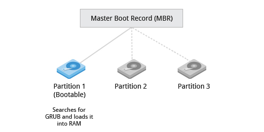

Khái niệm đầy đủ hơn bạn tham khảo tại [đây](https://lilylnx.wordpress.com/2011/02/23/khai-niem-phan-vung-dia-cung-trong-linux/)


# Công nghệ LVM là gì ?

`LVM` là một công cụ để quản lý phân vùng logic được tạo và phân bổ từ các ổ đĩa vật lý.

Nó cho phép ấn định không gian đĩa cứng thành những logical Volume khiến cho việc thay đổi kích thước trở nên dễ dàng hơn (so với partition). Với kỹ thuật Logical Volume Manager (LVM) bạn có thể thay đổi kích thước mà không cần phải sửa lại table của OS. Điều này thật hữu ich với những trường hợp bạn đã sử dụng hết phần bộ nhớ còn trống của partition và muốn mở rộng dung lượng của nó


`LVM` được sử dụng cho các mục đích sau

- Tạo 1 hoặc nhiều phần vùng logic hoặc phân vùng với toàn bộ đĩa cứng (hơi giống với RAID 0, nhưng tương tự như JBOD), cho phép thay đổi kích thước volume.
- Quản lý trang trại đĩa cứng lớn (Large hard Disk Farms) bằng cách cho phép thêm và thay thế đĩa mà không bị ngừng hoạt động hoặc gián đoạn dịch vụ, kết hợp với trao đổi nóng (hot swapping).
- Trên các hệ thống nhỏ (như máy tính để bàn), thay vì phải ước tính thời gian cài đặt, phân vùng có thể cần lớn đến mức nào, LVM cho phép các hệ thống tệp dễ dàng thay đổi kích thước khi cần.
- Thực hiện sao lưu nhất quán bằng cách tạo snapshot nhanh các khối một cách hợp lý.
- Mã hóa nhiều phân vùng vật lý bằng một mật khẩu.


# Vai trò của LVM

- Không để hệ thống bị gián đoạn hoạt động
- Không làm hỏng dịch vụ
- Có thể kết hợp Hot Swapping (thao tác thay thế nóng các thành phần bên trong máy tính)


# Ưu - Nhược điểm

## Ưu điểm
- Có thể gom nhiều đĩa cứng vật lý lại thành một đĩa ảo dung lượng lớn hơn.
- Có thể tạo ra các vùng dung lượng lớn nhỏ tùy ý.
- Có thể thay đổi các vùng dung lượng đó dễ dàng linh hoạt.
## Nhược điểm
- Các bước thiết lập phức tạp.
- Càng gắn nhiều đĩa cứng và thiết lập càng nhiều LVM thì hệ thống khởi động càng lâu.
- Khả năng mất dữ liệu khi một trong đĩa cứng vật lý bị hỏng.


# Kiến trúc của VLM

Trong đó, kiến trúc gồm có 3 lớp chính :

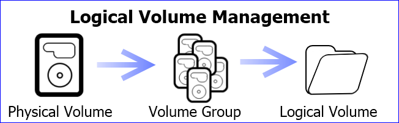

Chức năng LVM bằng cách xếp các lớp lên trên các thiết bị lưu trữ vật lý.
Các lớp cơ bản mà LVM sử dụng:

- Physical Volumes(pv): Ổ cứng vật lý (đĩa cứng, partition, SSD…) có thể chia thành nhiều phân vùng vật lý
- Volume Groups(vg): Là một nhóm bao gồm các Physical Volumes trên 1 hoặc nhiều ổ đĩa khác nhau được kết hợp lại thành một Volume Group

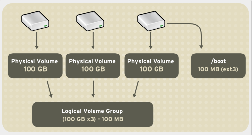

- Logical Volumes(lv): Một Volume Group được chia nhỏ thành nhiều Logical Volume. Nó được dùng cho các để mount tới hệ thống tập tin (File System) và được format với những chuẩn định dạng khác nhau như ext2, ext3, ext4…

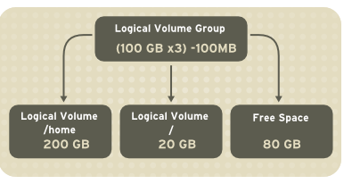

Tóm lại, LVM có thể được sử dụng để kết hợp các Physical Volumes thành các Volume Groups để thống nhất không gian lưu trữ có sẵn trên một hệ thống. Sau đó, quản trị viên có thể phân Volume Groups thành các Logical Volumes tùy ý, hoạt động như các phân vùng.

Mô hình đầy đủ :

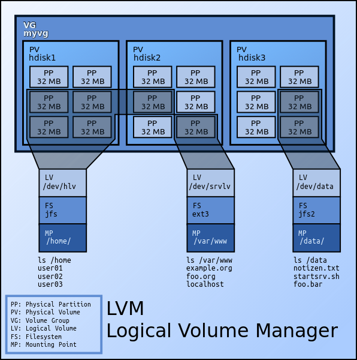

- Hard drives – Drives

    Thiết bị lưu trữ dữ liệu, ví dụ như trong linux nó là /dev/sda

- Partition

     Partitions là các phân vùng của Hard drives, mỗi Hard drives có 4 partition, trong đó partition bao gồm 2 loại là primary partition và extended partition

    - Primary partition:
        - Phân vùng chính, có thể khởi động
        - Mỗi đĩa cứng có thể có tối đa 4 phân vùng này

    - Extended partition:
        - Phân vùng mở rộng, có thể tạo những vùng luân lý

- File Systems

    - Tổ chức và kiểm soát các tập tin
    - Được lưu trữ trên ổ đĩa cho phép truy cập nhanh chóng và an toàn
    - Sắp xếp dữ liệu trên đĩa cứng máy tính
    - Quản lý vị trí vật lý của mọi thành phần dữ liệu

    

# Thực hành Lap

Chuẩn bị
- Tạo máy ảo trên vmware Workstation cài hệ điều hành Centos 7 Sever
- Add thêm một số ổ cứng vào máy ảo

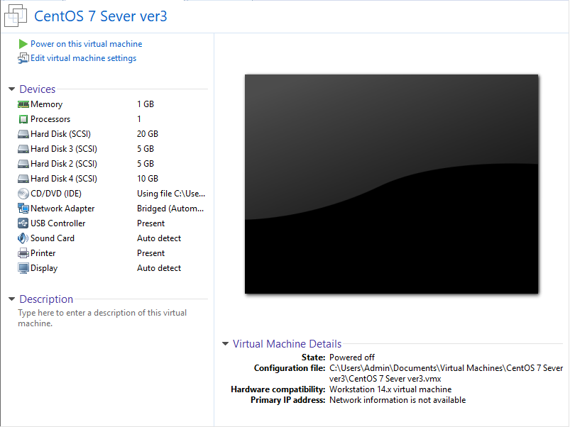

## Tạo Logical Volume trên LVM

### B1. Kiểm tra các Hard Drives có trên hệ thống

Bạn có thể kiểm tra xem có những Hard Drives nào trên hệ thống bằng cách sử dụng câu lệnh `lsblk`

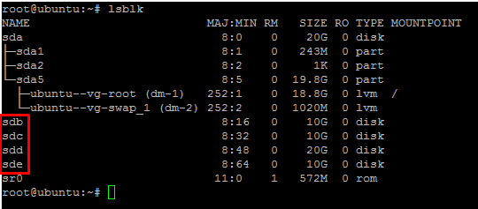

### B2. Tạo Partition

Từ các Hard Drives trên hệ thống, bạn tạo các partition. 
Ở đây, từ sdb, mình tạo các partition bằng cách sử dụng lệnh sau fdisk /dev/sdb

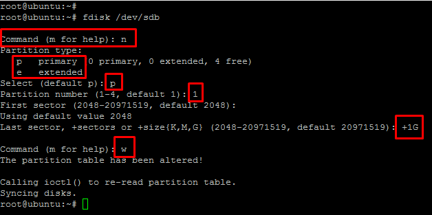

Trong đó :
- Bạn chọn `n` để bắt đầu tạo partition
- Bạn chọn `p` để tạo partition primary
- Bạn chọn `1` để tạo partition primary 1
- Tại `First sector (2048-20971519, default 2048)` bạn để mặc định
- Tại `Last sector, +sectors or +size{K,M,G} (2048-20971519, default 20971519)` bạn chọn `+1G` để partition bạn tạo ra có dung lượng 1 G
- Bạn chọn `w` để lưu lại và thoát.

Tiếp theo bạn thay đổi định dạng của partition vừa mới tạo thành LVM

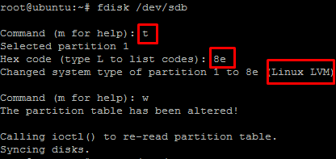

- Bạn chọn `t` để thay đổi định dạng partition
- Bạn chọn `8e` để đổi thành LVM

Tương tự, bạn tạo thêm các partition primary từ sdb

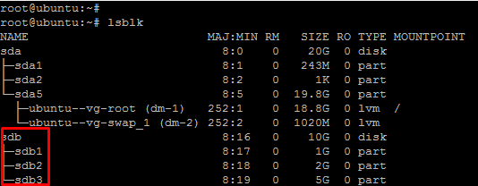

Tạo các partition primary từ sdc bằng lệnh fdisk /dev/sdc


### B3. Tạo Physical Volume

Tạo các Physical Volume là /dev/sdb1 và /dev/sdc1 bằng các lệnh sau:
```
# pvcreate /dev/sdb1

# pvcreate /dev/sdc1
```
Bạn có thể kiểm tra các Physical Volume bằng câu lệnh `pvs` hoặc có thể sử dụng lệnh `pvdisplay`

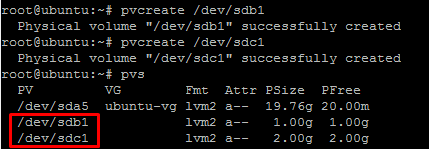

### B4. Tạo Volume Group

Tiếp theo, mình sẽ nhóm các Physical Volume thành 1 Volume Group bằng cách sử dụng câu lệnh sau:
```
# vgcreate vg-demo1 /dev/sdb1 /dev/sdc1
```
Trong đó vg-demo1 là tên của Volume Group

Có thể sử dụng câu lệnh sau để kiểm tra lại các Volume Group đã tạo
```
# vgs

# vgdisplay
```
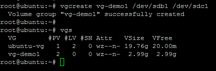

### B5. Tạo Logical Volume

Từ một Volume Group, chúng ta có thể tạo ra các Logical Volume bằng cách sử dụng lệnh sau:
```
# lvcreate -L 1G -n lv-demo1 vg-demo1
```
-L: Chỉ ra dung lượng của logical volume

-n: Chỉ ra tên của logical volume

Trong đó lv-demo1 là tên Logical Volume, vg-demo1 là Volume Group mà mình vừa tạo ở bước trước

Lưu ý là chúng ta có thể tạo nhiều Logical Volume từ 1 Volume Group

Có thể sử dụng câu lệnh sau để kiểm tra lại các Logical Volume đã tạo
```
# lvs

# lvdisplay
```

### B6. Định dạng Logical Volume

Để format các Logical Volume thành các định dạng như ext2, ext3, ext4, ta có thể làm như sau:
```
# mkfs -t ext4 /dev/vg-demo1/lv-demo1
```

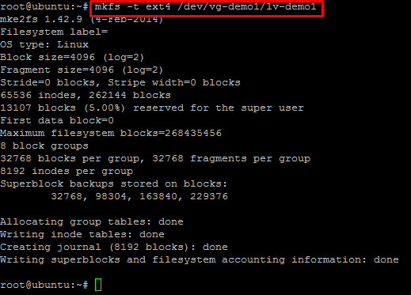

### B7. Mount và sử dụng

Trong bài lab này, mình sẽ tạo ra một thư mục để mount Logical Volume đã tạo vào thư mục đó
```
# mkdir demo1
```
Tiến hành mount logical volume lv-demo1 vào thư mục demo1 như sau:
```
# mount /dev/vg-demo1/lv-demo1 demo1
```
Kiểm tra lại dung lượng của thư mục đã được mount:
```
# df -h
```

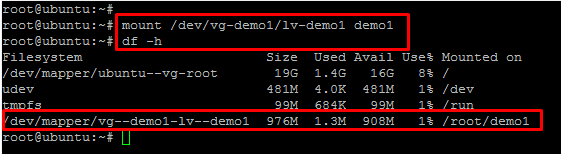

## Thay đổi dung lượng Logical Volume trên LVM

## *Tăng*

Logical Volume này thuộc Volume Group vg-demo1, để tăng kích thước, bước đầu tiên phải kiểm tra xem Volume Group còn dư dung lượng để kéo giãn Logical Volume không. Logical Volume thuộc 1 Volume Group nhất định, Volume Group đã cấp phát hết thì Logical Volume cũng không thể tăng dung lượng được. Để kiểm tra, ta dùng lệnh sau:
```
# vgdisplay
```

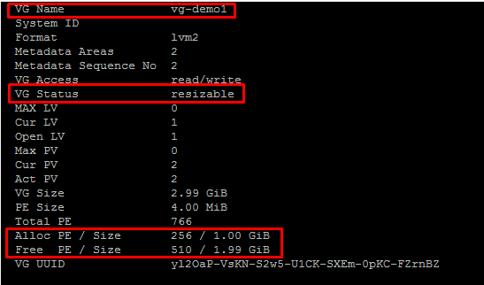

Volume Group ở đây vẫn còn dung lượng để cấp phát, ta có thể nhận thấy điều này qua 2 
trường thông tin là `VG Status resizable` và `Free PE / Size 510 / 1.99 GiB` với dung lượng Free là 510*4 = 2040 Mb

Để tăng kích thước Logical Volume ta sử dụng câu lệnh sau:
```
# lvextend -L +50M /dev/vg-demo1/lv-demo1
```
Với `-L` là tùy chọn để tăng kích thước

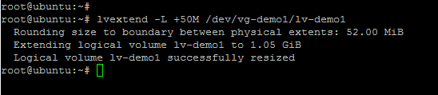

Kiểm tra lại bằng cách dùng lệnh `lvs`

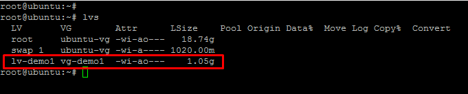

Sau khi tăng kích thước cho Logical Volume thì Logical Volume đã được tăng nhưng file system trên volume này vẫn chưa thay đổi, bạn phải sử dụng lệnh sau để thay đổi:
```
# resize2fs /dev/vg-demo1/lv-demo1
```

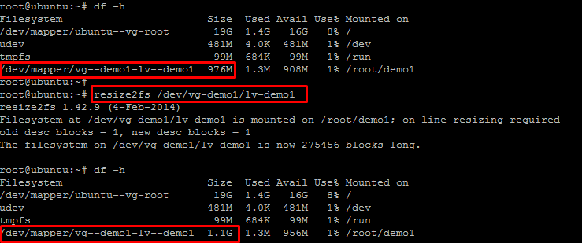

## *Giảm*

Để giảm kích thước của Logical Volume, trước hết các bạn phải umount Logical Volume mà mình muốn giảm
```
# umount /dev/vg-demo1/lv-demo1
```
Tiến hành giảm kích thước của Logical Volume
```
# lvreduce -L 20M /dev/vg-demo1/lv-demo1
```
Sau đó tiến hành format lại Logical Volume
```
# mkfs.ext4 /dev/vg-demo1/lv-demo1
```
Cuối cùng là mount lại Logical Volume
```
# mount /dev/vg-demo1/lv-demo1 demo1
```
Kiểm tra kết quả ta được như sau:

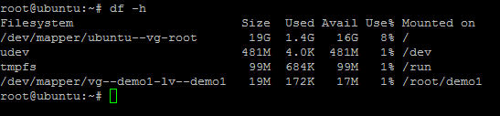


# Thay đổi dung lượng Volume Group trên LVM

Ở phần trước mình có thể tăng kích thước của Logical Volume nhưng với điều kiện Volume Group của Logical Volume đó còn dung lượng. Phần này chúng ta sẽ tìm hiểu xem làm thế nào có thể mở rộng thêm kích thước của Volume Group cũng như thu hồi dung lượng của nó.

Việc thay đổi kích thước của Volume Group chính là việc nhóm thêm Physical Volume hay thu hồi Physical Volume ra khỏi Volume Group

Trước tiên, các bạn cần kiểm tra lại các partition và Volume Group
```
# vgs

# lsblk
```

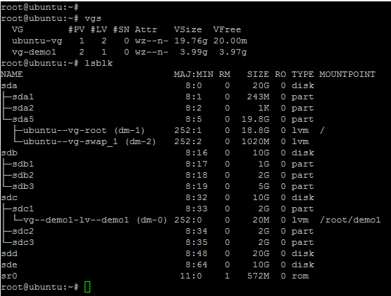

Tiếp theo, nhóm thêm 1 partition vào Volume Group như sau:
```
# vgextend /dev/vg-demo1 /dev/sdb3
```

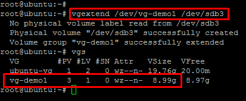

Ở đây, muốn nhóm vào Volume Group phải là Physical Volume nên hệ thống đã tự động tạo cho mình Physical Volume và nhóm vào Volume Group.

Chúng ta có thể cắt 1 Physical Volume ra khỏi Volume Group như sau:
```
# vgreduce /dev/vg-demo1 /dev/sdb3
``` 

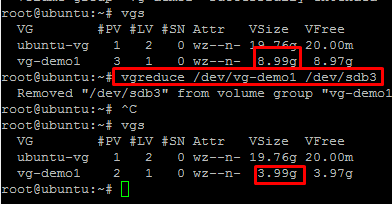

# Xóa Logical Volume, Volume Group, Physical Volume

Xóa Logical Volumes

Trước tiên ta phải Umount Logical Volume
```
# umount /dev/vg-demo1/lv-demo1
```
Sau đó tiến hành xóa Logical Volume bằng câu lệnh sau:
```
# lvremove /dev/vg-demo1/lv-demo1
```
Ta kiểm tra lại kết quả

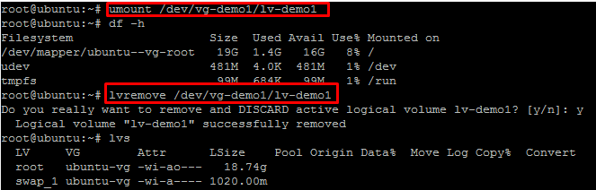

Xóa Volume Group

Trước khi xóa Volume Group, chúng ta phải xóa Logical Volume

Xóa Volume Group bằng cách sử dụng lệnh sau:
```
# vgremove /dev/vg-demo1
```
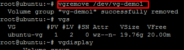

Xóa Physical Volume

Cuối cùng là xóa Physical Volume:
```
# pvremove /dev/sdb3
```
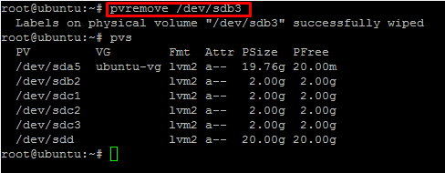


Tài liệu tham khảo :

https://sysadmincasts.com/episodes/27-lvm-linear-vs-striped-logical-volumes

https://blogd.net/linux/gioi-thieu-ve-lvm/

https://blogd.net/linux/tao-va-quan-ly-lvm-trong-linux/#7-l%E1%BB%9Di-k%E1%BA%BFt

https://github.com/hocchudong/Logical-Volume-Manager-LVM-